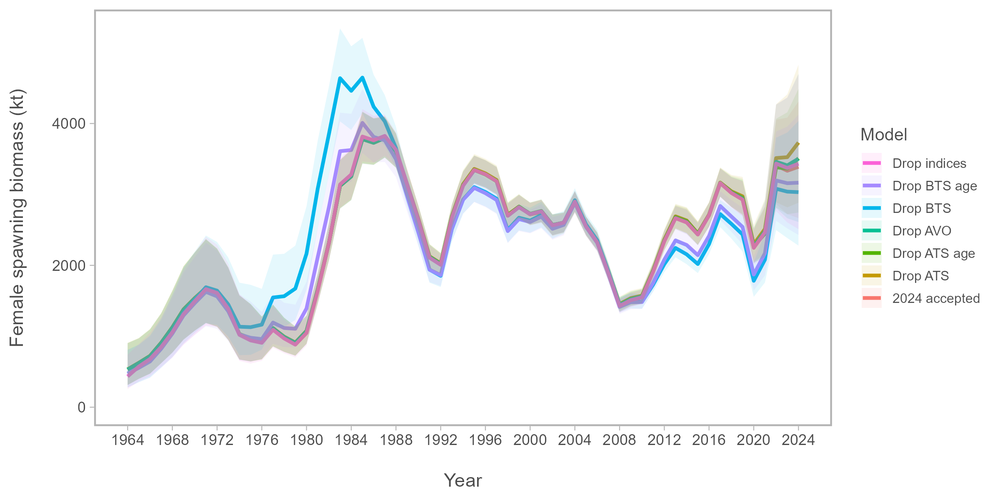

```{r startup, echo=FALSE, warnings=FALSE, message=FALSE, eval=TRUE}
knitr::opts_chunk$set(message = FALSE)
knitr::opts_chunk$set(warning = FALSE)
library(plotly)
library(r4ss)
library(ggridges)
library(ebswp)
library(tidyverse)
library(patchwork)
library(gganimate)
library(ggridges)
library(viridis)
# Set ggplot theme
#devtools::install_github("seananderson/ggsidekick")
library(ggsidekick)
theme_set(theme_sleek())
.THEME=theme_sleek()
.OVERLAY=TRUE
#plot_ssb(loo_lst)
#plot_recruitment(loo_lst)
#plot_ser(loo_lst)
library(reshape2)
#theme_set(ggthemes::theme_few()) 
options(warn = -1)
do_sigmaR_profile=0
do_edf=0
do_ft=0
do_abc_sel=0
do_yearloop=0
do_srrlst=0
do_selsens= 0
do_loo = 0

Plot_Sel <- function(sel, fage = 1, lage = 13, nages = 15, styr = 1964, endyr = 2024) {
  sdf <- pivot_longer(sel, names_to = "age", values_to = "sel", cols = 2:(nages + 1)) |>
    filter(Year >= styr, Year <= endyr) |>
    mutate(age = as.numeric(age))
  p1 <- sdf |> ggplot(
    aes(x = age, y = as.factor(Year), height = sel)
  ) +
    geom_density_ridges(
      stat = "identity", scale = 2.8,
      alpha = .3, fill = "goldenrod", color = "tan"
    ) +
    ggthemes::theme_few() +
    ylab("Year") +
    xlab("Age (years)") +
    scale_x_continuous(limits = c(fage, lage), breaks = fage:lage) +
    scale_y_discrete(limits = rev(levels(as.factor(sdf$Year)))) +
    facet_grid(. ~ source)
  return(p1)
}

loadup<-FALSE
#loadup<-TRUE
if (loadup){
  source(here::here("R", "GetResults.R"))
  r1 <- SS_obj(SS_output(dir = here::here("runs","ss","base"),verbose=FALSE),src="SS3 base") 
  r2 <- SS_obj(SS_output(dir = here::here("runs","ss","tight"),verbose=FALSE),src="SS3 Constrained") 
  r3 <- SS_obj(SS_output(dir = here::here("runs","ss","flex"),verbose=FALSE),src="SS3 Flexible") 
  c1 <- cea_obj(cea_run=fm0, src="CEA 0.7")
  c2 <- cea_obj(cea_run=fm0DM, src="CEA 0.7, DM")
  #gp_run<-gp_obj()
  pm_run<-pm_obj()
  #pm_run2<-pm_obj(pm2, src="Pollock_model VPA-like")
  #load(here("SAM","poll23","run","model2.RData"))
  sam_run <- SAM_obj()
  #am_run<-AMAK_obj(run_dir=here("amak2","runs", "base"))
  #am_run2<-AMAK_obj(run_dir=here("amak2","runs", "3par"),src="AMAK-3par-logistic")
  #am_run3<-AMAK_obj(run_dir=here("amak2","runs", "cpue"),src="AMAK w CPUE", nind=6)
  #all_sel <- rbind(sam_run$sel,pm_run$sel,am_run$sel,ss_run$sel,gp_run$sel)
  #all_sel <- rbind(pm_run$sel,r1$sel,r2$sel,r3$sel)#,gp_run$sel)

  #all_ts <- rbind( sam_run$ts,pm_run$ts,am_run$ts,ss_run$ts,gp_run$ts)
  save.image(file=here::here("compares.Rdata"))
} else {
  load(here::here("compares.Rdata"))
}
#Plot_Sel() + ggthemes::theme_few(base_size = 9)


```

# Executive Summary

The work presented below was based on the same data sets used in the 2024 assessment. The
first task was to update the model runs to include the 2023 data. The model runs were
updated and the results are presented below. The model runs were then used to compare the
FT-NIR data with the traditional data sources (BTS and ATS). The results of these
comparisons are presented below. The model fits to the data are presented in the tables at
the end of the document. The first section steers towards the R library used for 
processing model results for EBS pollock. The second section presents the comparisons of the
FT-NIR data with the traditional data sources. The third section compares results of
different software platforms (e.g., SS3, CEA, and AMAK) for the assessment. The fourth section
shows results comparing newer model-based estimates from survey data.


#  R Library for assessment compilations (ebswp)

The `ebswp` library is a collection of functions for compiling and analyzing results from
the stock assessment models for the eastern Bering Sea walleye pollock (@ianelli2025). The
library is designed to work with the ADMB code and depends on a consistent format for the
report files generated. The link in the reference provides access to some notes on
applications as vignettes to the package (e.g., .
[here](https://afsc-assessments.github.io/ebswp/index.html "EBSWP Library")).


# Comparing FT-NIR compositions with traditional microscope age estimations

The fish age and growth lab at the AFSC have endeavored to expand on new technologies
(@helser2019).

Examining the abundance-at-age (for design-based estimates of the bottom-trawl age
compositions) we show that in general, the TMA estimates show a high level of consistency
by cohort (@fig-consisTMA). For these same data, when applied to the FTNIRs age-estimation
method, the consistency was lower (@fig-consisFTN).

When preparing the data for the assessment, we plotted out the proportions-at-age for the
TMA data and noted the differences in the estimates using the FTNIRs age estimates
(@fig-proportionsFSH, @fig-proportionsBTS, and @fig-proportionsATS). Other preparations
involved estimating the age-determination errors for each method following that of
@punt2008. For the FTNIRs data, we optionally estimated separate age-estimation error
matrices by gear type. The appearance of the fleet-aggregated and fleet-specific input
data files is shown in @fig-dataFile.

```{r consisTMA}
#| echo: false
#| warnings: FALSE
#| messages: FALSE
#| label: fig-consisTMA
#| fig.cap: "Cohort consistency over different ages based on log-abundance from the bottom-trawl survey data for pollock in recent years for traditional microscope age estimates. The cohorts are shown in the labels."
  knitr::include_graphics("figs/consisTMA.png")
```

```{r consisFTN}
#| echo: false
#| warnings: FALSE
#| messages: FALSE
#| label: fig-consisFTN
#| fig.cap: "Cohort consistency over different ages based on log-abundance from the bottom-trawl survey data for pollock in recent years for FTNIRs  age estimates. The cohorts are shown in the labels."
  knitr::include_graphics("figs/consisFTN.png")
```

```{r proportionsFSH}
#| echo: false
#| warnings: FALSE
#| messages: FALSE
#| label: fig-proportionsFSH
#| fig.cap: "Proportions at age for recent years for the fishery data where the columns represent the traditional microscope age estimates (TMA)  compared to the FTNIRs   age estimates (lines for the red-outlined panels)."
  knitr::include_graphics("figs/proportionsFSH.png")
```

```{r proportionsBTS}
#| echo: false
#| warnings: FALSE
#| messages: FALSE
#| label: fig-proportionsBTS
#| fig.cap: "Proportions at age for recent years for the bottom-trawl survey data where the columns represent the traditional microscope age estimates (TMA)  compared to the FTNIRs   age estimates (lines for the red-outlined panels)."
  knitr::include_graphics("figs/proportionsBTS.png")
```

```{r proportionsATS}
#| echo: false
#| warnings: FALSE
#| messages: FALSE
#| label: fig-proportionsATS
#| fig.cap: "Proportions at age for recent years for the acoustic-trawl survey data where the columns represent the traditional microscope age estimates (TMA)  compared to the FTNIRs   age estimates (lines for the red-outlined panels)."
  knitr::include_graphics("figs/proportionsATS.png")
```

```{r dataFile}
#| echo: false
#| warnings: FALSE
#| messages: FALSE
#| label: fig-dataFile
#| fig.cap: "Schematic of input datafile showing the breakout of the fleet-specific FTNIRs age-error matrices (right panel) compared to that where the global FTNIRs age-error matrices are used (left panel). "
  knitr::include_graphics("figs/dataFile.png")
```

For the assessment model, the alternatives are shown based on the coverage of data and
availability among types of ageing is shown in @fig-dataExtent.

```{r data}
#| echo: false
#| warnings: FALSE
#| messages: FALSE
#| label: fig-dataExtent
#| fig.cap: "Data extent by age composition for the models with FTNIRs age estimates. The data types are for the Fishery, bottom trawl survey (BTS), and acoustic trawl survey (ATS) and the years of coverage are shown in the x-axis."
# Sample data
if (do_ft){
  df <- data.frame(
    type = factor(c("Fishery-TMA", "Fishery-FTN", "BTS-TMA", "BTS-FTN","ATS-TMA","ATS-FTN"),
      levels     =c("Fishery-TMA", "Fishery-FTN", "BTS-TMA", "BTS-FTN","ATS-TMA","ATS-FTN")),
    start_year = c(1964, 2016, 1982, 2014, 1994, 2014),
    end_year   = c(2015, 2023, 2013, 2023, 2013, 2023)
  )
  # Plot
  ggplot(df, aes(y = type,color=type)) +
    geom_segment(aes(x = start_year, xend = end_year, y = type, yend = type), 
                 linewidth = 5) +
    scale_x_continuous(breaks = seq(1960, 2025, 5)) +
    theme_minimal() + theme(legend.position = "none") +
    labs(title = "Coverage of years by type, EBS pollock", x = "Years", y = "Type")
}else{
  knitr::include_graphics("figs/DataExtent.png")
}


```

```{r ft1}
#| echo: false
#| warnings: FALSE
#| messages: FALSE
#| label: fig-ft1
#| fig.cap: "Model results comparing last year's selected model -2021)"
if (do_ft) {
  thisyr=2024; nextyr=thisyr+1; dec_tab_ord <<- 1:8
  mod_names <- c("2024 TMA", "Base","FT-NIR fleets aggregated", "FT-NIR fleet-specific")
  mod_dir <- c("lastyrdb", "lastyrdbae", "ftnir1", "ftnir2")
  ftn_lst <- get_results(rundir = here::here("runs"))
  #source(here::here("R","pm_CIE.R"))
  saveRDS(ftn_lst, here::here("runs", "ftnir.rds"))
} else{
  ftn_lst <- readRDS(here::here("runs", "ftnir.rds"))
}

```

```{r comp_bts}
#| echo: false
#| warnings: FALSE
#| messages: FALSE
#| label: fig-comp_bts
#| fig.cap: "Model results comparing last year's selected model -2021)"
# Set working directory & plot save directory

```

```{r comp_fsh}
#| echo: false
#| warnings: FALSE
#| messages: FALSE
#| label: fig-comp_fsh
#| fig.cap: "Model results comparing last year's selected model -2021)"
# Read in proportions & shape for plotting

```

```{r comp_ats}
#| echo: false
#| warnings: FALSE
#| messages: FALSE
#| label: fig-comp_ats
#| fig.cap: "Model results comparing last year's selected model -2021)"
# Set working directory & plot save directory

```


## Comparisons of fit to FT-NIRS models

The model fits to the data are shown in @tbl-modfits. The table shows the goodness-of-fit

```{r}
#| echo: false
#| warnings: FALSE
#| messages: FALSE
#| label: tbl-modfits
#| tbl-cap: "Goodness-of-fit measures to primary data for different data and age-error applications. RMSE=root-mean square log errors, NLL=negative log-likelihood, SDNR=standard deviation of normalized residuals, Eff. N=effective sample size for composition data). See text for incremental model descriptions."
#| tbl-cap-location: margin
library(gt)
tab <- gt(tab_fit(ftn_lst[c(2,4,3)])) %>%
  tab_style( style = cell_borders(sides = "top", weight = px(2), color = "black"), locations = cells_body(rows = 1) ) %>%
  tab_style( style = cell_borders(sides = "top", weight = px(2), color = "black"), locations = cells_body(rows = 5) ) %>%
  tab_style( style = cell_borders(sides = "top", weight = px(2), color = "black"), locations = cells_body(rows = 8) ) %>%
  tab_style( style = cell_borders(sides = "top", weight = px(2), color = "black"), locations = cells_body(rows = 11) ) %>%
  tab_style( style = cell_borders(sides = "top", weight = px(2), color = "black"), locations = cells_body(rows = 18) ) |> 
  tab_style( style = cell_borders(sides = "top", weight = px(2), color = "black"), locations = cells_body(rows = 21) ) |> 
  tab_style( style = cell_borders(sides = "bottom", weight = px(2), color = "black"), locations = cells_body(rows = 21) )
tab
```


# Developments on estimating the effective degrees of freedom

In @zheng2024 they present a new method for estimating the effective degrees of freedom
(EDF) for general model applications. They note that "...hierarchical models can express
ecological dynamics using a combination of fixed and random effects, and measurement of
their complexity requires estimating how much random effects are shrunk toward a shared
mean. Estimating EDF is helpful to (1) penalize complexity during model selection and (2)
to improve understanding of model behavior. ” Specifically, with application to common
stock assessment problems we wish to evaluate the relationship between the information
content of the data and the level of model complexity. See the paper for details (equaion
6). The conceptual steps to implement are based on the availability of the Hessian matrix.
The Hessian matrix is a square matrix of second-order partial derivatives of a
scalar-valued function. In this case, the Hessian is used to approximate the curvature of
the log-likelihood function with respect to the model parameters. The diagonal elements of
the Hessian matrix represent the second partial derivatives of the log-likelihood with
respect to each parameter, and they can be used to estimate the EDF for each parameter.
The first step is to estimate the Hessian from the full log-posterior (data and priors/penalties). Then, we map
out the effect of the data on the log-likelihood by only the effect of the
priors/penalties. This gives insight on the non-data impact on log-likelihood. For the
pollock model, we added a command-line argument "`-do_nodata`".

@tbl-edf1

@tbl-edf2

@tbl-edf3


```{r nodata}
#| output: asis
#| echo: false

#library(adnuts)
library(here)
if (do_edf){
  #---Redo of Cole's get hessian routine to get files----
  getADMBHess <- function(filename = "admodel.hes") {
    if (!file.exists(filename)) {
      stop(paste0("file not found: ", filename))
    }
    f <- file(filename, "rb")
    on.exit(close(f))
    num.pars <- readBin(f, "integer", 1)
    hes.vec <- readBin(f, "numeric", num.pars^2)
    hes <- matrix(hes.vec, ncol = num.pars, nrow = num.pars)
    hybrid_bounded_flag <- readBin(f, "integer", 1)
    scale <- readBin(f, "numeric", num.pars)
    return(hes)
  }
  Get_EDF <- function(rundir, redo=FALSE) {
    if(redo){
      file.remove(here::here(rundir, "h1.hes")) 
      file.remove(here::here(rundir, "h0.hes")) 
    }
    if (file.exists(here::here(rundir, "h1.hes")) &  file.exists(here::here(rundir, "h0.hes")) ) {
    }else{
      setwd(here::here(rundir))
      system("pm ") 
      system("cp admodel.hes h1.hes")
      
      system("pm -nodata -binp pm.bar -phase 22 -maxfn 0")
      system("cp admodel.hes h0.hes")
    }
    ## Read in the Hessians
    h1 <- getADMBHess(filename=here::here(rundir, "h1.hes"))
    h0 <- getADMBHess(filename=here::here(rundir, "h0.hes"))
    ## Create a vector of indices where fixed-effect parameters----
    fit <- read_fit( here("runs/lastyrdb/pm"))
    par.names <- fit$names[1:fit$nopar]
    names(fit)
    nll <- fit$nlogl
    #pars <- adnuts:::.read_mle_fit("pm", here::here(rundir))
    indx <- h1[1, ] ;
    indx <- as.logical(indx)
    indx[] <- FALSE
    ## Read in the parameter names----
    indx[] <- (grepl("dev",par.names))
    ## Total number of fixed-effect parameters----
    sum(indx)
    ## Get the submatrices----
    h1s <- h1[indx, indx]
    h0s <- h0[indx, indx]
    ## Compute the negative EDF----
    negEDF <- Matrix::diag(Matrix::solve(h1s, h0s))
    ## Put in  a dataframe because jim hates tapply----
    df <- data.frame(negEDF = negEDF, par_names = sub("\\[.*", "", par.names[indx]))
    tab <- df |> group_by(par_names) |> summarize(N = n(), edf = N - sum(negEDF))
    tab <- rbind(tab,df |> summarize(par_names="Total",N = n(), edf = N - sum(negEDF)))
    tab <- rbind(tab,df |> summarise(par_names="AIC",  N = " ", edf = 2*nll + 2*(n() - sum(negEDF)) ) )
    return(tab)
  }
  
  t1<- Get_EDF(rundir = here::here(rundir="runs/lastyrdbae/")) |> mutate(Model="Base")  #|> 
  t2<- Get_EDF(rundir = here::here(rundir="runs/ftnir1/"), redo=FALSE)   |> mutate(Model="FTNIR1")  
  t3<- Get_EDF(rundir = here::here(rundir="runs/ftnir2/"), redo=FALSE)   |> mutate(Model="FTNIR2")  
  
  p1 <- t1
  p2 <- Get_EDF(rundir = here::here(rundir="runs/separable/"), redo=FALSE) |> mutate(Model="Separable F")  #|> 
  p3 <- Get_EDF(rundir = here::here(rundir="runs/vpa/"),       redo=FALSE) |> mutate(Model="VPA-like")  #|> 
  p4 <- Get_EDF(rundir = here::here(rundir="runs/const0.1/"),  redo=FALSE) |> mutate(Model="Const-0.1")  #|> 
  p5 <- Get_EDF(rundir = here::here(rundir="runs/const0.05/"),  redo=FALSE) |> mutate(Model="Const-0.05")  #|> 
  
  q2 <- Get_EDF(rundir = here::here(rundir="runs/rewt/"), redo=FALSE) |> mutate(Model="Francis re-wt")  #|> 
  # Save all variables into one file
  save(t1, t2, t3, p1, p2, p3, p4, p5, q2, file = here::here("edf_data.RData"))
}else{
  load(file = here::here("edf_data.RData"))
}

edf_table <- function(df) {
  n_check <- df %>%
    group_by(par_names) %>%
    summarize(n_unique = n_distinct(N))
  
  # If all n_unique values are 1, then proceed with the transformation
  df_wide <- df %>%
    # Get one copy of N per par_names
    group_by(par_names) %>%
    mutate(N = first(N)) %>%
    ungroup() %>%
    # Convert to wide format
    pivot_wider(
      id_cols = c(par_names, N),
      names_from = Model,
      values_from = edf
    )
  
  df_wide |>  gt::gt() |> 
    # Format all numeric columns except N to one decimal place
    gt::fmt_number(
      columns = -c(par_names, N),  # All columns except par_names and N
      decimals = 0
    ) %>%
    # Keep N as integers (no decimals)
    gt::fmt_number(
      columns = N,
      decimals = 0
    ) %>%
    # Add table header
    gt::tab_header(
      title = "EDF Values by Model and Parameter"
    )
}

```

```{r edf1}
#| echo: false
#| label: tbl-edf1
#| tbl-cap: "Effective degrees of freedom (EDF) for the different models. The models are the base model (Base), the FT-NIRs age estimates with fleet-aggregated data (FTNIR1), and the FT-NIRs age estimates with fleet-specific data (FTNIR2)."
#| tbl-cap-location: margin
edf_table (df=rbind(t1, q2))
#gt::gt(tab) |> gt::fmt_number(columns = 3, decimals = 1)
```
```{r edf2}
#| echo: false
#| label: tbl-edf2
#| tbl-cap: "Effective degrees of freedom (EDF) for the different models. The models are the base model (Base), the FT-NIRs age estimates with fleet-aggregated data (FTNIR1), and the FT-NIRs age estimates with fleet-specific data (FTNIR2)."
#| tbl-cap-location: margin
edf_table (df=rbind(p1,p5,p4,p3))
```
```{r edf3}
#| echo: false
#| label: tbl-edf3
#| tbl-cap: "Effective degrees of freedom (EDF) for the different models. The models are the base model (Base), the FT-NIRs age estimates with fleet-aggregated data (FTNIR1), and the FT-NIRs age estimates with fleet-specific data (FTNIR2)."
#| tbl-cap-location: margin
edf_table (df=rbind(t1, t2, t3))
```
# Leave-one-out sensitivity analysis

Here we present model runs that downweight one source of age composition data at a time,
as well as a run that downweights all survey biomass indices.

```{r loo}
#| echo: false
#| warnings: FALSE
#| messages: FALSE
#| label: fig-loo
#| fig.cap: "Model results comparing models that downweight one data source at a time"
if (do_loo) {
  thisyr=2024; nextyr=thisyr+1; dec_tab_ord <<- 1:8
  mod_names <- c("2024 accepted", "LOO BTS age comps", "LOO ATS age comps","LOO survey indices")
  mod_dir <- c("lastyr", "loo_bts_comp", "loo_ats_comp", "loo_srv_indices")
#  source("C:/GitProjects/ebswp/R/get-results.R", echo=TRUE)
#  source("C:/GitProjects/ebswp/R/get-vars.R", echo=TRUE)
#  source("C:/GitProjects/ebswp/R/get-tier3-res.R", echo=TRUE)
#  therundir<-as.character(here::here("runs"))
  loo_lst <- get_results(rundir = here::here("runs"))
  #source(here::here("R","pm_CIE.R"))
  saveRDS(loo_lst, here::here("runs", "loo.rds"))
  p1<-plot_ssb(loo_lst,xlim = c(1964,2024),breaks = seq(1964, 2024, 4))
  ggsave(filename = "figs/loo_ssb.png",plot = p1,width = 8, height = 4,units = "in",device = "png")
  
} else{
  loo_lst <- readRDS(here::here("runs", "loo.rds"))
  
}


```

# Alternative assessment software

## Stock-synthesis 3

Stock synthesis 3 (SS3) is a well establish framework and is common in many diverse
settings. (@methot2013) For EBS pollock, we extended an initial framework based on the
configurations used for Pacific hake (@hake2024) since there are many similarities in the
type of data available. Namely, empirical weight-at-age, acoustic survey data, and indices
of 1-year olds. @fig-ss3 shows the model results comparing the last year's model some
alternative model platforms.

```{r}
#| echo: false
#| warnings: FALSE
#| messages: FALSE
#| label: fig-ss3
#| fig.cap: "Model results comparing last year's model "

  
  
  ss_sel  <- rbind(r1$sel,r2$sel,r3$sel)#,r4$sel)#,r5$sel)
Plot_Sel(ss_sel) + ggthemes::theme_few(base_size = 9)
```

## SAM

The Stock Assessment Model (SAM) is a state-space model written in TMB (@nielsen2014, @nielsen2021). 
We attempted to configure the settings to have similar levels of flexibility
to the reference model used for catch advice in 2024 and the settings and results
can be found 
[here](https://github.com/noaa-afsc/EBS_pollock/tree/main/runs/SAM/poll24 "SAM model runs" )).


```{r}
#| echo: false
#| warnings: FALSE
#| messages: FALSE
#| label: fig-sam
#| fig.cap: "Model results comparing last year's model with the SAM model."
#| 

  sam_sel <- rbind(sam_run$sel,pm_run$sel)#,r4$sel)#,r5$sel)
Plot_Sel(sam_sel) + ggthemes::theme_few(base_size = 9)
  #all_ts <- rbind(pm_run$ts,r1$ts,c1$ts)
  #ss_sel  <- rbind(r1$sel,r2$sel,r3$sel)#,r4$sel)#,r5$sel)
```

```{r}
#| echo: false
#| warnings: FALSE
#| messages: FALSE
#| label: fig-sam_ts
#| fig.cap: "Model results comparing last year's model with the SAM model."
#| 


all_ts <- rbind(pm_run$ts,r1$ts,c1$ts,sam_run$ts)#,gp_run$sel)
Plot_SSB(rbind(sam_run$ts,pm_run$ts)) + ggthemes::theme_few(base_size = 19)
  #all_sel <- rbind(pm_run$sel,r1$sel,c2$sel)#,gp_run$sel)
  #ss_sel  <- rbind(r1$sel,r2$sel,r3$sel)#,r4$sel)#,r5$sel)
```

## WHAM

The "Woods Hole Assessment model" (WHAM) is written in TMB and is a fully state-space
model (@stock2021).

## RTMB model

Work at AFSC has developed a general model which has flexibility to specify regions and a
variety of options including random effects. While this model is not yet fully developed,
we present preliminary results here. The model is written in TMB and is similar to the
WHAM model. We pursue this model to explore the potential for a more flexible model that
can be used for more explicit considerations of stocks linked to different regions (e.g.,
the US and Russian portions of the EBS). Also, this model to add sex-specificity and
random effects (@cheng2025).

## CEATTLE model

The Rceattle model is developed by the AFSC and is written in TMB (@adams2022). The model
is an extension of the ADMB version used for multi-species model in the Eastern Bering Sea
(@jurado2005, @holsman2024) and has a number of newer features. It is generalizable to
include a variety of data types using lengths and can be set up for species tracked for
sexual dimorphic growth and other processes. Since it has been recast into TMB, it allows
for the ability to specify random effects in a number of processes. One development of the
model is to have the flexibility to bridge among extant single-species modeling platforms
by using it in "single-species" mode. To illustrate that, we introduce an application of
Rceattle to the EBS pollock data set. The model is not yet fully developed, but we present
preliminary results for consideration.

```{r}
#| echo: false
#| warnings: FALSE
#| messages: FALSE
#| label: fig-rceattle
#| fig.cap: "Model results comparing last year's model with the Rceattle model."

  cea_sel <- rbind(c1$sel,c2$sel,pm_run$sel)#,r4$sel)#,r5$sel)
Plot_Sel(cea_sel) + ggthemes::theme_few(base_size = 9)

```

```{r}
#| echo: false
#| warnings: FALSE
#| messages: FALSE
#| label: fig-rceattle_ts
#| fig.cap: "Model results comparing last year's model with the Rceattle model."

  all_ts <- rbind(pm_run$ts,c1$ts,c2$ts)
Plot_SSB(all_ts) + ggthemes::theme_few(base_size = 19)

```

```{r}
#| echo: false
#| warnings: FALSE
#| messages: FALSE
#| label: fig-all
#| fig.cap: "Model results comparing last year's model with the Rceattle model."
  all_sel <- rbind(pm_run$sel,r1$sel,c1$sel, sam_run$sel)#,gp_run$sel)
Plot_Sel(all_sel) + ggthemes::theme_few(base_size = 9)
```

```{r}
#| echo: false
#| warnings: FALSE
#| messages: FALSE
#| label: fig-all_ts
#| fig.cap: "Model results comparing last year's model with the Rceattle model."
  all_ts <- rbind(pm_run$ts,r1$ts,c1$ts)
Plot_SSB(rbind(c1$ts,pm_run$ts,sam_run$ts)) + ggthemes::theme_few(base_size = 19)
```

# Bottom-trawl survey spatial distribution modeling

## Abundance Index Methods

For model-based indices in the Bering Sea, we fitted observations of numerical abundance or biomass per unit area (where the choice of abundance or biomass varied by stock at the request of assessors) from all sampling locations in the 83-112 bottom trawl survey of the EBS, 1982-2025, including:

- Exploratory northern extension samples in 2001, 2005, and 2006
- 83-112 samples available in the NBS in 1982, 1985, 1988, 1991, 2010, 2017-2019, 2021-2023, and 2025

NBS samples collected prior to 2010 and in 2018 did not follow the 20 nautical mile sampling grid that was used in other survey years. Assimilating these unbalanced data requires extrapolating into unsampled areas, facilitated by including a spatially varying response to cold-pool extent [@Thorson2019]. This spatially varying coefficient term was estimated for both linear predictors of a delta-model, and detailed comparison of results for EBS pollock has shown that it has a small but notable effect on these indices and resulting stock assessment outputs [@OLeary2020].

Rather than using the cold-pool covariate for yellowfin sole, we instead used the mean bottom temperature within the inner and middle domain strata from an interpolated temperature product. All models were fitted in the sdmTMB R package (https://pbs-assess.github.io/sdmTMB; @Anderson2022). All environmental data used as covariates were computed within the coldpool R package (https://github.com/afsc-gap-products/coldpool; @Rohan2023).

We used a spatiotemporal Poisson-link delta-model [@Thorson2018] involving two linear predictors and a gamma distribution to model positive catch rates. We predicted population density across the entire EBS and NBS in each year, using AFSC GAP-approved prediction grids. Spatial and spatiotemporal fields were estimated using a spatial mesh including 250 "knots" whose locations were determined using a K-means algorithm to place the knots evenly over space, in proportion to the dimensions of the prediction grid.

While the prior VAST model was fitted with a 750 knot mesh, we found that sdmTMB models fitted with mesh resolutions from 250-750 knots all provided extremely similar index estimates and that reducing the number of knots dramatically improved computation time. We estimated geometric anisotropy (how spatial autocorrelation declines with differing rates over distance in some cardinal directions than others) and included a spatial and spatiotemporal term for both linear predictors.

To facilitate prediction of density in regions with unsampled years, we specified that the spatiotemporal fields were structured over time as an AR(1) process (where the magnitude of autocorrelation was estimated as a fixed effect for each linear predictor). However, in cases where the AR(1) correlation parameter ⍴ was estimated to be close to 1 for either model component, the model would be collapsed into a simpler structure by specifying ⍴ = 1, i.e., modeling spatiotemporal variation as a random walk. We did not include any temporal correlation for intercepts, which we treated as fixed effects for each linear predictor and year. Finally, we used epsilon bias-correction to correct for retransformation bias [@Thorson2016].

We checked model fits for convergence by confirming that the derivative of the marginal likelihood with respect to each fixed effect was sufficiently small (less than ~ 0.001) and that the Hessian matrix was positive definite, along with other model checks produced by the function `sdmTMB::sanity()`. We then checked goodness of model fit by computing Dunn-Smyth randomized quantile residuals [@Dunn1996] and visualizing these using a quantile-quantile plot within the DHARMa R package [@Hartig2021]. We also evaluated the distribution of these residuals over space in each year, and inspected them for evidence of residual spatiotemporal patterns.

## Model-based Age Composition Methods

For model-based estimation of age compositions in the Bering Sea, we fitted observations of numerical abundance-at-age at each sampling location. This was made possible by applying a year-specific, region-specific (EBS and NBS) age-length key to records of numerical abundance and length composition. In subcategories (combinations of year, length, age, sex) that contained insufficient data, age composition was computed from length composition given a globally pooled age-length key.

We computed these estimates in the tinyVAST R package (https://vast-lib.github.io/tinyVAST; @Thorson2024), assuming a Poisson-link delta-model [@Thorson2018] involving two linear predictors, and a gamma distribution to model positive catch rates. We did not include any density covariates in estimation of age composition for consistency with models used in the previous assessments and due to computational limitations.

We estimated the spatial range assuming geometric isotropy (i.e, spatial autocorrelation declines with equal rates over distance in all cardinal directions). We used the same extrapolation grid as implemented for abundance indices, but here we modeled spatial and spatiotemporal fields with a mesh with a coarser spatial resolution than the index model, here using 50 "knots". This reduction in the spatial resolution of the model, relative to that used for the abundance indices, was necessary due to the increased computational load of fitting multiple age categories.

The estimates of abundance at age were bias-corrected with the same method as the abundance index. We implemented the same diagnostics to check convergence and model fit as those used for the abundance index.

Both the model-based bottom trawl index and age composition estimates were calculated using code in the AFSC GAP model-based indices GitHub repository (https://github.com/afsc-gap-products/model-based-indices). Design-based estimates of bottom trawl products were calculated using code in the gapindex R package (https://github.com/afsc-gap-products/gapindex).


# References
