```{r startup, echo=FALSE, warnings=FALSE, message=FALSE, eval=TRUE}
knitr::opts_chunk$set(message = FALSE)
knitr::opts_chunk$set(warning = FALSE)
library(plotly)
library(r4ss)
library(ggridges)
library(ebswp)
library(tidyverse)
library(patchwork)
library(gganimate)
library(ggridges)
library(viridis)
library(gt)
# Set ggplot theme
# devtools::install_github("seananderson/ggsidekick")
thisyr=2024
library(ggsidekick)
theme_set(theme_sleek())
.THEME <- theme_sleek()
.OVERLAY <- TRUE
options(warn = -1)
do_sigmaR_profile <- 0
do_edf <- 0
do_ft <- 0
do_abc_sel <- 0
do_yearloop <- 0
do_srrlst <- 0
do_selsens <- 0
do_loo <- 0

Plot_Sel <- function(sel, fage = 1, lage = 13, nages = 15, styr = 1964, endyr = 2024) {
  sdf <- pivot_longer(sel, names_to = "age", values_to = "sel", cols = 2:(nages + 1)) |>
    filter(Year >= styr, Year <= endyr) |>
    mutate(age = as.numeric(age))
  p1 <- sdf |> ggplot(
    aes(x = age, y = as.factor(Year), height = sel)
  ) +
    geom_density_ridges(
      stat = "identity", scale = 2.8,
      alpha = .3, fill = "goldenrod", color = "tan"
    ) +
    ggthemes::theme_few() +
    ylab("Year") +
    xlab("Age (years)") +
    scale_x_continuous(limits = c(fage, lage), breaks = fage:lage) +
    scale_y_discrete(limits = rev(levels(as.factor(sdf$Year)))) +
    facet_grid(. ~ source)
  return(p1)
}

loadup <- FALSE
# loadup<-TRUE
if (loadup) {
  source(here::here("R", "GetResults.R"))
  # source(here::here("runs","spock", "FitSpock.R"))
  spock <- spock_obj(src = "RTMB")
  spock <- list(sel = sel, ts = ts, obj = m1)
  # names(spock)
  r1 <- SS_obj(SS_output(dir = here::here("runs", "ss", "base"), verbose = FALSE), src = "SS3 base")
  r2 <- SS_obj(SS_output(dir = here::here("runs", "ss", "tight"), verbose = FALSE), src = "SS3 Constrained")
  r3 <- SS_obj(SS_output(dir = here::here("runs", "ss", "flex"), verbose = FALSE), src = "SS3 Flexible")
  c1 <- cea_obj(cea_run = fm0, src = "CEA 0.7")
  c2 <- cea_obj(cea_run = fm0DM, src = "CEA 0.7, DM")
  # gp_run<-gp_obj()
  pm_run <- pm_obj()
  # pm_run2<-pm_obj(pm2, src="Pollock_model VPA-like")
  # load(here("SAM","poll23","run","model2.RData"))
  sam_run <- SAM_obj()
  # am_run<-AMAK_obj(run_dir=here("amak2","runs", "base"))
  # am_run2<-AMAK_obj(run_dir=here("amak2","runs", "3par"),src="AMAK-3par-logistic")
  # am_run3<-AMAK_obj(run_dir=here("amak2","runs", "cpue"),src="AMAK w CPUE", nind=6)
  # all_sel <- rbind(sam_run$sel,pm_run$sel,am_run$sel,ss_run$sel,gp_run$sel)
  # all_sel <- rbind(pm_run$sel,r1$sel,r2$sel,r3$sel)#,gp_run$sel)

  # all_ts <- rbind( sam_run$ts,pm_run$ts,am_run$ts,ss_run$ts,gp_run$ts)
  save.image(file = here::here("compares.Rdata"))
} else {
  load(here::here("compares.Rdata"))
  spock$sel <- spock$sel %>%
    rowwise() %>%
    mutate(across(`1`:`15`, ~ . / max(c_across(`1`:`15`)))) %>%
    ungroup()
}
# Plot_Sel() + ggthemes::theme_few(base_size = 9)
```

# Executive Summary

The work presented below was based on the same data sets used in the 2024 assessment. The
first task was to update the model runs to include the 2023 data. The model runs were
updated and the results are presented below. The model runs were then used to compare the
FT-NIR data with the traditional data sources (BTS and ATS). The results of these
comparisons are presented below. The model fits to the data are presented in the tables at
the end of the document. The first section steers towards the R library used for
processing model results for EBS pollock. The second section presents the comparisons of
the FT-NIR data with the traditional data sources. The third section compares results of
different software platforms (e.g., SS3, CEA, and AMAK) for the assessment. The fourth
section shows results comparing newer model-based estimates from survey data.

# R Library for assessment compilations (ebswp)

The `ebswp` library is a collection of functions for compiling and analyzing results from
the stock assessment models for the eastern Bering Sea walleye pollock (@ianelli2025). The
library is designed to work with the ADMB code and depends on a consistent format for the
report files generated. The link in the reference provides access to some notes on
applications as vignettes to the package (e.g., .
[here](https://afsc-assessments.github.io/ebswp/index.html "EBSWP Library")).

# Comparing FT-NIR compositions with traditional microscope age estimations

The fish age and growth lab at the AFSC have endeavored to expand on new technologies
(@helser2019).

## FT-NIRS data consistency comparisons

Examining the abundance-at-age (for design-based estimates of the bottom-trawl age
compositions) we show that in general, the TMA estimates show a high level of consistency
by cohort (@fig-consisTMA). For these same data, when applied to the FTNIRs age-estimation
method, the consistency was lower (@fig-consisFTN). The extent that this is a concern is
unknown.

```{r consisTMA}
#| echo: false
#| warnings: FALSE
#| messages: FALSE
#| label: fig-consisTMA
#| fig.cap: "Cohort consistency over different ages based on log-abundance from the bottom-trawl survey data for pollock in recent years for traditional microscope age estimates. The cohorts are shown in the labels."
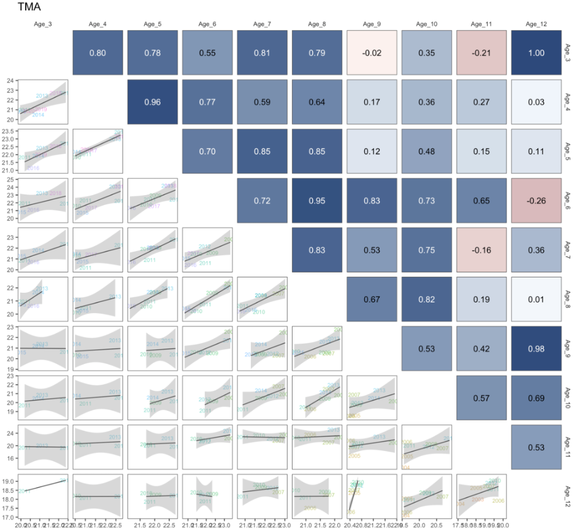
```

```{r consisFTN}
#| echo: false
#| warnings: FALSE
#| messages: FALSE
#| label: fig-consisFTN
#| fig.cap: "Cohort consistency over different ages based on log-abundance from the bottom-trawl survey data for pollock in recent years for FTNIRs  age estimates. The cohorts are shown in the labels."
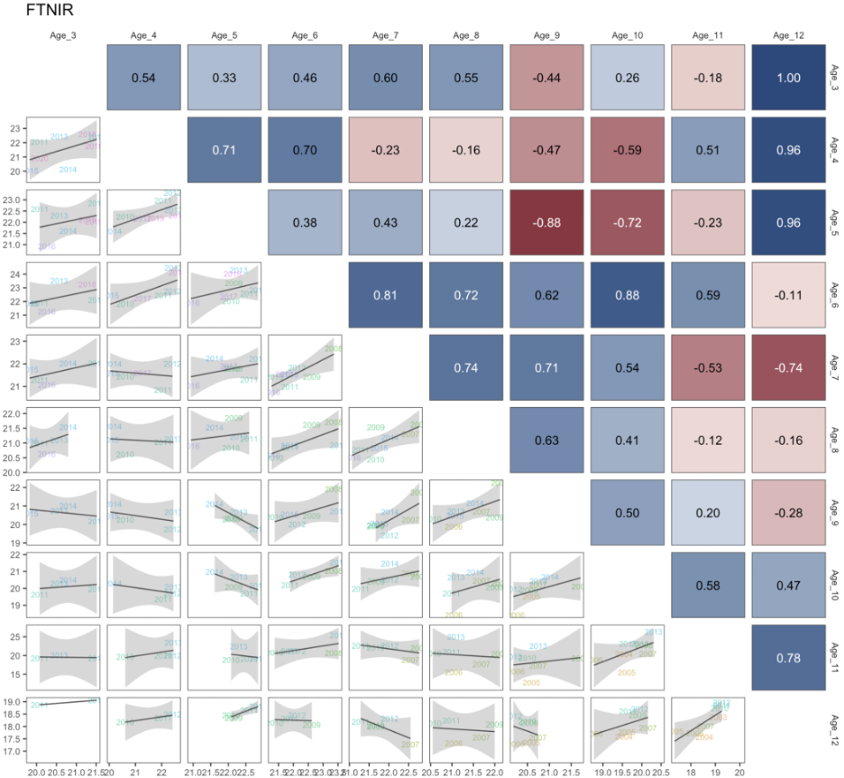
```

When preparing the data for the assessment, we plotted out the proportions-at-age for the
TMA data and noted the differences in the estimates using the FTNIRs age estimates
(@fig-proportionsFSH, @fig-proportionsBTS, and @fig-proportionsATS). Other preparations
involved estimating the age-determination errors for each method following that of
@punt2008. For the FTNIRs data, we optionally estimated separate age-estimation error
matrices by gear type. The appearance of the fleet-aggregated and fleet-specific input
data files is shown in @fig-dataFile.

```{r proportionsFSH}
#| echo: false
#| warnings: FALSE
#| messages: FALSE
#| label: fig-proportionsFSH
#| fig.cap: "Proportions at age for recent years for the fishery data where the columns represent the traditional microscope age estimates (TMA)  compared to the FTNIRs   age estimates (lines for the red-outlined panels)."
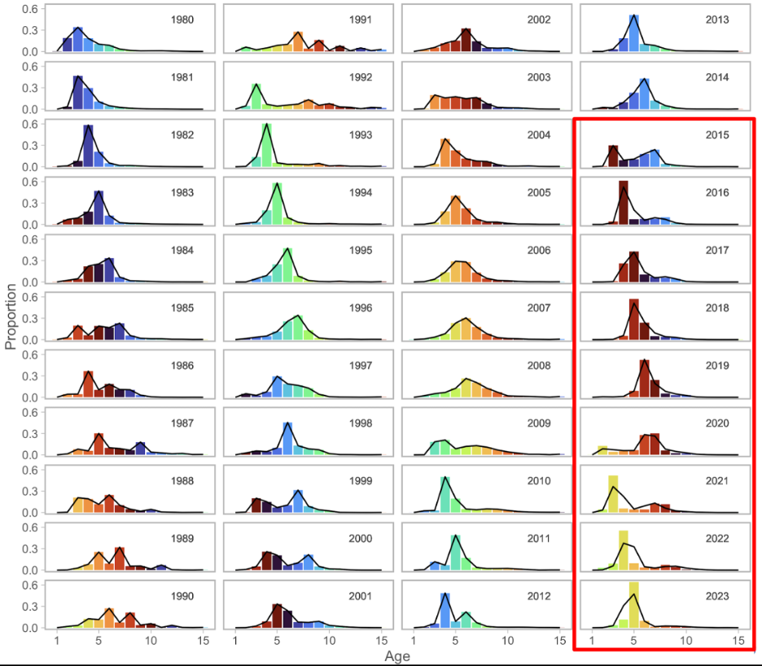
```

```{r proportionsBTS}
#| echo: false
#| warnings: FALSE
#| messages: FALSE
#| label: fig-proportionsBTS
#| fig.cap: "Proportions at age for recent years for the bottom-trawl survey data where the columns represent the traditional microscope age estimates (TMA)  compared to the FTNIRs   age estimates (lines for the red-outlined panels)."
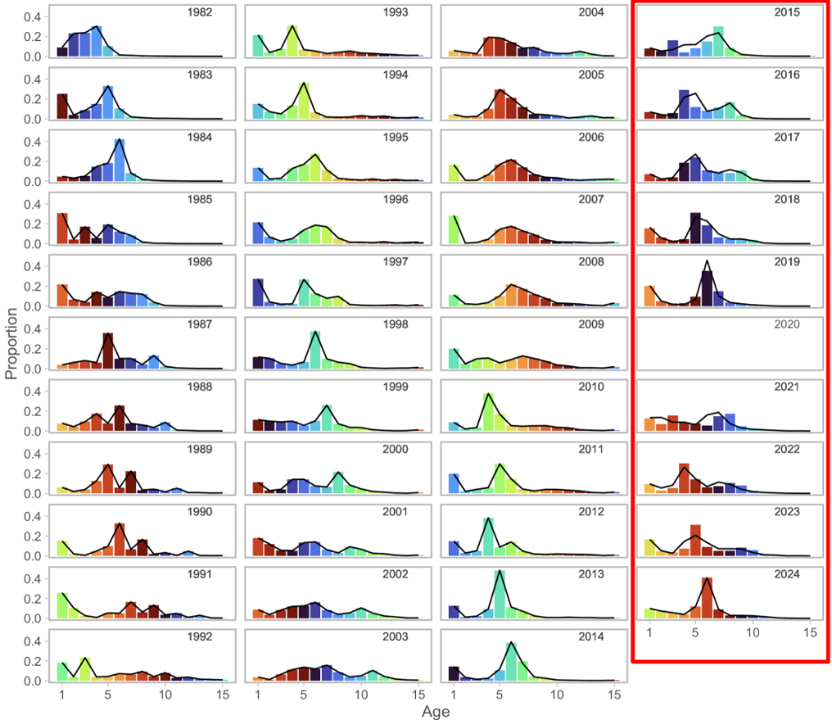
```

```{r proportionsATS}
#| echo: false
#| warnings: FALSE
#| messages: FALSE
#| label: fig-proportionsATS
#| fig.cap: "Proportions at age for recent years for the acoustic-trawl survey data where the columns represent the traditional microscope age estimates (TMA)  compared to the FTNIRs   age estimates (lines for the red-outlined panels)."
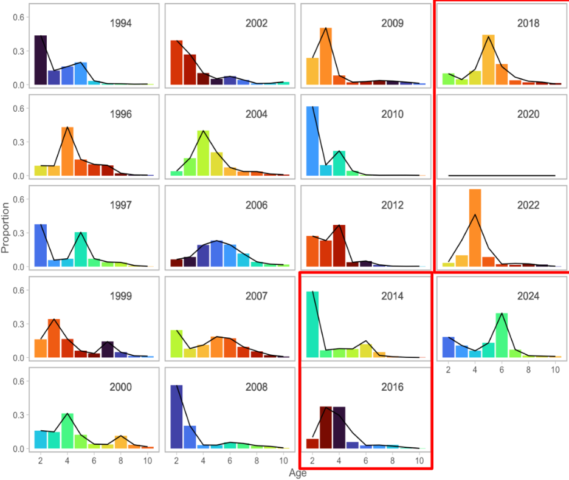
```

```{r dataFile}
#| echo: false
#| warnings: FALSE
#| messages: FALSE
#| label: fig-dataFile
#| fig.cap: "Schematic of input datafile showing the breakout of the fleet-specific FTNIRs age-error matrices (right panel) compared to that where the global FTNIRs age-error matrices are used (left panel). "
knitr::include_graphics("figs/dataFile.png")
```

For the assessment model, the alternatives are shown based on the coverage of data and
availability among types of ageing is shown in @fig-dataExtent. These figures are intended
to show what data are available for the model testing and the different ways of treating
age determination error matrices.

```{r data}
#| echo: false
#| warnings: FALSE
#| messages: FALSE
#| label: fig-dataExtent
#| fig.cap: "Data extent by age composition for the models with FTNIRs age estimates. The data types are for the Fishery, bottom trawl survey (BTS), and acoustic trawl survey (ATS) and the years of coverage are shown in the x-axis."
# Sample data
if (do_ft) {
  df <- data.frame(
    type = factor(c("Fishery-TMA", "Fishery-FTN", "BTS-TMA", "BTS-FTN", "ATS-TMA", "ATS-FTN"),
      levels = c("Fishery-TMA", "Fishery-FTN", "BTS-TMA", "BTS-FTN", "ATS-TMA", "ATS-FTN")
    ),
    start_year = c(1964, 2016, 1982, 2014, 1994, 2014),
    end_year = c(2015, 2023, 2013, 2023, 2013, 2023)
  )
  # Plot
  ggplot(df, aes(y = type, color = type)) +
    geom_segment(aes(x = start_year, xend = end_year, y = type, yend = type),
      linewidth = 5
    ) +
    scale_x_continuous(breaks = seq(1960, 2025, 5)) +
    theme_minimal() +
    theme(legend.position = "none") +
    labs(title = "Coverage of years by type, EBS pollock", x = "Years", y = "Type")
  thisyr <- 2024
  nextyr <- thisyr + 1
  dec_tab_ord <<- 1:8
  mod_names <- c("2024 TMA", "Base", "FT-NIR fleets aggregated", "FT-NIR fleet-specific")
  mod_dir <- c("lastyrdb", "lastyrdbae", "ftnir1", "ftnir2")
  ftn_lst <- get_results(rundir = here::here("runs"))
  # source(here::here("R","pm_CIE.R"))
  saveRDS(ftn_lst, here::here("runs", "ftnir.rds"))
} else {
  ftn_lst <- readRDS(here::here("runs", "ftnir.rds"))
  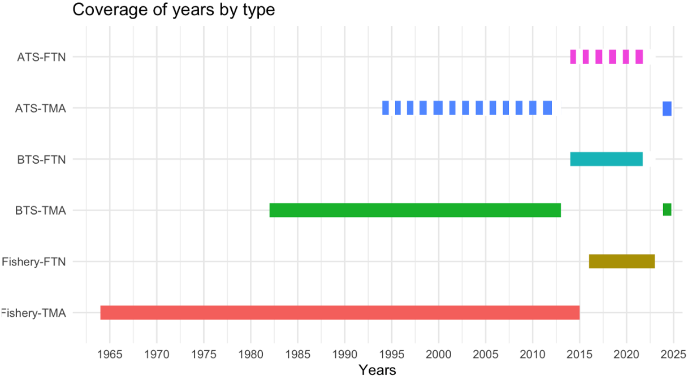
}
```

## Comparisons of fit to FT-NIRS models

The layout of model runs comparing the traditional microscope ages (TMA) with the FT-NIRS
ages is shown in @tbl-ftn_runs. The models are run with the FT-NIRS data with different
age-error matrix specficiations. The model fits to the data are shown in @tbl-modfits. The
table shows the goodness-of-fit

```{r ftn_runs}
#| echo: false
#| warnings: FALSE
#| label: tbl-ftn_runs
#| tbl-cap: "Configuration of different model options testing the impact of different treatment of the age composition data and ageing error."

df <- read_csv(here::here("doc", "data", "ftn_runs.csv"))
gt(df) %>%
  # Replace NA values with blank
  fmt_missing(
    columns = everything(),
    missing_text = ""
  ) %>%
  # Center align all columns' content
  cols_align(
    align = "center",
    columns = everything()
  ) %>%
  tab_spanner(
    label = "Model description",
    columns = -1 # All columns except the first
  ) %>%
  # Optional: Add other styling as needed
  tab_options(
    table.font.size = px(12),
    column_labels.font.weight = "bold"
  )
```

```{r modfits}
#| echo: false
#| results: asis
#| warnings: FALSE
#| messages: FALSE
#| label: tbl-modfits
#| tbl-cap: "Goodness-of-fit measures to primary data for different data and age-error applications. RMSE=root-mean square log errors, NLL=negative log-likelihood, SDNR=standard deviation of normalized residuals, Eff. N=effective sample size for composition data). See text for incremental model descriptions."

gt_table <- gt::gt(tab_fit(ftn_lst[c(2:4)])) #|>
numeric_cols <- 2:4 # Specify the numeric columns to format
target_rows <- c(8:21)
for (col in numeric_cols) {
  gt_table <- gt_table %>%
    fmt_number(
      columns = col,
      rows = target_rows,
      decimals = 0,
      use_seps = TRUE
    )
}
gt_table %>%
  tab_style(
    style = cell_borders(sides = "top", weight = px(2), color = "black"),
    locations = cells_column_labels()
  ) %>%
  tab_style(
    style = cell_borders(sides = "bottom", weight = px(2), color = "black"),
    locations = cells_body(rows = c(4, 7, 10, 18, 21))
  )
```

```{r ftn_ref}
#| results: asis
#| output: asis
#| echo: false
#| messages: FALSE
#| label: tbl-ftn_ref
#| tbl-cap: "Goodness-of-fit measures to primary data for different data and age-error applications. RMSE=root-mean square log errors, NLL=negative log-likelihood, SDNR=standard deviation of normalized residuals, Eff. N=effective sample size for composition data). See text for incremental model descriptions."
library(xtable)

# Mgt quants by final
df <- NULL
mod_scen <- c(2:4)
for (ii in mod_scen) {
  x <- ftn_lst[[ii]]
  ssb <- x$nextyrssbs
  names(ssb) <- paste0("${B}_{", nextyr, "}$")
  ssbcv <- round(x$nextyrssb.cv, 2)
  names(ssbcv) <- paste0("$CV_{B_{", nextyr, "}}$")
  Bmsy <- x$bmsys
  names(Bmsy) <- "$B_{MSY}$"
  Bmsycv <- round(x$bmsy.cv, 2)
  names(Bmsycv) <- "$CV_{B_{MSY}}$"
  spr <- paste0(round(x$sprmsy * 100, 0), "\\%")
  names(spr) <- "SPR rate at $F_{MSY}$"
  b35 <- x$b35s
  names(b35) <- paste0("$B_{35\\%}$")
  pbmsy <- paste0(round(100 * x$ssb1 / x$bmsy, 0), "\\%")
  names(pbmsy) <- paste0("${B}_{", nextyr, "}/B_{MSY}$")
  bzero <- x$b0s
  names(bzero) <- paste0("$B_0$")
  dynb0 <- x$dynb0s
  names(dynb0) <- paste0("Est. $B_{", thisyr, "} / B_{", thisyr, ",no fishing}$")
  b_bmsy <- paste0(round(x$curssb / x$bmsy * 100, 0), "\\%")
  names(b_bmsy) <- paste0("$B_{", thisyr, "} / B_{MSY}$")
  steep <- round(x$steep, 2)
  names(steep) <- "Steepness"
  v <- c(ssb, ssbcv, Bmsy, Bmsycv, pbmsy, bzero, b35, spr, steep, dynb0, b_bmsy)
  df <- cbind(df, v)
}
df <- data.frame(rownames(df), df, row.names = NULL)
names(df) <- c("Component", names(ftn_lst[mod_scen]))
gt(df) |> fmt_markdown()

#tab <- xtable(df, caption = "\\label{tbl:ressumm}Summary of model results and the stock condition for EBS pollock. Biomass units are thousands of t.", label = "tbl:ressumm", digits = 3, align = paste0("ll", strrep("r", length(mod_scen))))
# tab <- xtable(df, caption = tabcap[28], digits = 3,align=paste0("ll",strrep("r",length(mod_scen))) )
#print(tab, caption.placement = "top", include.rownames = FALSE, sanitize.text.function = function(x) { x }, comment = FALSE)

```

```{r mod_fit_agg_comp}
#| echo: false
#| warnings: FALSE
#| messages: FALSE
#| label: fig-mod_fit_agg_comp
#| fig.cap: "One-step ahead residuals for different model specifications for the fishery composition data"
# Set working directory & plot save directory
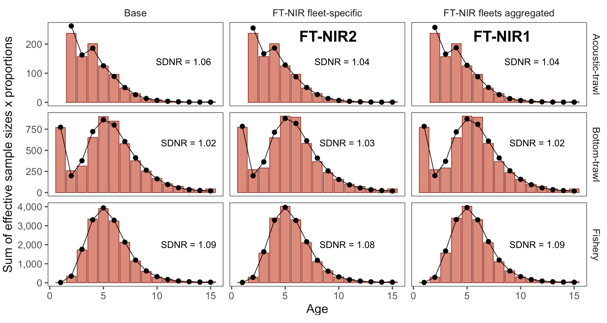
```

```{r fish_osa}
#| echo: false
#| warnings: FALSE
#| messages: FALSE
#| label: fig-bts_fish
#| fig.cap: "One-step ahead residuals for different model specifications for the fishery composition data"
# Set working directory & plot save directory
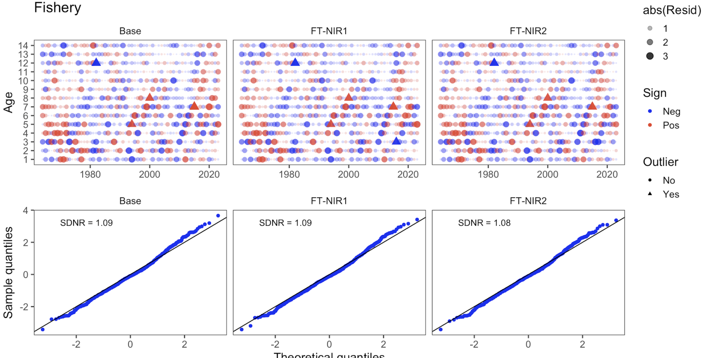
```

```{r bts_osa}
#| echo: false
#| warnings: FALSE
#| messages: FALSE
#| label: fig-bts_osa
#| fig.cap: "One-step ahead residuals for different model specifications for the bottom-trawl survey composition data"
# Read in proportions & shape for plotting
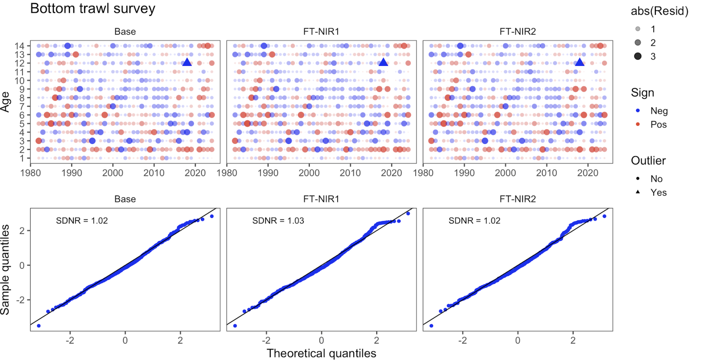
```

```{r ats_osa}
#| echo: false
#| warnings: FALSE
#| messages: FALSE
#| label: fig-ats_osa
#| fig.cap: "One-step ahead residuals for different model specifications for the acoustic-trawl survey composition data"
# Set working directory & plot save directory
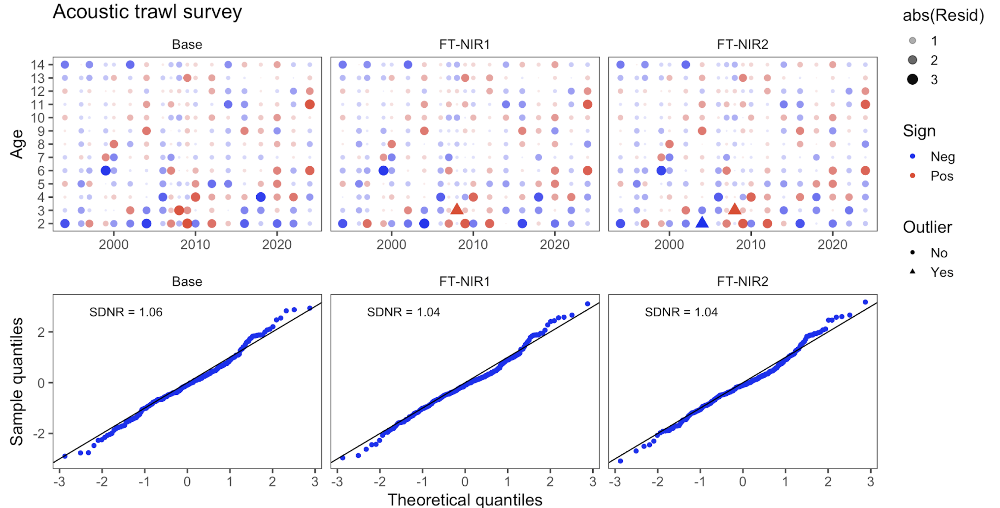
```

```{r comp_bts}
#| echo: false
#| warnings: FALSE
#| messages: FALSE
#| label: fig-comp_bts
#| fig.cap: "Model results comparing last year's selected model -2021)"
# Set working directory & plot save directory
```

```{r comp_fsh}
#| echo: false
#| warnings: FALSE
#| messages: FALSE
#| label: fig-comp_fsh
#| fig.cap: "Model results comparing last year's selected model -2021)"
# Read in proportions & shape for plotting
```

```{r comp_ats}
#| echo: false
#| warnings: FALSE
#| messages: FALSE
#| label: fig-comp_ats
#| fig.cap: "Model results comparing last year's selected model -2021)"
# Set working directory & plot save directory
```

# Leave-one-out survey sensitivity analysis

Here we present model runs that downweight one or more sources of survey data at a time.  @tbl-loo_runs shows the combinations of data types included for this analysis, which includes six model runs: (1) drop all Acoustic Trawl Survey (ATS) data (age 1 survey index, age 2+ survey biomass index, and age composition data), (2) drop the ATS age composition data, (3) drop the Acoustic Vessels of Opportunity (AVO) data (survey biomass index), (4) drop all Eastern Bering Sea Trawl Survey (BTS) data (age 1+ survey biomass index and age composition data), (5) drop the BTS age composition data, and (6) drop all survey biomass indices (BTS, ATS, and AVO survey biomass indices). 
The ATS age 1 data are included as a separate survey index in the assessment model, while BTS age 1 data are included with the age composition data in the multinomial objective function component.

```{r loo_runs}
#| echo: false
#| warnings: FALSE
#| messages: FALSE
#| label: tbl-loo_runs
#| tbl-cap: "Configuration of different model options testing the impact of different data components"
if (do_loo) {
  thisyr <- 2024
  nextyr <- thisyr + 1
  dec_tab_ord <<- 1:8
  mod_names <- c(
    "2024 accepted",
    "Drop BTS", 
    "Drop ATS ", 
    "Drop AVO ", 
    "Drop indices",
    "Drop BTS age ", 
    "Drop ATS age " 
  )
  mod_dir <- c(
    "lastyr",
    "loo_bts_all",
    "loo_ats_all",
    "loo_avo",
    "loo_srv_indices",
    "loo_bts_comp",
    "loo_ats_comp"
  )
  loo_lst <- get_results(rundir = here::here("runs"))
  # source(here::here("R","pm_CIE.R"))
  saveRDS(loo_lst, here::here("runs", "loo.rds"))

} else {
  loo_lst <- readRDS(here::here("runs", "loo.rds"))
}

  #do some plots
  p1 <- plot_ssb(loo_lst, xlim = c(1964, 2024), breaks = seq(1964, 2024, 4))
  ggsave(filename = here::here("doc", "figs", "loo_ssb.png"), plot = p1, width = 8, height = 4, units = "in", device = "png")
  
  p1b<-plot_ssb_rel(loo_lst, xlim = c(1964, 2024), breaks = seq(1964, 2024, 4))
  ggsave(filename = here::here("doc", "figs", "loo_rel_ssb.png"), plot = p1b, width = 8, height = 4, units = "in", device = "png")
  
  #this one is pretty ugly:
  p2<-plot_recruitment(loo_lst, xlim = c(1964, 2024))
  ggsave(filename = here::here("doc", "figs", "loo_recruits.png"), plot = p2, width = 15, height = 5, units = "in", device = "png")

#plot the indices:  
  p3<-plot_bts(loo_lst,error_bars = FALSE)
    ggsave(filename = here::here("doc", "figs", "loo_bts_index.png"), plot = p3, width = 8, height = 4, units = "in", device = "png")
  
  p4<-plot_ats(loo_lst,error_bars = FALSE)
  ggsave(filename = here::here("doc", "figs", "loo_ats_index.png"), plot = p4, width = 8, height = 4, units = "in", device = "png")
  
  p5<-plot_avo(loo_lst,error_bars = FALSE)
  ggsave(filename = here::here("doc", "figs", "loo_avo_index.png"), plot = p5, width = 8, height = 4, units = "in", device = "png")
  
#do some tables  
df <- read_csv(here::here("doc", "data", "loo_runs.csv"))
gt::gt(df) %>%
  # Replace NA values with blank
  fmt_missing(
    columns = everything(),
    missing_text = ""
  ) %>%
  # Center align all columns' content
  cols_align(
    align = "center",
    columns = everything()
  ) %>%
  tab_spanner(
    label = "Model description",
    columns = -1 # All columns except the first
  ) %>%
  # Optional: Add other styling as needed
  tab_options(
    table.font.size = px(12),
    column_labels.font.weight = "bold"
  )
```

Among these models, when downweighting the BTS data, the model estimates of spawning
biomass changed in trends @fig-loo-ssb . The model estimates of recruitment were less
variable across sensitivity runs, but estimates differed the most from the 2024 accepted model when all BTS data and BTS age composition data were dropped @fig-loo-recruitment. The relative fits to the different indices by
data component ommission show that the model is relatively insensitive to data being
excluded (see @fig-loo-bts-index, @fig-loo-ats-index, and @fig-loo-avo-index). The
consistency can also be noted in the goodness-of-fit measures in @tbl-loo_fits. The table
shows several measures of goodness-of-fit for components that are dropped successively.

In conclusion, the data sources suggest a good level of consistency driving the
trends-- there appears to be relatively low levels of conflict between data sources. This is likely due
to the constant natural mortality-at-age, highly precise fishery catch-at-age, and estimation of time-varying fishery selectivity. That is,
the traditional "VPA" approach of back-calculating the abundance based on the numbers
caught results in a relatively consistent estimate of the population size. The importance
of the survey data can be seen in some of the reference calculations where the uncertainty
increases dramatically and the stock-status perception is quite different across sensitivity runs @tbl-loo_ref. Most dramatically, dropping all survey indices led to a CV in "$B_{MSY}$" estimates of 1.26 as compared to 0.13 in the 2024 accepted model. 

```{r loo relative ssb}
#| echo: false
#| warnings: FALSE
#| messages: FALSE
#| label: fig-loo-ssb
#| fig.cap: "Comparison of spawning biomass (SSB) relative to the 2024 accepted model for models that downweight one data source at a time"
knitr::include_graphics(here::here("doc", "figs", "loo_rel_ssb.png"))
```

```{r loo recruitment}
#| echo: false
#| warnings: FALSE
#| messages: FALSE
#| label: fig-loo-recruitment
#| fig.cap: "Comparison of recruitment estimates for models that downweight one data source at a time"
knitr::include_graphics(here::here("doc", "figs", "loo_recruits.png"))
```

```{r loo bts index}
#| echo: false
#| warnings: FALSE
#| messages: FALSE
#| label: fig-loo-bts-index
#| fig.cap: "Comparison of fits to the Eastern Bering Sea Bottom Trawl Survey (BTS) biomass index for models that downweight one data source at a time"
knitr::include_graphics(here::here("doc", "figs", "loo_bts_index.png"))
```

```{r loo ats index}
#| echo: false
#| warnings: FALSE
#| messages: FALSE
#| label: fig-loo-ats-index
#| fig.cap: "Comparison of fits to the Acoustic Trawl Survey (ATS) biomass index for models that downweight one data source at a time"
knitr::include_graphics(here::here("doc", "figs", "loo_ats_index.png"))
```

```{r loo avo index}
#| echo: false
#| warnings: FALSE
#| messages: FALSE
#| label: fig-loo-avo-index
#| fig.cap: "Comparison of fits to the Acoustic Vessels of Opportunity (AVO) biomass index for models that downweight one data source at a time"
knitr::include_graphics(here::here("doc", "figs", "loo_avo_index.png"))
```

```{r loo_fits}
#| echo: false
#| warnings: FALSE
#| messages: FALSE
#| label: tbl-loo_fits
#| tbl-cap: "Goodness-of-fit measures to primary data for leave-one-out model sensitivity runs. RMSE=root-mean square log errors, NLL=negative log-likelihood, SDNR=standard deviation of normalized residuals, Eff. N=effective sample size for composition data). See text for incremental model descriptions."
(tab_fit(loo_lst[c(1:7)])) #|>
gt_table <- gt::gt(tab_fit(loo_lst[c(1:7)])[1:10,]) #|>
numeric_cols <- 2:8 # Specify the numeric columns to format
target_rows <- c(8:10)
for (col in numeric_cols) {
  gt_table <- gt_table %>%
    fmt_number(
      columns = col,
      rows = target_rows,
      decimals = 0,
      use_seps = TRUE
    )
}
names(gt_table)
gt_table %>% 
  tab_style(
    style = cell_borders(sides = "top", weight = px(2), color = "black"),
    locations = cells_column_labels()
  ) %>%
  tab_style(
    style = cell_borders(sides = "bottom", weight = px(2), color = "black"),
    locations = cells_body(rows = c(4, 7, 10))
    #locations = cells_body(rows = c(4, 7, 10, 18, 21))
  )
```

```{R}
#| echo: false
#| results: asis
#| output: asis
#| messages: FALSE
#| label: tbl-loo_ref
#| tbl-cap: "Estimated derived quantities and selected corresponding CVs for leave-one-out sensitivity analysis runs. See text for incremental model descriptions."
df <- NULL
mod_scen <- c(1:7)
for (ii in mod_scen) {
  x <- loo_lst[[ii]]
  ssb <- x$nextyrssbs
  names(ssb) <- paste0("${B}_{", nextyr, "}$")
  ssbcv <- round(x$nextyrssb.cv, 2)
  names(ssbcv) <- paste0("$CV_{B_{", nextyr, "}}$")
  Bmsy <- x$bmsys
  names(Bmsy) <- "$B_{MSY}$"
  Bmsycv <- round(x$bmsy.cv, 2)
  names(Bmsycv) <- "$CV_{B_{MSY}}$"
  spr <- paste0(round(x$sprmsy * 100, 0), "\\%")
  names(spr) <- "SPR rate at $F_{MSY}$"
  b35 <- x$b35s
  names(b35) <- paste0("$B_{35\\%}$")
  pbmsy <- paste0(round(100 * x$ssb1 / x$bmsy, 0), "\\%")
  names(pbmsy) <- paste0("${B}_{", nextyr, "}/B_{MSY}$")
  bzero <- x$b0s
  names(bzero) <- paste0("$B_0$")
  dynb0 <- x$dynb0s
  names(dynb0) <- paste0("Est. $B_{", thisyr, "} / B_{", thisyr, ",no fishing}$")
  b_bmsy <- paste0(round(x$curssb / x$bmsy * 100, 0), "\\%")
  names(b_bmsy) <- paste0("$B_{", thisyr, "} / B_{MSY}$")
  steep <- round(x$steep, 2)
  names(steep) <- "Steepness"
  v <- c(ssb, ssbcv, Bmsy, Bmsycv, pbmsy, bzero, b35, spr, steep, dynb0, b_bmsy)
  df <- cbind(df, v)
}
df <- data.frame(rownames(df), df, row.names = NULL)
names(df) <- c("Estimated Quantity", names(loo_lst[mod_scen]))
gt(df) |> fmt_markdown()
```

# Alternative assessment software

## Stock-synthesis 3

Stock synthesis 3 (SS3) is a well establish framework and is common in many diverse
settings. (@methot2013) For EBS pollock, we extended an initial framework based on the
configurations used for Pacific hake (@hake2024) since there are many similarities in the
type of data available. Namely, empirical weight-at-age, acoustic survey data, and indices
of 1-year olds.

Within the SS3 framework, we evaluated different configurations for fishery selectivity
variability (@fig-ss3). These showed the impact on the uncertainty and stock trends
(@fig-synts-1 for SSB and @fig-synts-2 for recruitment). 

```{r }
#| echo: false
#| warnings: FALSE
#| messages: FALSE
#| label: fig-ss3
#| fig.cap: "Model results comparing three different SS3 model configurations. The models are the base model (Base), the constrained model (Constrained), and the flexible model (Flexible)."
ss_sel <- rbind(r1$sel, r2$sel, r3$sel) # ,r4$sel)#,r5$sel)
Plot_Sel(ss_sel) + ggthemes::theme_few(base_size = 9)
```


```{r }
#| label: fig-synts
#| fig-cap: "Model results comparing the time-series for three different SS3 model configurations. The models are the base model (Base), the constrained model (Constrained), and the flexible model (Flexible)."
#| echo: false
#| warnings: FALSE
#| messages: FALSE
#|
all_ts <- rbind(r1$ts, r2$ts, r3$ts)
(Plot_SSB(all_ts) + ggthemes::theme_few(base_size = 19))
(Plot_Rec(all_ts) + ggthemes::theme_few(base_size = 19))
# all_sel <- rbind(pm_run$sel,r1$sel,c2$sel)#,gp_run$sel)
# ss_sel  <- rbind(r1$sel,r2$sel,r3$sel)#,r4$sel)#,r5$sel)
```

Comparing the "base" SS3 model with the pollock model showed different patterns in 
the early periods for 
selectivity (@fig-ss3vpmsel) but slight differences in SSB and recruitment estimates
(@fig-pmvss3-1 and @fig-pmvss3-2).

```{r }
#| label: fig-ss3vpmsel
#| echo: false
#| warnings: FALSE
#| messages: FALSE
#| fig.cap: "Model results comparing selectivity estimates between the base SS3 model configuration and the pollock model accepted in 2024."
ss_sel <- rbind(pm_run$sel, r1$sel) # ,r4$sel)#,r5$sel)
Plot_Sel(ss_sel) + ggthemes::theme_few(base_size = 11)
```


```{r }
#| label: fig-pmvss3
#| fig.cap: "Model results comparing the base SS3 model configuration with the model used for pollock in 2024."
#| echo: false
#| warnings: FALSE
#| messages: FALSE
#|
all_ts <- rbind(r1$ts, pm_run$ts)
(Plot_SSB(all_ts) + ggthemes::theme_few(base_size = 19))
(Plot_Rec(all_ts) + ggthemes::theme_few(base_size = 19))
# all_sel <- rbind(pm_run$sel,r1$sel,c2$sel)#,gp_run$sel)
# ss_sel  <- rbind(r1$sel,r2$sel,r3$sel)#,r4$sel)#,r5$sel)
```

## SAM

The Stock Assessment Model (SAM) is a state-space model written in TMB (@nielsen2014,
@nielsen2021). We attempted to configure the settings to have similar levels of
flexibility to the reference model used for catch advice in 2024 and the settings and
results can be found
[here](https://github.com/noaa-afsc/EBS_pollock/tree/main/runs/SAM/poll24 "SAM model runs")).
Comparing "selectivity" in the SAM model to the reference model, we see broad similarities
but slightly lower inter-annual variability in the SAM run (@fig-sam).

```{r}
#| echo: false
#| warnings: FALSE
#| messages: FALSE
#| label: fig-sam
#| fig.cap: "Model results comparing last year's model with the SAM model."
#|
sam_sel <- rbind(sam_run$sel, pm_run$sel) # ,r4$sel)#,r5$sel)
Plot_Sel(sam_sel) + ggthemes::theme_few(base_size = 9)
# all_ts <- rbind(pm_run$ts,r1$ts,c1$ts)
# ss_sel  <- rbind(r1$sel,r2$sel,r3$sel)#,r4$sel)#,r5$sel)
```

The spawning biomass trend largely overlaps in the uncertainty between the SAM
and pollock model (@fig-samts-1). The recruitment estimates are similar as well
(@fig-samts-2). 

```{r samts}
#| label: fig-samts
#| fig.cap: "Model results comparing last year's model with the SAM model for spawning biomass (top) and recruitment at age 1 (bottom)."
#| echo: false
#| warnings: FALSE
#| messages: FALSE
#|
all_ts <- rbind(pm_run$ts, r1$ts, c1$ts, sam_run$ts) # ,gp_run$sel)
(Plot_SSB(rbind(sam_run$ts, pm_run$ts)) + ggthemes::theme_few(base_size = 12))
(Plot_Rec(rbind(sam_run$ts, pm_run$ts)) + ggthemes::theme_few(base_size = 12))
# all_sel <- rbind(pm_run$sel,r1$sel,c2$sel)#,gp_run$sel)
# ss_sel  <- rbind(r1$sel,r2$sel,r3$sel)#,r4$sel)#,r5$sel)
```

## Other models in development

The "Woods Hole Assessment model" (WHAM) is written in TMB and is a fully state-space
model (@stock2021). Initial trials are available on the [github
repository](https://github.com/noaa-afsc/EBS_pollock/tree/main/runs/wham).

The Rceattle model is developed by the AFSC and is written in TMB (@adams2022). The model
is an extension of the ADMB version used for multi-species model in the Eastern Bering Sea
(@jurado2005, @holsman2024) and has a number of newer features. It is generalizable to
include a variety of data types using lengths and can be set up for species tracked for
sexual dimorphic growth and other processes. Since it has been recast into TMB, it allows
for the ability to specify random effects in a number of processes. One development of the
model is to have the flexibility to bridge among extant single-species modeling platforms
by using it in "single-species" mode. To illustrate that, we introduce an application of
Rceattle to the EBS pollock data set. The model is not yet fully developed, but we present
preliminary results for consideration. Initial runs are favorable but further work is
needed to bridge the selectivity options (@fig-rceattle).

```{r}
#| label: fig-rceattle
#| fig.cap: "Model results comparing last year's model with the Rceattle model."
#| echo: false
#| warnings: FALSE
#| messages: FALSE


cea_sel <- rbind(c1$sel, c2$sel, pm_run$sel) # ,r4$sel)#,r5$sel)
Plot_Sel(cea_sel) + ggthemes::theme_few(base_size = 9)
```

```{r}
#| label: fig-rceattle_ts
#| echo: false
#| warnings: FALSE
#| messages: FALSE
#| fig.cap: "Model results comparing last year's model with the Rceattle model."

all_ts <- rbind(pm_run$ts, c1$ts, c2$ts)
Plot_SSB(all_ts) + ggthemes::theme_few(base_size = 19)
```

```{r}
#| echo: false
#| warnings: FALSE
#| messages: FALSE
#| label: fig-all
#| fig.cap: "Model results comparing last year's model with the Rceattle model."
all_sel <- rbind(pm_run$sel, r1$sel, c1$sel, sam_run$sel) # ,gp_run$sel)
Plot_Sel(all_sel) + ggthemes::theme_few(base_size = 9)
```

```{r}
#| echo: false
#| warnings: FALSE
#| messages: FALSE
#| label: fig-all_ts
#| fig.cap: "Model results comparing last year's model with the Rceattle model."
all_ts <- rbind(pm_run$ts, r1$ts, c1$ts)
Plot_SSB(rbind(c1$ts, pm_run$ts, sam_run$ts)) + ggthemes::theme_few(base_size = 19)
Plot_Rec(rbind(c1$ts, pm_run$ts, sam_run$ts)) + ggthemes::theme_few(base_size = 19)
```

## Spatial modeling of the EBS pollock stock

In development is a spatially disaggregated general model by colleagues at the Auke Bay
lab and the University of Alaska, Fairbanks (@spock). This general model which has
flexibility to specify regions and a variety of options including random effects. While
this model is not yet fully developed, we present preliminary results here. The model is
written in RTMB and is similar to the WHAM model. We pursue this to explore the potential
for a more flexible model that can be used for more explicit considerations of stocks
linked to different regions (e.g., the US and Russian portions of the EBS). Also, this
model to add sex-specificity and random effects (@cheng2025).

@fig-spock_sel shows the model results comparing time-varying selectivity whereas
@fig-spock_ts-1 shows the model results time series. The difference in the age-1 recruits (@fig-spock_ts-2) is
likely due to the fact that the spatial model currently has constant M-at-age compared to
the base model.

```{r}
#| echo: false
#| warnings: FALSE
#| messages: FALSE
#| label: fig-spock_sel
#| fig.cap: "Model results comparing last year's model with the SPock model."
#|
all_sel <- rbind(pm_run$sel, spock$sel) # , c2$sel)#,gp_run$sel)
Plot_Sel_age(all_sel)
```

```{r}
#| echo: false
#| warnings: FALSE
#| messages: FALSE
#| label: fig-spock_ts
#| fig.width: 8
#| fig.height: 4
#| fig.cap: "Model results comparing last year's model with the SPock model."
# all_ts <- rbind(pm_run$ts,spock$ts,r2$ts)
all_ts <- rbind(pm_run$ts, spock$ts)
# all_ts <- rbind(spock$ts,r2$ts)
# all_ts <- rbind(pm_run$ts,r2$ts)
# ggplotly(Plot_SSB(all_ts) + ggthemes::theme_few(base_size = 19))
# library(plotly)
(Plot_SSB(all_ts) + ggthemes::theme_few(base_size = 19))
# htmlwidgets::saveWidget(p1, "figs/plot1.html", selfcontained = TRUE)
# Plot_Rec(rbind(pm_run$ts,spock$ts,r2$ts), width=2,
Plot_Rec(all_ts,
  width = 2,
  size = 3, alpha = .3
) + ggthemes::theme_few(base_size = 19)
```

# Bottom-trawl survey spatial distribution modeling

## Abundance Index Methods

For model-based indices in the Bering Sea, we fitted observations of numerical abundance
or biomass per unit area (where the choice of abundance or biomass varied by stock at the
request of assessors) from all sampling locations in the 83-112 bottom trawl survey of the
EBS, 1982-2025, including:

-   Exploratory northern extension samples in 2001, 2005, and 2006
-   83-112 samples available in the NBS in 1982, 1985, 1988, 1991, 2010, 2017-2019,
    2021-2023, and 2025

NBS samples collected prior to 2010 and in 2018 did not follow the 20 nautical mile
sampling grid that was used in other survey years. Assimilating these unbalanced data
requires extrapolating into unsampled areas, facilitated by including a spatially varying
response to cold-pool extent [@Thorson2019]. This spatially varying coefficient term was
estimated for both linear predictors of a delta-model, and detailed comparison of results
for EBS pollock has shown that it has a small but notable effect on these indices and
resulting stock assessment outputs [@OLeary2020].

Rather than using the cold-pool covariate for yellowfin sole, we instead used the mean
bottom temperature within the inner and middle domain strata from an interpolated
temperature product. All models were fitted in the sdmTMB R package
(https://pbs-assess.github.io/sdmTMB; @Anderson2022). All environmental data used as
covariates were computed within the coldpool R package
(https://github.com/afsc-gap-products/coldpool; @Rohan2023).

We used a spatiotemporal Poisson-link delta-model [@Thorson2018] involving two linear
predictors and a gamma distribution to model positive catch rates. We predicted population
density across the entire EBS and NBS in each year, using AFSC GAP-approved prediction
grids. Spatial and spatiotemporal fields were estimated using a spatial mesh including 250
"knots" whose locations were determined using a K-means algorithm to place the knots
evenly over space, in proportion to the dimensions of the prediction grid.

While the prior VAST model was fitted with a 750 knot mesh, we found that sdmTMB models
fitted with mesh resolutions from 250-750 knots all provided extremely similar index
estimates and that reducing the number of knots dramatically improved computation time. We
estimated geometric anisotropy (how spatial autocorrelation declines with differing rates
over distance in some cardinal directions than others) and included a spatial and
spatiotemporal term for both linear predictors.

To facilitate prediction of density in regions with unsampled years, we specified that the
spatiotemporal fields were structured over time as an AR(1) process (where the magnitude
of autocorrelation was estimated as a fixed effect for each linear predictor). However, in
cases where the AR(1) correlation parameter ⍴ was estimated to be close to 1 for either
model component, the model would be collapsed into a simpler structure by specifying ⍴ =
1, i.e., modeling spatiotemporal variation as a random walk. We did not include any
temporal correlation for intercepts, which we treated as fixed effects for each linear
predictor and year. Finally, we used epsilon bias-correction to correct for
retransformation bias [@Thorson2016].

We checked model fits for convergence by confirming that the derivative of the marginal
likelihood with respect to each fixed effect was sufficiently small (less than \~ 0.001)
and that the Hessian matrix was positive definite, along with other model checks produced
by the function `sdmTMB::sanity()`. We then checked goodness of model fit by computing
Dunn-Smyth randomized quantile residuals [@Dunn1996] and visualizing these using a
quantile-quantile plot within the DHARMa R package [@Hartig2021]. We also evaluated the
distribution of these residuals over space in each year, and inspected them for evidence
of residual spatiotemporal patterns.

## Model-based Age Composition Methods

For model-based estimation of age compositions in the Bering Sea, we fitted observations
of numerical abundance-at-age at each sampling location. This was made possible by
applying a year-specific, region-specific (EBS and NBS) age-length key to records of
numerical abundance and length composition. In subcategories (combinations of year,
length, age, sex) that contained insufficient data, age composition was computed from
length composition given a globally pooled age-length key.

We computed these estimates in the tinyVAST R package
(https://vast-lib.github.io/tinyVAST; @Thorson2024), assuming a Poisson-link delta-model
[@Thorson2018] involving two linear predictors, and a gamma distribution to model positive
catch rates. We did not include any density covariates in estimation of age composition
for consistency with models used in the previous assessments and due to computational
limitations.

We estimated the spatial range assuming geometric isotropy (i.e, spatial autocorrelation
declines with equal rates over distance in all cardinal directions). We used the same
extrapolation grid as implemented for abundance indices, but here we modeled spatial and
spatiotemporal fields with a mesh with a coarser spatial resolution than the index model,
here using 50 "knots". This reduction in the spatial resolution of the model, relative to
that used for the abundance indices, was necessary due to the increased computational load
of fitting multiple age categories.

The estimates of abundance at age were bias-corrected with the same method as the
abundance index. We implemented the same diagnostics to check convergence and model fit as
those used for the abundance index. Results compared favorably among methods
(@fig-sdm_age).

Both the model-based bottom trawl index and age composition estimates were calculated
using code in the AFSC GAP model-based indices GitHub repository
(https://github.com/afsc-gap-products/model-based-indices). Design-based estimates of
bottom trawl products were calculated using code in the gapindex R package
(https://github.com/afsc-gap-products/gapindex).

```{r sdm_age}
#| echo: false
#| warnings: FALSE
#| messages: FALSE
#| label: fig-sdm_age
#| fig.cap: "Model results comparing last year's model with the sdmTMB model."

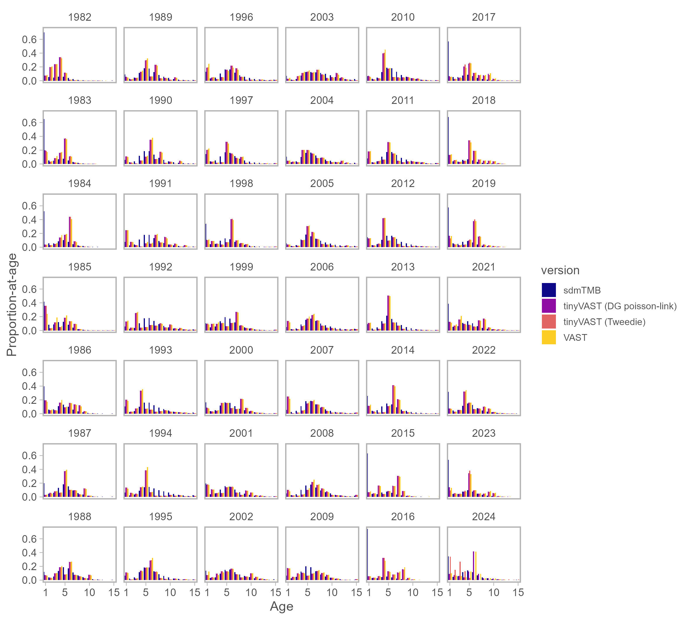
```

# References
