<!--
Editorial writing note for this document:
- Use plain language and define necessary scientific terms at first use.
- Replace jargon and unexplained abbreviations with familiar wording.
- State results, limits, and next steps in affirmative terms.
- Preserve specialized terms when they carry a precise scientific meaning.
-->

::: {.callout-note title="AI-assisted development"}
Artificial intelligence (AI) tools were used to aid document development and
model implementation. AI-assisted material was reviewed and revised by the
authors, who retain responsibility for the scientific content, code, analyses,
interpretations, and conclusions.
:::

# Summary

This working paper brings together eastern Bering Sea pollock assessment work
that resumed after the 2025 funding lapse and federal furlough. It establishes
a common review record for data preparation, model numbering, software
translations, diagnostics, projections, and responses to Scientific and
Statistical Committee (SSC) comments. The comparisons use the 1964--2024 data
basis inherited from accepted Model 23.0. New 2025 and 2026 observations will
enter the assessment after the source products, sample sizes, ageing-error
treatment, and quality-control checks are complete.

The model numbering plan separates scientific purpose from software. Model
23.0 is the accepted 2024 ADMB assessment model. Model 23.1 is the direct RTMB
translation check, and Model 23.2 is the Rceattle translation check. Model 25.0
is the RTMB development line begun in 2025, and Model 26.0 is the Rceattle
development line begun in 2026. SPoRC provides a supporting comparison across
the development lines. The Data section also separates two age-data questions:
use of FT-NIRS predicted ages and revision of the method used to expand BTS age
samples into annual proportions at age.

Model 25.0 reproduces the corrected full-age BTS ADMB bridge and supports
continued evaluation of composition fit, selectivity, and retrospective
stability. From 1978 through 2024, the matched Model 23.0 and Model 23.2 ADMB
runs have correlations of 0.994 for spawning biomass and 0.999 for age-1
recruitment; their 2024 differences are +1.12% and -9.19%, respectively. The
simple Model 26.0 Rceattle fit met the stated convergence
criteria and closely followed the Model 23.2 Rceattle-aligned ADMB bridge, with
trajectory correlations above 0.998. Its composition residuals varied less
than expected under the fitted model. Forty-seven of 50 dispersed-start fits
returned to the best solution, while three reached the same higher objective.
The repeated higher objective indicates a recurring alternative solution. All
50 simulated-data self-tests completed with convergence status OK. The lag-preserving
nine-peel retrospective produced Mohn's rho values of 0.329 for spawning
biomass, 0.211 for total biomass, 0.185 for age-1 recruitment, and -0.126 for
fishing mortality. The peels generally estimated greater biomass and
recruitment and lower fishing mortality than the full fit over the same years.
Controlled data tests for the 2020-to-2021 peel transition identified the 2021
BTS biomass index as the strongest single influence on spawning biomass, with
the 2020 fishery age composition and 2021 BTS age composition also contributing
to the revision.
These results make composition fit, the recurring alternative solution, and
retrospective stability the principal Model 26.0 evaluation priorities.

The whole-index-fleet sensitivities retained CPUE and removed BTS, ATS, or AVO
in separate refits. All three completed with convergence status OK and
positive-definite Hessians. BTS had the greatest influence: its removal reduced
2024 spawning biomass by 12.2% and increased 2024 fishing mortality by 98.7%.
Removing ATS increased 2024 spawning biomass by 11.7% and age-1 recruitment by
34.3%. Removing AVO changed each 2024 quantity by less than 7%. These severe
deletion tests show the complementary roles of the survey series and identify
BTS as the principal source of scale information.

The `spmR` projections demonstrate a reproducible handoff from Model 26.0 to
the standard seven-alternative projection workflow. Updated 2025 and 2026 data
will provide the basis for ABC, OFL, and status determinations during the
November and December 2026 review cycle. The exploratory recruitment analysis
favored the model containing age-0 late-summer sea-surface temperature; its
negative fitted pathway provides a testable in-sample association for further
biological and predictive evaluation. The bridge, convergence tests,
diagnostics, retrospective evaluation, index sensitivities, and projection
handoff support the recommendation that Model 26.0 be adopted for 2026
management advice after the updated-data run and formal Plan Team and SSC
review. Model 23.0 provides continuity through that transition. Appendix 1
preserves the SSC comments and response plan, Appendix 2 provides the
development framework for an Ecosystem and Socioeconomic Profile, and Appendix
3 documents fishery length-frequency patterns.

# Introduction

This document brings together eastern Bering Sea pollock assessment work
affected by the 2025 funding lapse and federal furlough. Routine SAFE
preparation, review, and archiving paused during that period. After work
resumed, data preparation and model development progressed on different
schedules. This report restores a single review record for the data updates,
model numbering, ADMB-to-RTMB bridge, and 2026 RTMB and Rceattle development.

The appendices preserve supporting material that informs this work.
[Appendix 1](#sec-ssc-comments) presents the main SSC comments and planned
responses and retains the earlier 2024 comments. [Appendix
2](#sec-esp-development-framework) provides the development structure for an
EBS pollock Ecosystem and Socioeconomic Profile (ESP). [Appendix
3](#sec-length-frequency-patterns) summarizes seasonal and spatial patterns in
the observed pollock length-frequency samples. Together, the main sections and
appendices connect the resumed work with the assessment review record.

# Model specifications

## Model numbering plan

The model number should identify the model's place in the review record. The
software name should be shown separately. Under this plan, **Model 23.0** is the
2024 ADMB source, **Model 23.1** is its direct RTMB translation check, and
**Model 23.2** is the Rceattle translation check. The newer model names are
**Model 25.0 (RTMB)** for the work begun in 2025 and **Model 26.0 (Rceattle)**
for the development line begun in 2026.
The flowchart shows the two numbered development lines and SPoRC's supporting
comparison role (@fig-model-numbering).

```{mermaid}
%%| label: fig-model-numbering
%%| fig-cap: "Proposed numbering and development history for EBS pollock assessment models."
%%| fig-alt: "Flowchart beginning with the Model 23.0 ADMB source used in 2024. One branch passes through the Model 23.1 RTMB translation check to Model 25.0 in RTMB, begun in 2025. A second branch passes through the Model 23.2 Rceattle translation check to Model 26.0 in Rceattle, begun in 2026. SPoRC supports comparisons with both development lines and would receive a model number if advanced as an assessment candidate."

flowchart LR
  accTitle: EBS pollock assessment model numbering and development history
  accDescr: Flowchart from the 2024 Model 23.0 ADMB source through the Model 23.1 RTMB translation check to the Model 25.0 RTMB line, and through the Model 23.2 Rceattle translation check to the Model 26.0 Rceattle line, with SPoRC supporting comparisons of the two development lines.
  A["Model 23.0<br/>2024 ADMB source"] -->|"direct translation<br/>and checks"| B["Model 23.1<br/>RTMB translation check"]
  B --> C["Model 25.0<br/>RTMB line begun in 2025"]
  A -->|"Rceattle bridge<br/>and checks"| E["Model 23.2<br/>Rceattle translation check"]
  E --> D["Model 26.0<br/>Rceattle line begun in 2026"]
  S["SPoRC<br/>supporting comparison"] -.->|"common tests"| C
  S -.->|"common tests"| D
  classDef model fill:#e8f0f7,stroke:#52616b,color:#111111
  class A,B,C,D,E,S model
```

The labels should be used as follows:

- **Model 23.0 (ADMB)** identifies the accepted source model used in 2024.
- **Model 23.1 (RTMB)** identifies the direct translation used to check that the
  new code reproduces Model 23.0. Its role is a numbered translation check,
  while Model 23.0 continues to support management advice.
- **Model 23.2 (Rceattle)** identifies the Rceattle translation check aligned
  with the modified ADMB bridge. It provides the direct reference for Model
  26.0 implementation checks.
- **Model 25.0 (RTMB)** is the public name for the RTMB assessment line begun in
  2025 at the SSC's request.
- **Model 26.0 (Rceattle)** is the public name for the Rceattle development line
  begun in 2026. List its scientific changes separately from the software
  change. Its bridge, diagnostics, retrospective behavior, and projections
  support the recommendation for its 2026 operational role. Model 23.0 provides
  continuity through the formal review transition.
- **SPoRC** remains a supporting comparison. The [single-region EBS pollock
  vignette](https://chengmatt.github.io/SPoRC/dev/articles/f_single_region_ebs_pollock_case_study.html)
  illustrates the bridge from Model 23.0 to SPoRC and identifies the current
  differences between the implementations. Research on pollock movement and
  connections between U.S. and Russian waters is progressing. A numbered model
  name would apply when SPoRC advances as an assessment candidate.

For later variants, keep the main number and add a decimal suffix, such as
26.1 or 26.2. Each suffix should represent one clearly documented change. Use
the same label in the report, tables, presentations, run folders, and archive.

# Data

## Data summary {#sec-data-summary}

The current cross-platform comparison uses the sex-combined, ages 1--15 data
basis inherited from the 2024 Model 23.0 assessment. The population time series
extends from 1964 through 2024. Fishery age compositions extend through 2023
because of the normal processing lag. The same underlying assessment
observations are translated into the ADMB, RTMB, SPoRC, and Rceattle input
structures. Each model retains its own fit calculations, sample-size
conventions, and data organization. The accepted assessment and
2024 model-evaluation documents provide the overall data lineage
[@ianelli2023a; @ianelli2024].

The basic data used across the platforms are:

- **Fishery data:** annual retained catch from 1964 through 2024, fishery age
  compositions from 1964 through 2023, empirical fishery weight at age, and
  the historical fishery catch-per-unit-effort (CPUE) index for 1965--1976.
- **Bottom-trawl survey (BTS):** the biomass index and its covariance,
  age compositions, sample sizes, and survey weight at age for 42 survey years
  during 1982--2024. The standard survey was absent in 2020. Model-based
  estimation of pollock survey indices and age compositions is described by
  @OLeary2020, and spatially structured estimation of pollock weight at age is
  described by @indivero2023.
- **Acoustic-trawl survey (ATS):** pollock abundance indices, age compositions,
  sample sizes, and weight at age for 19 survey years during 1994--2024. The
  survey series includes separate information for age-1 pollock and older
  pollock. Survey methods are documented by @honkalehto2015; current work on
  uncertainty in acoustic-trawl estimates is described by @urmy2025.
- **Supplementary abundance indices:** the acoustic vessel-of-opportunity
  (AVO) series has 18 observations during 2006--2024, and the historical CPUE
  series has 12 observations during 1965--1976. The AVO approach and recent
  reanalysis are described by @honkalehto2011 and @lauffenburger2024.
- **Biological schedules:** the models use ageing-error information, maturity,
  natural mortality, and spawning, fishery, and survey weight-at-age schedules.
  AFSC pollock ageing methods and data quality are summarized by
  @matta2026agegrowth; spatial and temporal variation in EBS pollock weight at
  age is evaluated by @indivero2023.

Across platforms, **ADMB Model 23.0** provides the accepted 2024 assessment
reference, observation schedule, and source-model settings. **RTMB Models 23.1
and 25.0** use the corrected ADMB bridge inputs directly and preserve the
complete ages 1--15 BTS composition treatment; the [RTMB data-input
documentation](https://jimianelli.github.io/rtmb_ebswp/ebs_pollock_rtmb_ebswp_assessment.html#data-inputs)
describes that translation. **SPoRC** maps the corrected bridge observations to
one fishery and four survey or index components for an independent
single-region comparison, as described in the [SPoRC EBS pollock working
paper](https://jimianelli.github.io/sporc_ebswp/). **Rceattle Model 26.0** reads
a workbook prepared from the same 1964--2024 assessment source and retains all
15 modeled ages; its data application is documented in the [Rceattle EBS
pollock report](https://noaa-afsc.github.io/ebswp_rceattle/). Each platform
retains its own internal data structure and method for measuring model fit.

The summary above describes the common 2024-terminal bridge used for model
comparison. New 2025 and 2026 observations will enter the assessment only
after their source products, sample sizes, ageing-error treatment, and quality
control have been finalized.

## Issues {#sec-age-data-issues}



# Model results

## Model 23.1 {#sec-model-23-1}

The [September 2025 ADMB-to-RTMB bridge](https://noaa-afsc.github.io/EBS_pollock/doc/Sept_2025.html#bridging-admb-to-rtmb)
documented the small ADMB changes made before checking the direct RTMB
translation. For the model numbering used here, **ADMB original = Model 23.0**
and **ADMB Modified = Model 23.1**. The second label identifies the adjusted
ADMB version used to build and check Model 23.1 in RTMB. Model 23.1 serves as a
translation check, while Model 23.0 continues to support management advice.

The spawning biomass and age-1 recruitment comparisons are reproduced in
@fig-model-23-1-admb-bridge. The source analysis attributes most of the small
differences between the series to a revised rule for fishery selectivity,
specifically the penalty applied when selectivity declines after age 6.

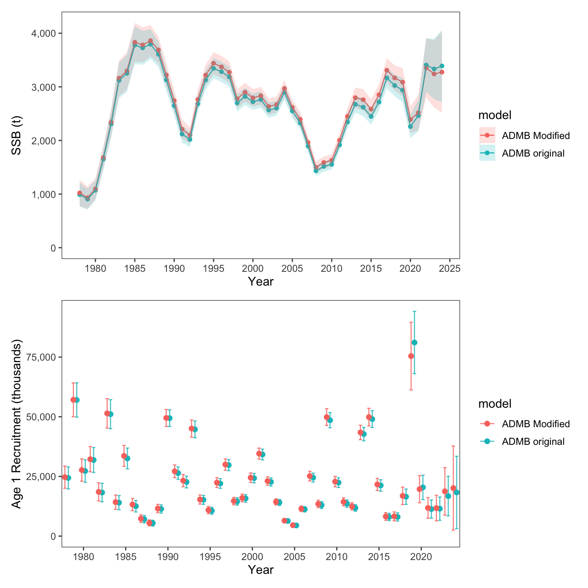{#fig-model-23-1-admb-bridge fig-alt="Two-panel comparison of Models 23.0 and 23.1 from 1978 through 2024. The upper panel shows closely tracking spawning stock biomass trajectories with uncertainty ribbons. The lower panel shows closely tracking age-1 recruitment estimates with uncertainty bars. Model 23.1 is generally slightly above Model 23.0 for spawning biomass, while recruitment differences are small and vary by year." width="100%"}

## Model 25.0 {#sec-model-25-0}

The RTMB implementation matches the corrected ADMB bridge, including the full
BTS age range, at the same best-fitting ADMB values, called maximum-likelihood
estimates. Observed and predicted BTS age compositions each cover ages 1--15
and sum to one. Integer sample sizes set their influence in the multinomial
likelihood, the fit calculation for age proportions. The total number of fish
used to scale the age composition retains its ages 2--15 definition. The
fitted BTS survey index measures biomass. Comparison with the historical
configuration shows the effect of correcting the treatment of BTS data in the
model fit.

The same corrected base model supports the one-step-ahead (OSA) checks, the
analysis fitted only to BTS data (Only-BTS sensitivity), nine retrospective
peels that remove recent years in sequence, and stock-production-model (SPM)
projections. The retrospective procedure accounts for reporting lags among
data streams and uses the previous year's selectivity curve for the final
year. Positive Mohn's rho values, which summarize the direction and size of
retrospective change, identify a stability concern for continued evaluation.
Simulation testing and review will guide future operational refinements.
Current management advice uses the accepted ADMB assessment model. The
hierarchical Form-2 results generated with SparseNUTS describe a separate
selectivity option.

### Evaluation of time-varying BTS availability {#sec-bts-availability}



## Model 26.0 {#sec-model-26-0}

### Data and simple model approach

Model 26.0 uses the common 1964--2024 bridge data described in
@sec-data-summary. This run was fitted with Rceattle version 5.23.0 from the
[`dsem-v5-integration` branch](https://github.com/grantdadams/Rceattle/tree/dsem-v5-integration),
pinned at commit
`adf22f84b399e84e3b9a707e0b3bbb1624179a27`. The version number and commit are
reported together because the run represents a branch snapshot.

The simple configuration retains non-parametric selectivity for the fishery,
acoustic vessel-of-opportunity (AVO), acoustic-trawl survey (ATS), and
historical catch-per-unit-effort series. The bottom-trawl survey (BTS) retains
the logistic curve and separate age-1 component used in the bridge. Annual
selectivity changes follow the established random-walk configuration. The 2D
age-by-year AR1 formulation remains a separate research sensitivity, allowing
this analysis to focus on the simpler assessment structure requested for Model
26.0.
The data-flow diagram shows how the shared observations support the fitted
population states, bridge comparison, diagnostics, projections, and
environmental-pathway analysis (@fig-model-26-approach).

The Model 26.0 configuration retains ages 1--15, the established selectivity
forms, and the two-stage fitting sequence (@tbl-model-26-configuration). The
current branch retains the time-varying parametric BTS field as a compatibility
setting and directs future development toward the newer selectivity-linkage
interface. This run keeps the compatibility setting to match the bridge
configuration. A later Model 26.x comparison can evaluate the interface change
separately.

Both fitting stages met the current Rceattle convergence criteria. Model 26.0
had a maximum absolute gradient of $7.65\times10^{-5}$, a positive-definite
Hessian, and a Hessian condition number of 489,090. The weakest direction
remains associated with the shared ATS/AVO annual selectivity changes
(@tbl-model-26-convergence).

The analysis is archived as separate R scripts for the
[assessment fit and OSA checks](scripts/model-26-0/run_model_26_rceattle_5_23.R),
[DSEM pathways](scripts/model-26-0/run_model_26_dsem_5_23_pathways.R),
[retrospective analysis](scripts/model-26-0/run_model_26_retrospective_sensitivity_5_23.R),
[retrospective data sensitivity](scripts/model-26-0/run_model_26_retrospective_data_sensitivity_5_23.R),
[whole-index-fleet sensitivity](scripts/model-26-0/run_model_26_index_series_sensitivity_5_23.R),
[spmR projections](scripts/model-26-0/run_model_26_spmr_projection_5_23.R),
and [self-test](scripts/model-26-0/run_model_26_self_test_5_23.R).

```{mermaid}
%%| label: fig-model-26-approach
%%| fig-cap: "Data and calculation flow for the simple Model 26.0 Rceattle analysis."
%%| fig-alt: "Fishery catch, survey and abundance indices, age compositions, and biological schedules enter the Rceattle population model. The model estimates annual abundance, recruitment, fishing mortality, and selectivity. The fitted model is then compared with the Model 23.2 bridge and used for OSA residuals, jitter tests, self-tests, whole-index-fleet sensitivities, retrospective analysis, Standard Projection Model projections, and exploratory DSEM pathways."

flowchart LR
  accTitle: Simple Model 26.0 data and analysis flow
  accDescr: Assessment observations and biological schedules enter the simple Rceattle population model. Its fitted states support the bridge comparison, diagnostics, projection, and exploratory DSEM analyses.
  A["Catch and abundance indices"] --> M["Model 26.0<br/>Rceattle 5.23.0"]
  B["Ages 1-15<br/>composition data"] --> M
  C["Maturity, mortality,<br/>weight, and ageing error"] --> M
  M --> S["Abundance, recruitment,<br/>fishing mortality, selectivity"]
  S --> V["Model 23.2 bridge comparison"]
  S --> D["OSA, jitter, self-test,<br/>index sensitivity, retrospective"]
  S --> P["spmR projection"]
  S --> E["Exploratory DSEM pathways"]
  classDef input fill:#e8f0f7,stroke:#52616b,color:#111111
  class A,B,C,M,S,V,D,P,E input
```

| Item | Model 26.0 setting |
|---|---|
| Assessment years and ages | 1964--2024; ages 1--15 |
| Composition fit | `MultinomialAFSC`; likelihood sample sizes retained from the bridge workbook |
| Non-parametric selectivity | Fishery, AVO, ATS, and historical CPUE |
| BTS selectivity | Logistic curve with the separate age-1 component retained from the bridge |
| Time variation | Established random-walk selectivity changes |
| Natural mortality | Fixed age schedule used in the bridge |
| Fitting sequence | Scale fit with annual selectivity changes held constant, followed by the full simple fit |

: Main settings for the Rceattle 5.23.0 Model 26.0 analysis. {#tbl-model-26-configuration}

| Fit | Objective | Maximum gradient | Positive-definite Hessian | Status |
|---|---:|---:|:---:|:---:|
| Stage 1 scale fit | 562.952 | 0.0000495 | Yes | OK |
| Model 26.0 | 716.908 | 0.0000765 | Yes | OK |

: Model 26.0 fitting results from Rceattle 5.23.0. {#tbl-model-26-convergence}

### Model 23.2 bridge comparison

For this comparison, **Model 23.2** identifies the Rceattle-aligned ADMB bridge
configuration. It contains the structural and likelihood changes needed to
place the ADMB and Rceattle calculations on a common basis. Model 23.2 therefore
provides the closest reference for evaluating the fitted Model 26.0
trajectories, while Model 23.1 continues to identify the direct RTMB translation
described earlier.

The matched Model 23.0 and Model 23.2 ADMB runs use the same input selector and
shared data files. From 1978 through 2024, their spawning biomass trajectories
have a correlation of 0.994 and a mean absolute difference of 7.15%. Their
age-1 recruitment trajectories have a correlation of 0.999 and a mean absolute
difference of 3.26%. In 2024, Model 23.2 spawning biomass is 1.12% higher and
age-1 recruitment is 9.19% lower than Model 23.0. The uncertainty intervals
overlap broadly across the displayed period (@fig-model-23-0-23-2-admb).

The three Model 26.0 trajectories have correlations above 0.998 with the Model
23.2 bridge, and their mean absolute differences range from 0.69% to 1.45%
(@tbl-model-26-bridge). The fitted trajectories closely follow the bridge over
the full assessment period (@fig-model-26-bridge). The remaining differences
reflect parameter estimation in Rceattle rather than a fixed-parameter
translation test.

The [annual comparison data](data/EBSpollock_Sept_2026/model-26-0/model_23_0_vs_23_2_admb_trajectories.csv),
[summary](data/EBSpollock_Sept_2026/model-26-0/model_23_0_vs_23_2_admb_summary.csv),
and [source record](data/EBSpollock_Sept_2026/model-26-0/model_23_0_vs_23_2_admb_provenance.csv)
preserve the paired estimates, standard errors, run summaries, and file
checksums used for the comparison.

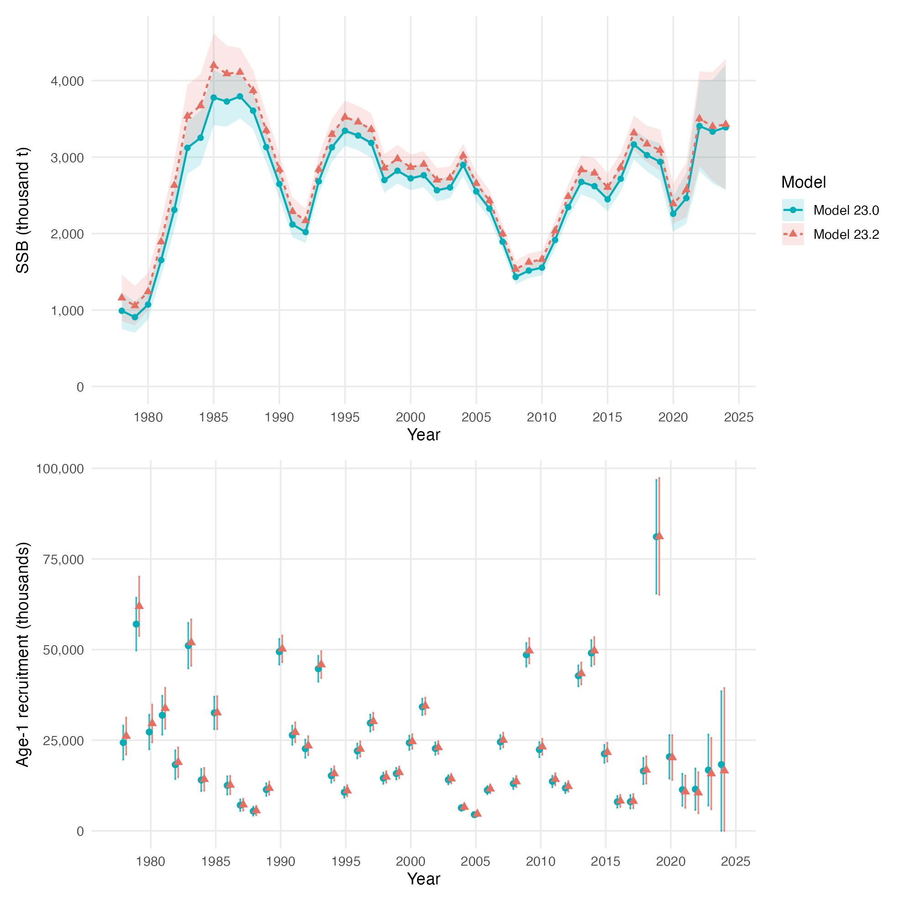{#fig-model-23-0-23-2-admb fig-alt="Two vertically arranged panels compare Model 23.0 and Model 23.2 from 1978 through 2024. The upper panel shows spawning biomass lines with shaded uncertainty bands; Model 23.2 is generally higher through much of the series, and the estimates converge in recent years. The lower panel shows age-1 recruitment points with vertical uncertainty bars; the two models track closely, with Model 23.2 lower in 2024. Models are distinguished by color, line type, and point shape." width="100%"}

| Quantity | Correlation | Mean absolute difference | 2024 difference |
|---|---:|---:|---:|
| Spawning biomass | 0.9992 | 1.45% | +2.88% |
| Age-1 recruitment | 0.9997 | 0.69% | -4.95% |
| Total biomass | 0.9989 | 1.17% | +1.63% |

: Basic comparison of Model 26.0 with the Model 23.2 Rceattle-aligned ADMB
bridge. Differences are relative to Model 23.2. {#tbl-model-26-bridge}

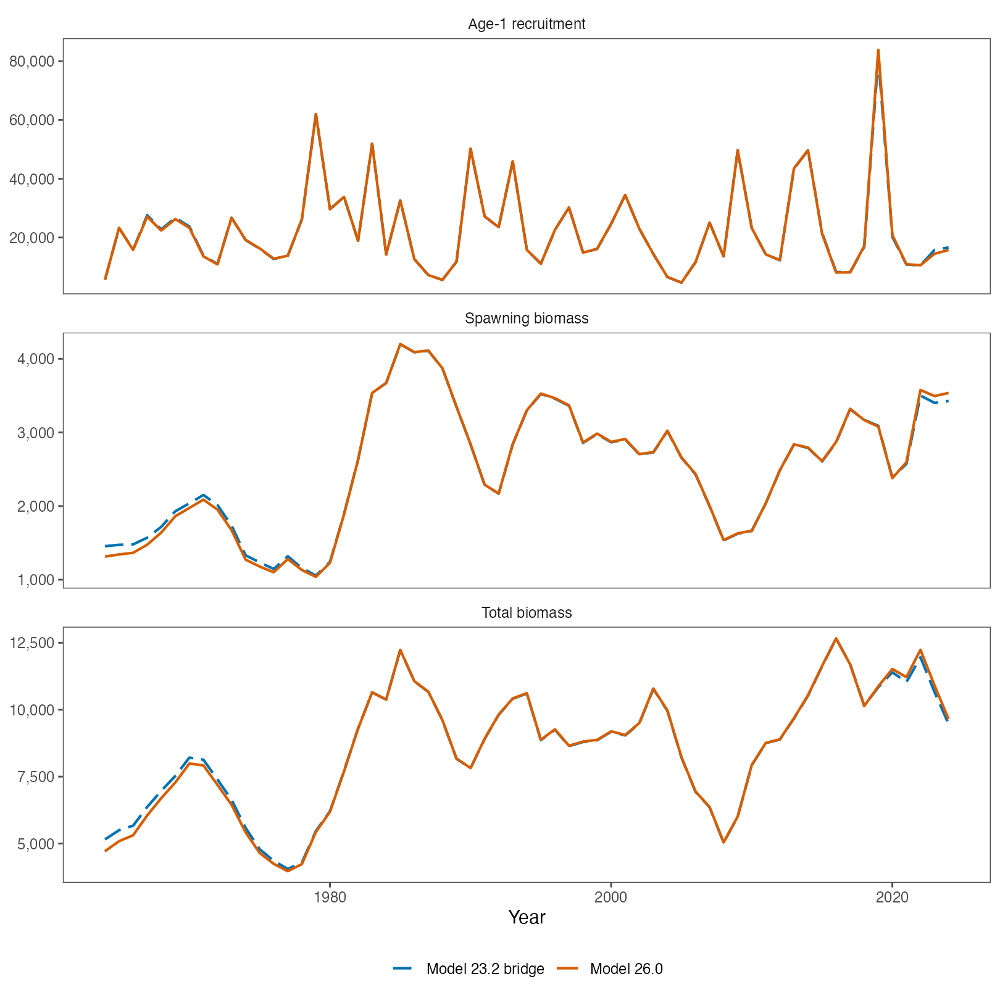{#fig-model-26-bridge fig-alt="Three vertically arranged time-series panels compare Model 26.0 with the Model 23.2 bridge from 1964 through 2024. The two lines closely track for spawning biomass, age-1 recruitment, and total biomass, with small departures in selected years." width="92%"}

The annual selectivity comparisons place Model 23.2 on the left and Model 26.0
on the right. Each curve is divided by its annual maximum, so the figures
compare shape rather than scale. Fishery curves cover 1964--2024, BTS curves
cover 1982--2024, and ATS curves cover 1994--2024. Across the matched ages and
years, the normalized curves have correlations of 0.997 for the fishery,
greater than 0.999 for BTS, and 0.878 for ATS. The fishery and BTS shapes align
closely, while the ATS comparison shows more age-specific differences
(@fig-model-23-2-26-fishery-selectivity--@fig-model-23-2-26-ats-selectivity).
The [selectivity comparison data](data/EBSpollock_Sept_2026/model-26-0/model_23_2_vs_26_0_selectivity.csv)
retain the unscaled and normalized annual values.

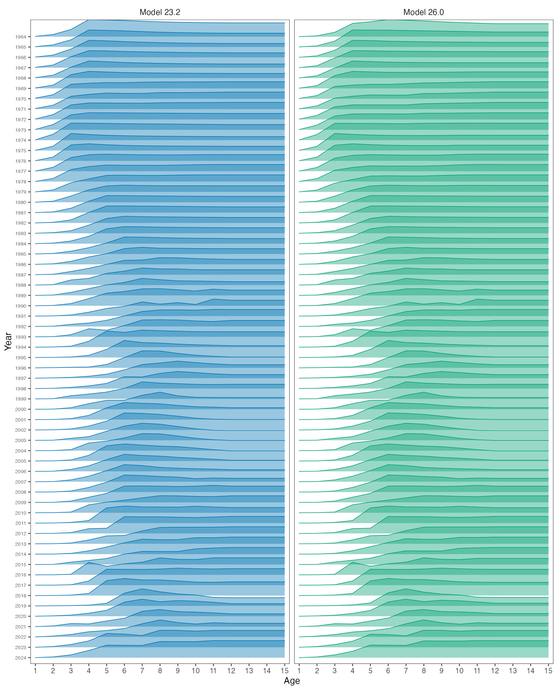{#fig-model-23-2-26-fishery-selectivity fig-alt="Two tall side-by-side ridge plots compare relative fishery selectivity at ages 1 through 15 for every year from 1964 through 2024. Model 23.2 is on the left in blue and Model 26.0 is on the right in green. The annual curves have very similar shapes and track the same changes through time." width="92%"}

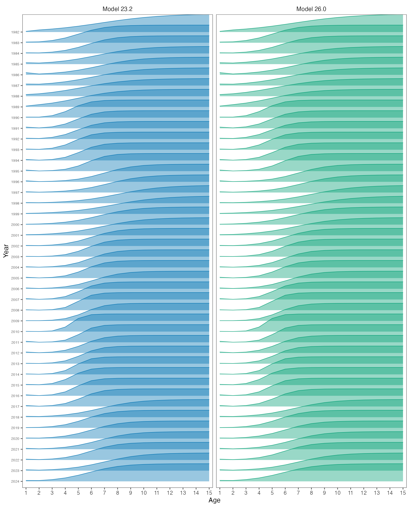{#fig-model-23-2-26-bts-selectivity fig-alt="Two tall side-by-side ridge plots compare relative bottom-trawl survey selectivity at ages 1 through 15 for every year from 1982 through 2024. Model 23.2 is on the left in blue and Model 26.0 is on the right in green. Both sets of curves rise from younger to older ages and align closely across years." width="92%"}

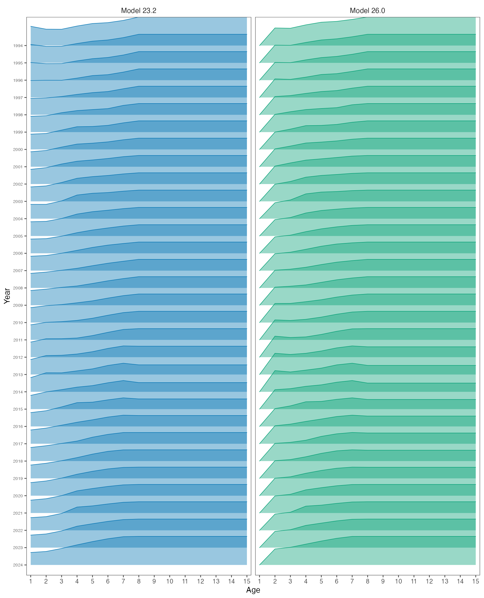{#fig-model-23-2-26-ats-selectivity fig-alt="Two tall side-by-side ridge plots compare relative acoustic-trawl survey selectivity at ages 2 through 15 for every year from 1994 through 2024. Model 23.2 is on the left in blue and Model 26.0 is on the right in green. Both panels begin at age 2, rise across younger ages, and level across older ages, with visible age-specific differences between the panels." width="92%"}

### Diagnostics

The diagnostic sequence begins with one-step-ahead residuals for composition
data, followed by dispersed starting values, simulated-data recovery,
whole-index-fleet deletion, and retrospective peels. These tests address
complementary questions: observation fit, sensitivity to starting values,
recovery under known simulated data, influence of major survey streams, and
stability as recent years are removed.

#### One-step-ahead residuals

One-step-ahead (OSA) residuals compare each observed age proportion with its
conditional prediction after the preceding age bins have been accounted for.
Rceattle calculated the internal fishery and BTS residuals, and
[`afscOSA` version 0.0.1](https://github.com/noaa-afsc/afscOSA/releases/tag/v0.0.1)
produced the common AFSC plots and summaries. For ATS, `afscOSA` calculated
the OSA residuals directly from ages 2--15, the ages that contribute to its
composition likelihood. The `N` input came from the
Rceattle `Sample_size` field used in the multinomial likelihood. It represents
the likelihood sample size. The table reports the effective sample size
separately.

The table and figure use the same composition rows retained by the `afscOSA`
count conversion. The fishery and BTS retain every input year. ATS age 1 is
zero in both the observed and fitted compositions, so its composition
likelihood and diagnostics begin at age 2. Including the structural-zero
column in a generic 15-bin residual sequence creates an artificial first
residual and shifts the remaining ATS sequence. The corrected conversion uses
the 14 contributing ages. ATS 2020 remains in the fitted Rceattle likelihood;
its sample size of one is distributed among ages 2--15, and every
age-specific count rounds to zero in the `afscOSA` conversion. The common
display therefore uses the other 18 ATS years.

Each SDNR is below its expected interval: 0.638 for the fishery, 0.802 for BTS,
and 0.849 for ATS (@tbl-model-26-osa). The aggregate fits and residual bubbles
show the age, year, and cohort locations of the remaining patterns
(@fig-model-26-osa). Interpretation emphasizes the aggregate fits and cells
supported by appreciable predicted counts.

| Composition source | Years displayed | Residuals | SDNR | Expected interval | Likelihood sample-size total | Rounded count total | Effective sample size |
|---|---:|---:|---:|---:|---:|---:|---:|
| Fishery | 60 | 840 | 0.638 | 0.952--1.048 | 17,147 | 17,127 | 154,219 |
| BTS | 42 | 588 | 0.802 | 0.943--1.057 | 5,403 | 5,397 | 3,040 |
| ATS | 18 | 234 | 0.849 | 0.909--1.091 | 930 | 914 | 680 |

: OSA dispersion and aggregate sample-size diagnostics. SDNR is the standard
deviation of normalized residuals. The likelihood sample-size total sums all
rows used in the fitted Rceattle likelihood, including ATS 2020. The rounded
count total and effective sample size come from the displayed `afscOSA`
conversion.
{#tbl-model-26-osa}

{#fig-model-26-osa fig-alt="Four rows of diagnostic plots for fishery, bottom-trawl survey, and acoustic-trawl survey age compositions. The fishery and bottom-trawl survey panels contain ages 1 through 15 and all input years. The acoustic-trawl survey panels begin at age 2, contain 18 years, and omit 2020 from the display because its sample size of one produces zero rounded counts. The first row compares aggregate observed and fitted proportions. The second row shows OSA quantile plots with residual standard deviations of 0.64 for fishery, 0.80 for bottom-trawl survey, and 0.85 for acoustic-trawl survey. The lower rows show OSA and Pearson residual bubbles by age and year." width="100%"}

#### Jitter test

Fifty phased refits began from parameter values perturbed with standard
deviation 0.2 and seed 20260831. All 50 completed with convergence status OK.
Forty-seven returned to the best objective within 0.001. Three reached the same
higher objective, approximately 609.5 units above the best value. The objective
distribution and summary count show the 47 returns to the best solution and
the three higher-mode fits (@fig-model-26-jitter; @tbl-model-26-jitter). This
repeated higher solution identifies a second mode and supports retaining the
two-stage fitting sequence and dispersed-start checks in routine work.

| Requested fits | Converged fits | Returned to best | Higher-mode fits | Largest objective difference |
|---:|---:|---:|---:|---:|
| 50 | 50 | 47 | 3 | 609.5 |

: Fifty-start jitter test for Model 26.0. {#tbl-model-26-jitter}

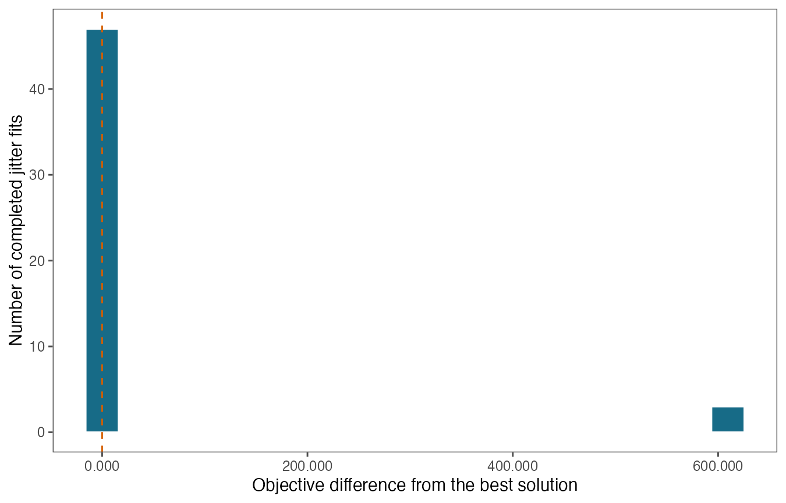{#fig-model-26-jitter fig-alt="Histogram of objective differences for 50 converged jitter fits. Forty-seven values cluster at zero, while three fits occur around 609.5 objective units above the best solution." width="78%"}

#### Self-test

The self-test simulated 50 new observation sets from Model 26.0 and refitted
each from the original pre-fit starting values. Recruitment deviations were
held at their fitted realization, so this test measures recovery under new
observation error. All 50 refits completed with convergence status OK; the
largest maximum gradient was $1.19\times10^{-4}$. Recruitment had the widest
central 90% range and the largest mean absolute difference, while total
biomass had the narrowest range and smallest mean absolute difference
(@tbl-model-26-self-test; @fig-model-26-self-test).

The current simulator redrew some AVO and BTS index observations to retain
positive values. Those simulated observations follow a positive-truncated
distribution while the fitted bridge likelihood uses the corresponding normal
form. The recovery summary therefore serves primarily as a fitting and coding
check. A future observation-model sensitivity can align the fitted and
simulated distributions directly.

| Quantity | Median difference | Mean absolute difference | Central 90% range |
|---|---:|---:|---:|
| Age-1 recruitment | -1.51% | 9.76% | -23.76% to +22.83% |
| Spawning biomass | -2.09% | 6.23% | -13.55% to +17.75% |
| Total biomass | -1.71% | 4.77% | -9.34% to +13.36% |

: Recovery across all years and the 50 observation-level self-tests.
{#tbl-model-26-self-test}

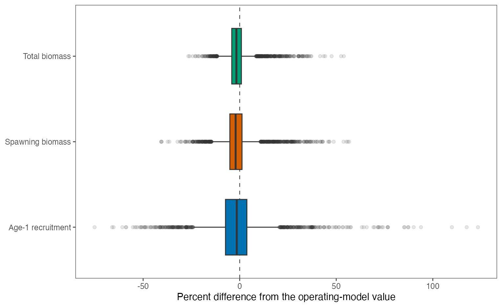{#fig-model-26-self-test fig-alt="Horizontal boxplots show percent differences from the operating-model values for age-1 recruitment, spawning biomass, and total biomass across 50 simulated observation sets and all assessment years. Distributions are centered slightly below zero and are widest for recruitment." width="82%"}

#### Whole index-series sensitivity

Three refits tested the influence of the complete BTS, ATS, and AVO fleets.
Each fit started from the converged Model 26.0 estimates and retained the base
configuration, including the non-parametric selectivity settings, fixed
effects for recruitment deviations, and CPUE. Setting a fleet's `Fleet_type` to `Off` removes
its index and composition contributions from the likelihood. The ATS
sensitivity also removed the separate ATS age-1 index fleet; the BTS age-1
fleet was already off in the base model. The objective values have different
data contributions, so interpretation uses the trajectory changes rather than
an objective or AIC comparison.
The [reproducible sensitivity script](scripts/model-26-0/run_model_26_index_series_sensitivity_5_23.R)
records this configuration.

All three refits completed with convergence status OK and positive-definite
Hessians. Their maximum gradients ranged from $3.68\times10^{-5}$ to
$6.68\times10^{-5}$. Dropping BTS had the greatest effect on population scale
and fishing mortality: 2024 spawning biomass decreased 12.2%, total biomass
decreased 15.3%, and fishing mortality increased 98.7%. Dropping ATS increased
2024 spawning biomass 11.7%, total biomass 19.3%, and recruitment 34.3%.
Dropping AVO changed each 2024 quantity by less than 7% (@tbl-model-26-index-sensitivity).

The trajectories show the strong historical role of BTS and the increasing
recent contribution of ATS, while AVO provides a smaller complementary signal
(@fig-model-26-index-sensitivity). Whole-series deletion is an intentionally
severe influence test. The result supports retaining all three survey streams
and giving particular attention to BTS data preparation and availability in
the operational update. The [summary data](data/EBSpollock_Sept_2026/model-26-0/model_26_0_index_series_sensitivity_summary.csv)
and [annual trajectories](data/EBSpollock_Sept_2026/model-26-0/model_26_0_index_series_sensitivity_trajectories.csv)
provide the reported values.

| Sensitivity | Index observations excluded | Composition years excluded | 2024 SSB change | 2024 total biomass change | 2024 recruitment change | 2024 fishing mortality change |
|---|---:|---:|---:|---:|---:|---:|
| Drop BTS | 42 | 42 | -12.2% | -15.3% | -4.6% | +98.7% |
| Drop ATS and ATS age-1 | 37 | 19 | +11.7% | +19.3% | +34.3% | -11.6% |
| Drop AVO | 18 | 0 | +4.4% | +5.3% | +6.8% | -3.3% |

: Whole-index-fleet sensitivities relative to the Model 26.0 base fit. CPUE was
retained in every fit. {#tbl-model-26-index-sensitivity}

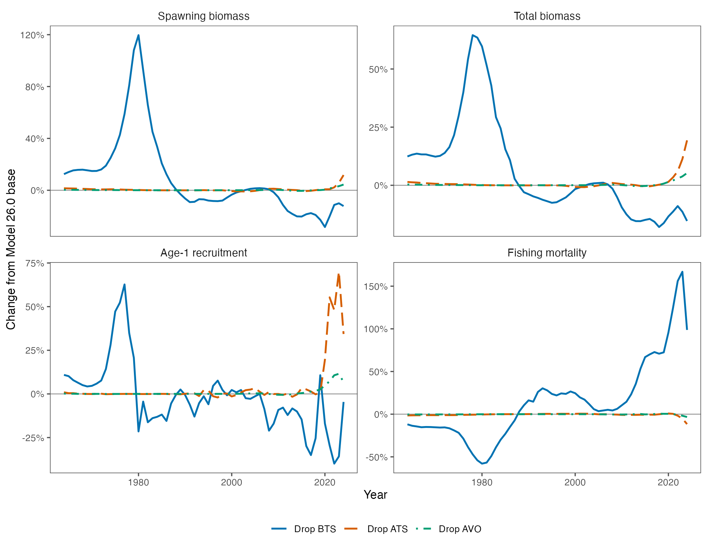{#fig-model-26-index-sensitivity fig-alt="Four line-chart panels show percent changes from the Model 26.0 base fit after dropping BTS, ATS, or AVO. Drop BTS is a blue solid line and produces the largest historical changes, a lower terminal biomass, and nearly double the terminal fishing mortality. Drop ATS is an orange long-dashed line and produces higher recent biomass and recruitment. Drop AVO is a green dot-dashed line and stays closest to the base fit. A horizontal gray line marks zero change." width="100%"}

#### Retrospective analysis

##### Configuration and primary results

Nine peels ended in 2023 through 2015. The primary analysis follows the
stream-specific lag rules used in the earlier retrospective analysis. Fishery
age compositions retain their one-year lag, the ATS age-1 index retains its
two-year lag, and the discontinued CPUE series continues to end in 1976. The
remaining active index and composition series extend through the peel year when
an observation exists. All 81 stream-by-peel checks reproduced these rules.

Each peel recalculates its data-based fishery-selectivity starting values and
uses the same two-stage fitting sequence as the full Model 26.0 fit. The first
stage establishes population and selectivity scale with annual selectivity
changes held constant. The second stage estimates those annual changes. The
terminal fishery and CPUE selectivity increment is fixed at zero, which carries
the preceding-year selectivity-at-age curve into the terminal year. The largest
terminal-to-preceding-year selectivity difference was
$6.7\times10^{-16}$. The
[retrospective script](scripts/model-26-0/run_model_26_retrospective_sensitivity_5_23.R)
records the lag, convergence, and selectivity checks.

All nine peels completed with convergence status OK and positive-definite
Hessians. The largest maximum gradient was $2.01\times10^{-4}$.

The peels generally estimate greater spawning biomass, total biomass, and
recruitment, together with lower fishing mortality, than the full model over
the corresponding terminal years. Spawning biomass has the largest Mohn's rho
and the largest average relative revision, making it a central Model 26.0
evaluation priority (@tbl-model-26-retro; @fig-model-26-retro).

| Quantity | Mohn's rho |
|---|---:|
| Total biomass | 0.211 |
| Spawning biomass | 0.329 |
| Age-1 recruitment | 0.185 |
| Fishing mortality | -0.126 |

: Mohn's rho from nine lag-preserving, two-stage Model 26.0 peels. Each value
compares a peel at its terminal assessment year with the corresponding value
from the full Model 26.0 fit. {#tbl-model-26-retro}

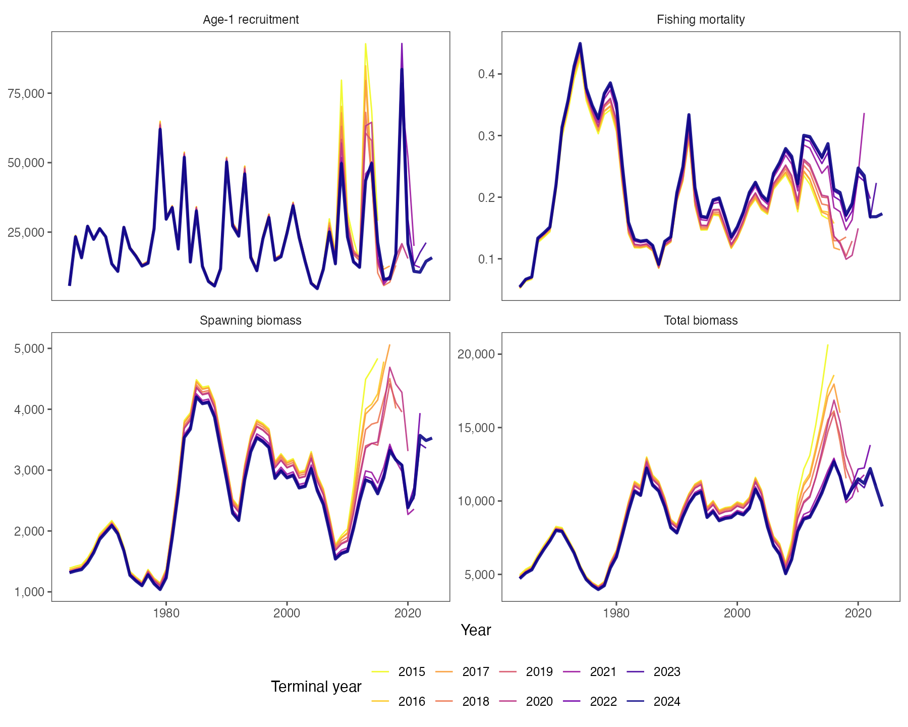{#fig-model-26-retro fig-alt="Four line-chart panels show age-1 recruitment, fishing mortality, spawning biomass, and total biomass for the full Model 26.0 fit and nine peels ending from 2023 back to 2015. Earlier peels generally show greater biomass and recruitment and lower fishing mortality over shared years." width="100%"}

##### Sensitivity and evaluation

The data-sensitivity evaluation focuses on the main downward revision between
the peels ending in 2020 and 2021. The same stream-specific lag rules identify
five newly available observations: the 2020 fishery age composition and the
2021 BTS biomass index, BTS age composition, AVO index, and BTS age-1 index.
Each controlled refit starts from the converged 2021-peel estimates, retains
the 2021 parameter map, keeps DSEM disabled, and removes one observation block.
This design measures the conditional influence of each new data block while
holding the Model 26.0 structure constant. The
[data-sensitivity script](scripts/model-26-0/run_model_26_retrospective_data_sensitivity_5_23.R)
records the [observation inventory](data/EBSpollock_Sept_2026/model-26-0/model_26_0_retrospective_new_data_inventory.csv),
[block-deletion results](data/EBSpollock_Sept_2026/model-26-0/model_26_0_retrospective_data_block_deletion.csv),
[cumulative-addition results](data/EBSpollock_Sept_2026/model-26-0/model_26_0_retrospective_data_cumulative_addition.csv),
and [reproduction check](data/EBSpollock_Sept_2026/model-26-0/model_26_0_retrospective_data_reproduction_check.csv).

All five block-deletion fits and six cumulative-addition fits completed with
convergence status OK and positive-definite Hessians; the largest maximum
gradient was $5.66\times10^{-5}$. Removing the 2021 BTS biomass index had the
largest effect on 2020 spawning biomass, increasing it by 28.2%, and increased
the 2013 and 2014 cohort estimates by 11.5% and 15.7%. Removing the 2021 BTS
age composition increased 2020 spawning biomass by 14.1%, while removing the
2020 fishery age composition increased the 2013 cohort by 13.6% and 2020
spawning biomass by 5.7%. The AVO and BTS age-1 index effects on these older
cohorts and spawning biomass were negligible
(@tbl-model-26-retro-sensitivity; @fig-model-26-retro-sensitivity).

The cumulative evaluation begins with the 2021 state and process dimensions
and the observation availability of the 2020 peel. Adding the 2020 fishery age
composition reduced the 2020 spawning-biomass difference from 46.1% to 28.6%,
adding the 2021 BTS biomass index reduced it to 13.8%, and adding the 2021 BTS
age composition brought it to within 0.04% of the complete 2021 peel. The AVO
and BTS age-1 indices completed the sequence. The final step reproduced the
complete 2021 objective and selected estimates exactly. Together, the removal
and addition tests identify the fishery age composition and BTS data as the
principal signals associated with this retrospective revision, with the BTS
biomass index providing the largest single influence on spawning biomass.

| Data block removed | 2013 cohort change | 2014 cohort change | 2020 SSB change | Maximum gradient |
|---|---:|---:|---:|---:|
| 2020 fishery age composition | +13.6% | +5.6% | +5.7% | $4.14\times10^{-5}$ |
| 2021 BTS biomass index | +11.5% | +15.7% | +28.2% | $4.04\times10^{-5}$ |
| 2021 BTS age composition | +7.6% | +6.0% | +14.1% | $5.66\times10^{-5}$ |
| 2021 AVO index | +0.02% | +0.02% | -0.04% | $5.02\times10^{-5}$ |
| 2021 BTS age-1 index | 0.0% | 0.0% | 0.0% | $4.83\times10^{-5}$ |

: Controlled data-block removal from the lag-preserving 2021 peel. Percentages
show changes from the complete 2021-peel estimates. {#tbl-model-26-retro-sensitivity}

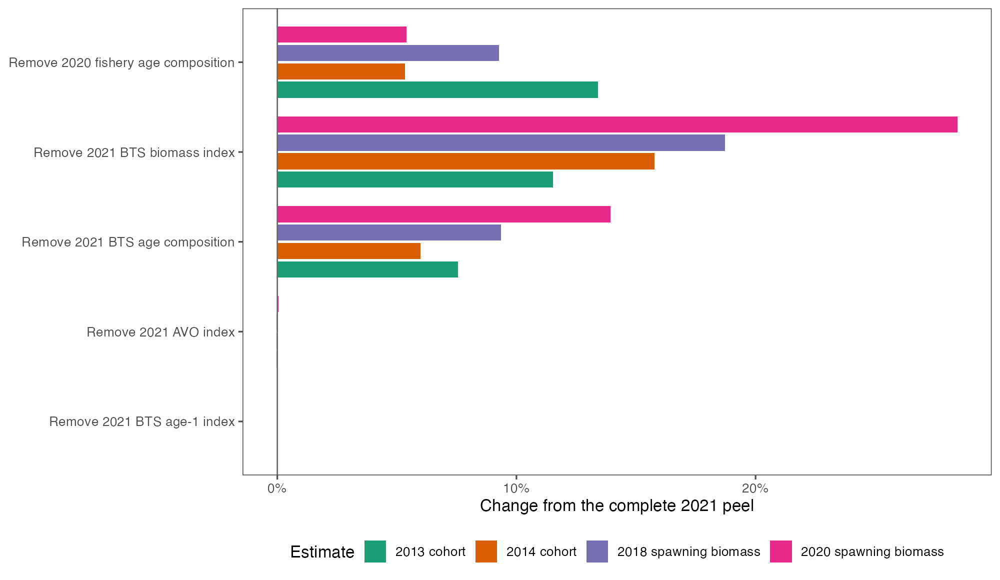{#fig-model-26-retro-sensitivity fig-alt="Horizontal grouped bars show changes in the 2013 and 2014 cohort estimates and spawning biomass in 2018 and 2020 after removing one observation block from the 2021 peel. Removing the 2021 BTS biomass index produces the largest increase in 2020 spawning biomass; the 2020 fishery age composition and 2021 BTS age composition also contribute." width="100%"}

### Projections

The projection uses `spmR` version 0.3.0 and the validated Standard Projection
Model workflow. The
[projection runner](scripts/model-26-0/run_model_26_spmr_projection_5_23.R)
and [input writer](scripts/model-26-0/write_spmr_projection_inputs.R) transfer
the current Model 26.0 population state, annual recruitment, biological
schedules, and recent fishing pattern into the `pm.prj` format. The projection
uses the arithmetic mean fishery selectivity-at-age and fishing mortality from
2020--2024; mean fishing mortality over those years is 0.1984.

#### Standard alternatives

The seven alternatives use 1,000 simulations over 14 projection years beginning
in 2025. Catch is fixed at 1,350 thousand t in 2025 and 2026, so the alternatives
first separate in 2027. These Model 26.0 results are intended to just demonstrate
the linkage with the standard Tier 3 projection model. ABC and OFL
recommendations and status determinations will be available when the new data
are updated for the SSC's December 2026 consideration.

The 2027--2028 comparison keeps spawning biomass at or above the $B_{35\%}$
proxy under Alternatives 1--5. Alternative 6 is below the proxy in both years,
and Alternative 7 moves below it in 2028. Projected catch, ABC, and OFL share
the fixed-catch assumptions in 2025 and 2026 and then follow the rules for each
alternative (@tbl-model-26-projection; @fig-model-26-projection;
@fig-model-26-projection-removals).

| Alternative | Year | Catch | ABC | OFL | SSB | F | B/B~35%~ |
|---:|---:|---:|---:|---:|---:|---:|---:|
| 1 | 2027 | 1,864 | 1,864 | 2,259 | 2,476 | 0.35 | 1.17 |
| 1 | 2028 | 1,308 | 1,308 | 1,583 | 2,115 | 0.31 | 1.00 |
| 2 | 2027 | 1,864 | 1,864 | 2,259 | 2,476 | 0.35 | 1.17 |
| 2 | 2028 | 1,308 | 1,308 | 1,583 | 2,115 | 0.31 | 1.00 |
| 3 | 2027 | 1,132 | 1,132 | 2,259 | 2,582 | 0.20 | 1.22 |
| 3 | 2028 | 1,015 | 1,015 | 1,963 | 2,447 | 0.20 | 1.16 |
| 4 | 2027 | 856 | 856 | 2,259 | 2,619 | 0.15 | 1.24 |
| 4 | 2028 | 803 | 803 | 2,104 | 2,585 | 0.15 | 1.22 |
| 5 | 2027 | 0 | 0 | 2,259 | 2,726 | 0.00 | 1.29 |
| 5 | 2028 | 0 | 0 | 2,455 | 3,035 | 0.00 | 1.44 |
| 6 | 2027 | 1,561 | 1,561 | 1,561 | 2,017 | 0.37 | 0.95 |
| 6 | 2028 | 1,210 | 1,210 | 1,210 | 1,831 | 0.34 | 0.87 |
| 7 | 2027 | 1,509 | 1,809 | 1,809 | 2,211 | 0.32 | 1.05 |
| 7 | 2028 | 1,424 | 1,424 | 1,424 | 1,977 | 0.36 | 0.94 |

: Model 26.0 `spmR` results for 2027 and 2028. Catch, ABC, OFL, and SSB are
rounded simulation means in thousand t. {#tbl-model-26-projection}

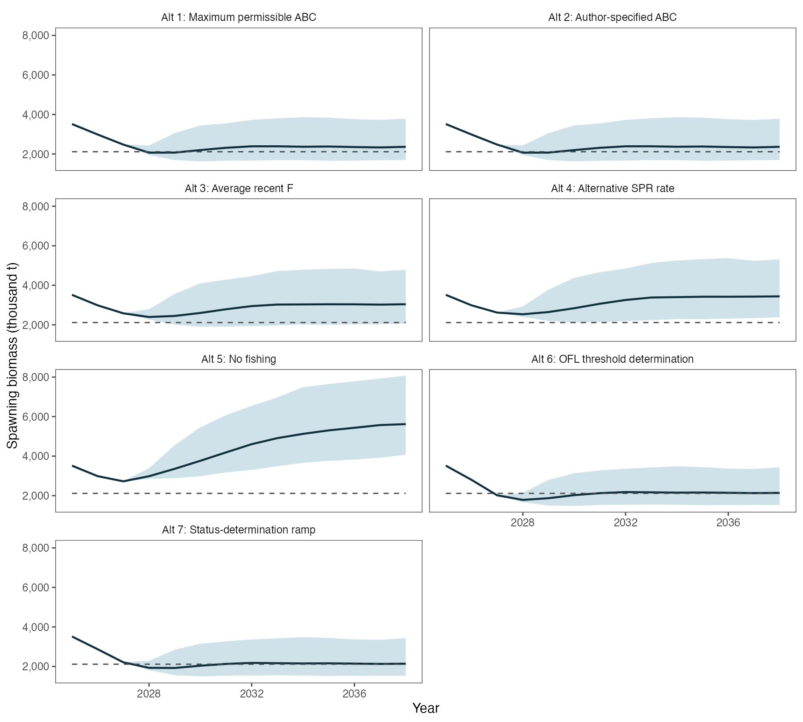{#fig-model-26-projection fig-alt="Seven panels show median projected spawning biomass and central 90-percent intervals from 2025 through 2038. A dashed line marks B35 percent in each panel. The alternatives separate after the fixed-catch years." width="100%"}

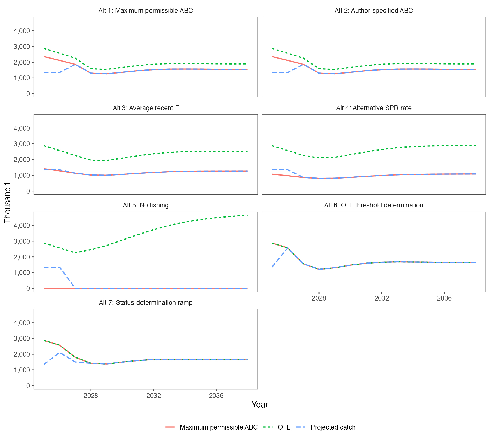{#fig-model-26-projection-removals fig-alt="Seven panels compare projected catch, maximum permissible ABC, and OFL from 2025 through 2038. The lines share the fixed-catch years and then separate according to each alternative." width="100%"}

#### Fixed-catch sensitivity

An additional Alternative 2 run fixes catch at 1,300 thousand t from 2025
through 2032. Mean spawning biomass remains above the $B_{35\%}$ proxy through
the displayed fixed-catch period. The displayed $B/B_{35\%}$ values remain
above one, reaching 1.12 in 2028 and 1.25 in 2032
(@tbl-model-26-projection-alt2).

| Year | Catch | ABC | OFL | SSB | F | B/B~35%~ |
|---:|---:|---:|---:|---:|---:|---:|
| 2025 | 1,300 | 2,360 | 2,878 | 3,523 | 0.180 | 1.67 |
| 2026 | 1,300 | 2,131 | 2,588 | 3,013 | 0.200 | 1.43 |
| 2028 | 1,300 | 1,583 | 1,909 | 2,366 | 0.269 | 1.12 |
| 2030 | 1,300 | 1,460 | 1,786 | 2,447 | 0.308 | 1.16 |
| 2032 | 1,300 | 1,594 | 1,967 | 2,645 | 0.313 | 1.25 |

: Alternative 2 projection with catch fixed at 1,300 thousand t. Catch, ABC,
OFL, and SSB are rounded simulation means in thousand t.
{#tbl-model-26-projection-alt2}

### Exploratory DSEM recruitment pathways

The Dynamic Structural Equation Model (DSEM) analysis links recruitment to a
small set of prespecified environmental pathways while retaining the Model
26.0 assessment structure. It uses the same Rceattle 5.23.0 branch snapshot.
The four models share the same observation years, missing-value pattern,
standardization, and time-series treatment of the two environmental indices.

The response is age-1 recruitment. Late-summer sea-surface temperature (SST)
is aligned with the cohort's age-0 year. Cold-pool extent is aligned with the
following age-1 calendar year. SST represents a broad energetic-condition
pathway, while cold-pool extent represents a possible spatial-separation and
cannibalism pathway. The conceptual graph keeps the biological steps visible
even though the fitted examples use direct proxy paths (@fig-model-26-dsem-dag).

All four DSEM fits completed with positive-definite Hessians and convergence
status OK. Fit AIC favored the DSEM model with age-0 late-summer SST. The
combined model was 1.63 AIC units higher, the no-edge reference was 2.25 units
higher, and the cold-pool model was 4.11 units higher
(@fig-model-26-dsem-aic; @tbl-model-26-dsem).

The SST pathway is negative in both models that include it, with intervals
below zero. The cold-pool pathway is smaller and its interval spans zero in
both models (@fig-model-26-dsem-paths; @tbl-model-26-dsem-paths). These results
describe an in-sample association that is consistent with the proposed
energetic pathway. Direct measurements of fall age-0 energy, prey quality,
overwinter survival, and juvenile-adult overlap will provide the stronger next
tests of the biological mechanism.

The diagnostics and DSEM results support continued Model 26.0 development.
The close bridge trajectories and complete convergence provide a strong
implementation basis. The OSA dispersion, repeated higher jitter mode, and
positive spawning-biomass retrospective pattern define the next evaluation
priorities. The ESP framework in
[Appendix 2](#sec-esp-development-framework) organizes the additional
indicator and mechanism work.

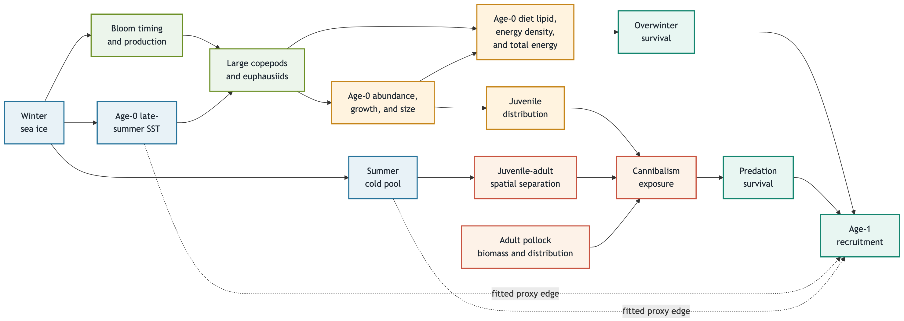{#fig-model-26-dsem-dag fig-alt="Directed graph in which sea ice affects cold-pool extent, temperature, blooms, and prey. Prey and juvenile abundance affect age-0 energy and overwinter survival. Cold-pool extent and adult-juvenile overlap affect cannibalism. These survival pathways lead to age-1 recruitment. Dashed direct paths connect late-summer SST and cold-pool extent to recruitment for the fitted proxy models." width="100%"}

| DSEM specification | Delta AIC | Reduction in unexplained recruitment variation |
|---|---:|---:|
| Age-0 late-summer SST | 0.00 | 10.5% |
| Cold pool + age-0 late-summer SST | 1.63 | 12.0% |
| No-edge reference | 2.25 | 0.0% |
| Cold pool | 4.11 | 0.3% |

: Exploratory DSEM comparison using the common data block. {#tbl-model-26-dsem}

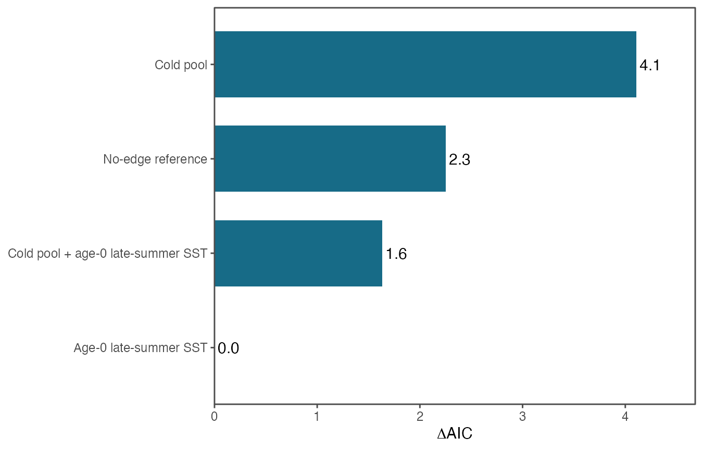{#fig-model-26-dsem-aic fig-alt="Horizontal bars compare AIC differences for age-0 late-summer SST, the combined SST and cold-pool model, the no-edge reference, and the cold-pool-only model. The SST-only model has the lowest AIC." width="76%"}

| Model | Recruitment pathway | Estimate | 95% interval |
|---|---|---:|---:|
| Cold pool | Cold pool | 0.041 | -0.169 to 0.251 |
| Age-0 late-summer SST | SST | -0.222 | -0.426 to -0.017 |
| Combined | Cold pool | -0.069 | -0.292 to 0.153 |
| Combined | SST | -0.254 | -0.484 to -0.024 |

: Standardized direct proxy pathways to age-1 recruitment. {#tbl-model-26-dsem-paths}

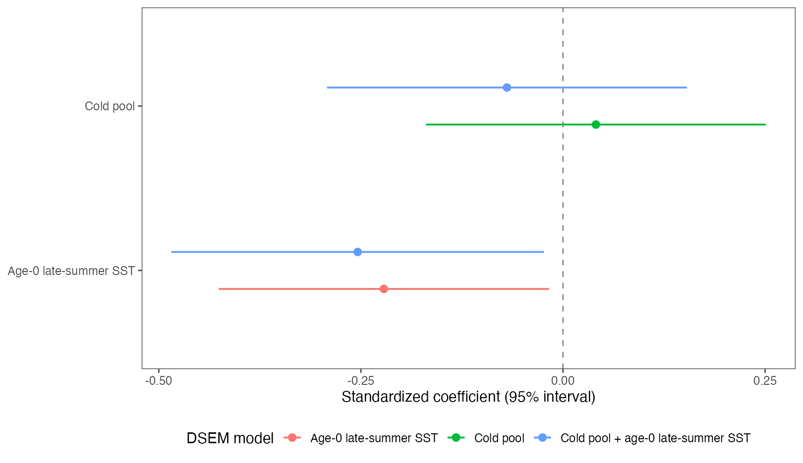{#fig-model-26-dsem-paths fig-alt="Point estimates and 95-percent intervals compare direct cold-pool and age-0 late-summer SST paths to recruitment. Both SST estimates are negative with intervals below zero. Cold-pool estimates lie near zero with intervals spanning zero." width="88%"}

# Conclusion

Model 26.0 provides a reproducible Rceattle implementation of the EBS pollock
assessment. It closely follows the Model 23.2 bridge, passes the stated
convergence and simulated-data recovery checks, carries the assessment state
into the standard Tier 3 projection model, and makes the full analysis
available through documented R workflows. The whole-index-fleet sensitivities
show that BTS supplies the strongest information about population scale and
fishing mortality, ATS contributes increasingly to recent biomass and
recruitment, and AVO provides a smaller complementary signal. These patterns
are consistent with the roles and lengths of the three survey series.

Rceattle is also being used to develop the Gulf of Alaska (GOA) pollock
assessment, and the companion comparison successfully reran the GOA base model
through its numerical fit checks. The GOA application estimates recruitment
and changes in survey catchability within the fitted model, whereas the EBS
application emphasizes translation of the established ADMB structure and a
separate `spmR` projection handoff. Together, the applications show how
Rceattle can support stocks with different survey histories and assessment
structures. They also provide a shared basis for pinning software and input
versions, recording which observations enter each fit, applying common fit and
retrospective checks, and testing the projection handoff. Stock-specific
surveys, age ranges, and selectivity choices remain central to each assessment
while the shared Rceattle platform supports consistent and transparent
evaluation across both regions.

The diagnostic results also define a practical operational checklist. The
production run should retain the two-stage fitting sequence and multi-start
evaluation, repeat the OSA and lag-preserving retrospective analyses, review
BTS inputs closely, and carry the fitted state into the validated `spmR`
projection workflow. The operational specification should keep DSEM disabled
(`DSEM = NULL`); the environmental pathways and SparseNUTS work remain separate
research evaluations.

The combined bridge, convergence, self-test, index-sensitivity, retrospective,
and projection evidence supports a recommendation that the Plan Team and SSC
adopt Model 26.0 for producing EBS pollock management advice in November and
December 2026. The updated-data run will provide the ABC, OFL, and stock-status
results for that review. Model 23.0 provides continuity until the review bodies
complete this transition.

# References {.unnumbered}

::: {#refs}
:::

# Appendices

## Appendix 1: Main SSC comments and responses {#sec-ssc-comments}

A funding lapse ended preparation of the November and December 2025 EBS
pollock SAFE package. The October 2025 SSC comments therefore carry forward to
the 2026 assessment cycle for formal response. The responses below describe
the planned work for 2026 and later years.

### Current status

- The next assessment needs to trace the 2025 RTMB starting model back to the
  2024 ADMB source, along with updated survey data, 2025 FT-NIRS ages, the
  comparison of traditional and FT-NIRS ages, model names, and the document
  archive.
- Work continues on Rceattle, SPoRC, natural mortality, selectivity, and
  age-composition weighting in response to the SSC comments.
- Current analyses address Russian catches and the recruitment penalty for the
  2018 year class.
- Work on the revised AVO index depends on completion and review of the new
  uncertainty analysis.

Completion of an SSC response requires the analysis, results, and explanation
for review. Current research contributes evidence toward that completion.

### Comments and responses

The response matrix pairs each October 2025 SSC comment with the analysis,
documentation, or review action planned for the 2026 assessment cycle.

| SSC comment | Response |
|---|---|
| Use the 2024 base model as the source for an RTMB implementation, with routine data updates. | Use the accepted Model 23.0 (ADMB) configuration as the scientific source. First check the direct RTMB translation as Model 23.1, then use Model 25.0 (RTMB) for the assessment line begun in 2025. List each new data set and each model change separately. Save the model version, run files, diagnostics, projections, and management quantities used in the report. |
| Use the updated Groundfish Assessment Program estimates of survey biomass and age composition. | Add the `sdmTMB` biomass estimates and `tinyVAST` age compositions as updated survey data. Record the data delivery date, software version, model settings, and input files. Compare the old and new survey series and show whether the change affects the assessment results. |
| Use FT-NIRS age compositions for the 2025 fishery and surveys. | Document how the FT-NIRS ages were produced, screened, grouped, and assigned to fishery and survey data. Record sample sizes and aging-error matrices. Check the final model input against the source data before fitting the assessment. |
| Compare traditional microscope ages with FT-NIRS ages and show the effects on model results and management quantities. | Run the same assessment with traditional ages, FT-NIRS ages with one aging-error matrix, and FT-NIRS ages with fleet-specific aging-error matrices. Compare cohort patterns, fits to fishery and survey ages, residuals, recruitment, spawning biomass, reference points, ABC, and OFL. Save the full comparison in the assessment appendix and at a permanent web address. |
| Revisit the revised AVO index after the new uncertainty analysis has been reviewed. | After review of the final uncertainty method, compare the revised point estimates and uncertainty with the current AVO series. Show their effect on model fit, stock estimates, and management quantities before proposing a change to the base model. |
| Develop a plan with the BSAI Groundfish Plan Team for moving beyond ADMB. | Use the model history and numbering plan above. Compare RTMB, Rceattle, and SPoRC with the same data and a common set of tests. Ask the Plan Team to agree on the tests before selecting the model software for future assessments. Keep the accepted assessment model as the control until a replacement gives stable estimates, sound uncertainty, acceptable retrospective results, and reproducible projections. |
| Examine the effect of including Russian catches. | First confirm the source, area, years, units, species identification, and uncertainty of the Russian catch estimates. Then run clearly defined catch scenarios. Explain the assumptions about stock movement and population boundaries and show the effects on stock size, reference points, ABC, and OFL. |
| Explore time-varying natural mortality, selectivity, age-composition weighting, and cohort and temperature effects on weight at age. | Study each topic separately. State the scientific question before fitting a model. For each change, show model fit, parameter uncertainty, retrospective results, projections, and effects on management advice. Keep poorly estimated or unstable models as research results. |
| Continue work with CEATTLE estimates of natural mortality and consider Rceattle for time-varying mortality. | Test time-varying natural mortality as a sensitivity analysis. Check whether the model can separate mortality changes from recruitment, selectivity, and survey effects. The full set of assessment needs will guide the choice of model software. |
| Explain how the recruitment penalty affects the estimated 2018 year class and why the likelihood profile favored a larger recruitment estimate. | Prepare a likelihood profile for the 2018 recruitment deviation. Show how the recruitment penalty and each data source change across the profile. Explain which parts of the model favor a larger year class and how the estimate affects spawning biomass, reference points, ABC, and OFL. |
| Clearly identify the models proposed for the assessment, including model numbers. | Use Model 23.0 (ADMB) for the accepted 2024 source, Model 23.1 (RTMB) for the direct translation check, Model 25.0 (RTMB) for the line begun in 2025, and Model 26.0 (Rceattle) for the line begun in 2026. Use the same short names in the report, presentations, run folders, tables, and archive. For every model, list its purpose, parent model, data set, model changes, software version, and review status. State clearly which model is recommended for management advice. |
| Archive the October and December SAFE documents and presentations. | Archive the October 2025 material that exists and add a short note explaining that the funding lapse prevented the November and December SAFE package. For future reviews, save the Quarto source, rendered reports, presentations, model files, data list, software versions, and file checksums in one dated release. |

: Responses to the October 2025 SSC comments on EBS pollock. The SSC comments
are summarized from pages 27 to 29 of the final October 2025 SSC report.

### Earlier responses to 2024 SSC comments

::: {.callout-note title="Retained material"}
The responses below were on the previous version of the SSC response page and
retain their original scientific claims. Confirm these claims against the
completed analyses and assessment record before citing them as final 2025
results.
:::

**Dynamic Species Environment Models (DSEM) and recruitment mechanisms**  
*The SSC recommended further exploration of DSEM to reconcile contrasting signals such as record larval biomass in 2024, low age-0 abundance, chronically low condition, and increasing adult biomass.*  
*In 2025, exploratory DSEM analyses continue under the ESR framework and remain outside the current assessment. The Recruitment section presents anomalous recruitment indicators for context.*

> **2026 activity:** The [Rceattle application](https://noaa-afsc.github.io/ebswp_rceattle/) presents the DSEM analysis together with preliminary ESP work.

**Pollock cannibalism index**  
*The SSC requested extrapolation of the index to biomass consumed.*  
*For 2025, the index is updated. Work continues toward final biomass-consumed estimates as a development priority.*

**Tier 1 vs. Tier 3 classification**  
*The SSC supported Tier 3 classification given reliance on priors and limited data at low stock sizes.*  
*The 2025 assessment maintains Tier 3a status and focuses its calculations on that tier, consistent with SSC guidance.*

**Multispecies model outputs**  
*The SSC encouraged use of time-varying mortality or consumption estimates from the multispecies model, noting its strategic role in climate planning.*  
*In 2025, multispecies outputs remain under review for potential use in ESP indicators and future assessment development.*

**Biological observations**  
*The SSC noted low weight-at-age and condition in recent years and emphasized the importance of the 2018 year class.*  
*The 2025 BTS confirms condition remains below average. The 2018 year class continues to dominate spawning biomass but shows expected decline as it ages out of the population.*

**Selectivity assumptions**  
*The SSC supported the use of the five-year moving average selectivity for projections.*  
*This method is retained in 2025, with updated retrospective diagnostics.*

**Model status and diagnostics**  
*The SSC endorsed Model 23.0, Tier 3a classification, and ABC equal to the maximum permissible.*  
*Model 23.0 is retained for 2025 with updated data inputs. Tier 3a status and ABC recommendations remain as supported by the SSC.*

**Additional recommendations**

- *State-space approach (TMB/RTMB):* exploratory work is ongoing.
- *Russian proportion/movement:* work continues to develop updated estimates.
- *FT-NIR age validation:* further evaluation continues in preparation for integration.
- *Recruitment penalty (2018 cohort):* sensitivity analyses are included; discussion of penalty influence is provided.

**Stock-Recruitment relationship**  
*The SSC noted reduced influence under Tier 3, but stressed unbiased estimation of recruitment deviates and transparent use of steepness priors.*  
*The recruitment bias correction is set to zero; steepness priors remain meta-analysis based. The 2025 assessment presents the Tier 3 analysis.*

**Documentation request**  
*The SSC requested that the September 2024 SRR document be included as an appendix or linked.*  
*The document has been added as Appendix X in this SAFE.*

#### SSC 2024 comments and 2025 responses

The retained response matrix summarizes how the 2025 work addressed each 2024
SSC comment and identifies topics that continue into the current cycle.

| SSC comment | 2025 response |
|---|---|
| Explore use of DSEM for pollock recruitment anomalies | Recruitment section presents the anomalies; exploratory analyses continue toward future integration. |
| Extrapolate cannibalism index to biomass consumed | Index updated; extrapolated biomass estimates continue in development toward final review. |
| Tier 1 vs. Tier 3 classification | Maintained Tier 3a classification and focused calculations on that tier. |
| Use multispecies model outputs (time-varying M, consumption) | Multispecies outputs remain under review for ESP and future assessment use. |
| Biological observations (low condition, 2018 year class) | 2025 BTS confirms below-average condition; 2018 cohort still dominant but declining. |
| Use of five-year moving average selectivity | Retained for 2025 projections; retrospective diagnostics updated. |
| Endorse Model 23.0, Tier 3a, ABC=max permissible | Continued use of Model 23.0; Tier 3a classification; ABC set equal to maximum permissible. |
| Recommendations: state-space approach, Russian distribution, FT-NIR, recruitment penalty | State-space exploration and FT-NIR evaluation continue; work is developing updated Russian estimates; sensitivity runs describe the penalty influence. |
| Stock-recruitment relationship | The 2025 assessment focuses on recruitment deviations with zero bias correction; the steepness prior remains meta-analysis based. |
| Add Sept 2024 SRR document as appendix | Document included as Appendix X. |

## Appendix 2: Draft EBS pollock ESP development framework {#sec-esp-development-framework}

This appendix provides a working structure for an eastern Bering Sea pollock
Ecosystem and Socioeconomic Profile (ESP). It separates the concise assessment
development results in @sec-model-26-0 from the broader indicator synthesis,
evidence trail, and update cycle needed for a complete ESP. The headings below
can be expanded as current-year ecosystem and socioeconomic products become
available.

| ESP component | EBS pollock content | Current development status |
|---|---|---|
| Executive summary | Management relevance, principal ecosystem signals, socioeconomic conditions, and key data needs | Complete after the annual indicator assessment |
| Introduction and justification | Purpose, review history, focal population responses, and intended management use | Initial justification recorded; team review planned |
| Data | Assessment states, physical indices, plankton and prey indices, age-0 condition, predation and overlap products, and socioeconomic series | Core inventory assembled; biological mediators continue to expand |
| Indicator synthesis | Life-history table, conceptual pathways, and mechanism table | Draft structure and initial recruitment graph available |
| Proposed indicators | Small set selected by mechanism, timing, record length, uncertainty, and annual availability | SST and cold pool illustrate the workflow; age-0 energy and prey remain priorities |
| Indicator assessment | Current condition, trends, uncertainty, and plain-language interpretation | Update with current-year ESP and Ecosystem Status Report products |
| Indicator analysis | Common-data DSEM comparisons, pathway estimates, prediction checks, and scientific sign checks | Four current-branch DSEM fits presented in Section 5.3 |
| Data gaps and priorities | Age-0 energy, prey lipid and abundance, bloom-prey timing, overlap, and observation error | Priorities identified for team confirmation and annual production |
| Conclusion and management use | Role of each indicator in recruitment modeling, risk assessment, or monitoring | Complete after validation and review |

: Proposed EBS pollock ESP structure and present development status.
{#tbl-esp-appendix-structure}

The framework assigns every ESP component a purpose and current development
status, keeping the pending annual synthesis and review steps visible
(@tbl-esp-appendix-structure).

### Executive summary

::: {.callout-note title="ESP summary placeholder"}
Summarize the current ecosystem and socioeconomic conditions after the annual
indicator assessment is complete. Distinguish indicators that improve
prediction from those that provide management context.
:::

### Introduction and justification

The ESP will connect ecosystem and fishing-community conditions with the
assessment quantities used to evaluate pollock status and risk. Age-1
recruitment is the initial focal population response because early survival
links physical conditions, prey, age-0 condition, overwinter survival, and
cannibalism with later assessment observations. The completed ESP should state
the management question for every retained indicator.

### Data

The ESP data inventory will record the source, units, timing, spatial coverage,
uncertainty, update schedule, and cohort alignment of each candidate series.
The inventory includes assessment states; sea ice, temperature, and cold-pool
indices; plankton and prey; age-0 abundance and condition; predator overlap and
consumption; and fishery and community indicators. The common data block used
for each statistical comparison will be archived with the results.

### Indicator synthesis

The life-stage synthesis connects the principal biological processes with the
available evidence and the observations needed to strengthen each pathway
(@tbl-esp-life-history).

| Life stage | Processes emphasized | Current evidence | Priority information need |
|---|---|---|---|
| Spawning and eggs | Adult condition, timing, location, egg development, and transport | Adult and physical indices are regularly available | Cohort-specific egg production and transport exposure |
| Larvae | Bloom timing, prey match, transport, growth, and predation | Physical forcing is available across many years | Annual prey-match and larval-survival indices |
| Age 0 | Prey amount and quality, growth, distribution, and fall energy | SST is long; prey and condition series are shorter | Consistent fall abundance, diet lipid, energy density, and total energy |
| Overwinter age 0 to age 1 | Energy reserves, metabolic demand, winter conditions, and predation | Physical proxies and modeled recruitment are available | Direct annual survival observations and uncertainty |
| Juvenile and pre-recruit | Adult overlap, cannibalism, and other predation | Adult abundance is long; overlap products require timing review | Cohort-aligned overlap and predation mortality |
| Adult | Spawner abundance, condition, distribution, and cannibalism | Assessment abundance, maturity, and condition are available | Separation of maternal, density, and shared-data pathways |

: Draft life-history synthesis for the EBS pollock ESP.
{#tbl-esp-life-history}

The conceptual graph in @fig-model-26-dsem-dag is the initial recruitment
framework. Each candidate statistical pathway should trace to a stated
mechanism, cohort timing, expected direction, and documented data source.

### Proposed indicators

Candidate indicators will be screened for a clear biological or socioeconomic
mechanism, correct seasonal and cohort timing, adequate record length,
quantified uncertainty, stable annual production, and a defined use in
assessment or risk evaluation. The initial physical examples are age-0
late-summer SST and cold-pool extent. Proximal biological indicators such as
fall age-0 energy and lipid-rich prey have priority as their annual series
develop.

### Indicator assessment

For every retained indicator, the annual assessment will show the current
value, historical distribution, trend, uncertainty, and interpretation. A
short synthesis will distinguish broad environmental context from evidence
that directly informs recruitment, stock status, fishery performance, or
community exposure.

### Indicator analysis

The initial common-data DSEM comparison is presented in
@sec-model-26-0. Future analyses will add terminal-year and blocked prediction,
alternative cohort timing, observation-error sensitivity, retrospective
stability, and candidate graphs containing proximal biological mediators.
Candidate models will retain a common data block so changes in fit reflect the
pathways rather than a changing set of years.

### Data gaps and priorities

The principal biological priorities are fall age-0 energy, lipid content and
abundance of key prey, bloom and prey-match timing, juvenile-adult overlap,
predation mortality, and consistent observation-error estimates. The ESP team
will also identify fishery and community indicators with stable annual updates
and clear links to management questions.

### Conclusion and management use

The completed ESP will classify each indicator as suitable for recruitment
modeling, assessment risk evaluation, socioeconomic context, or continued
monitoring. Predictive indicators will require performance checks across
withheld years. Contextual indicators will retain value by describing current
conditions and plausible mechanisms even when they remain outside the
assessment likelihood.

## Appendix 3: Fishery length frequency patterns {#sec-length-frequency-patterns}


