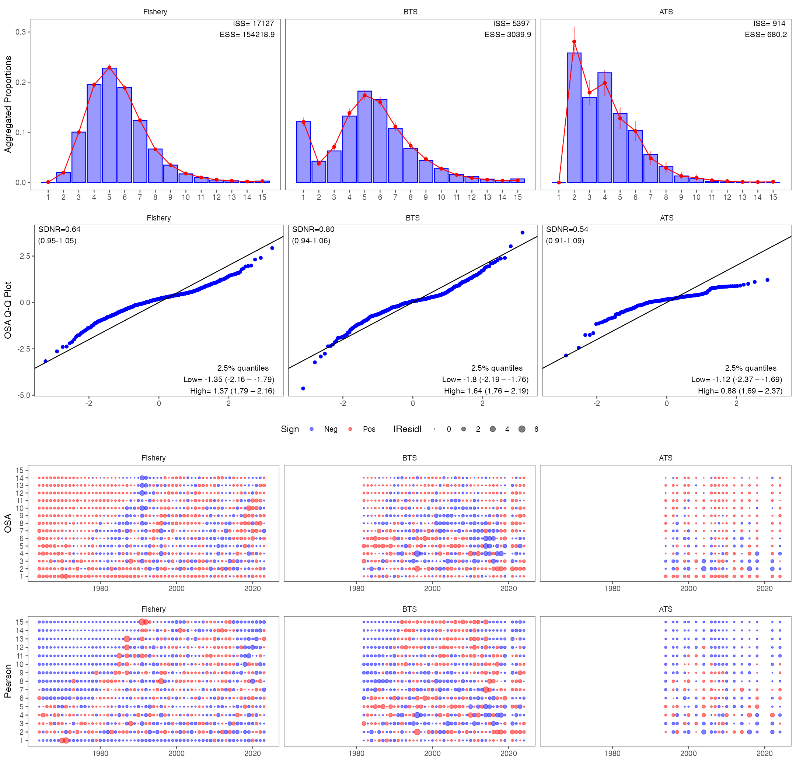
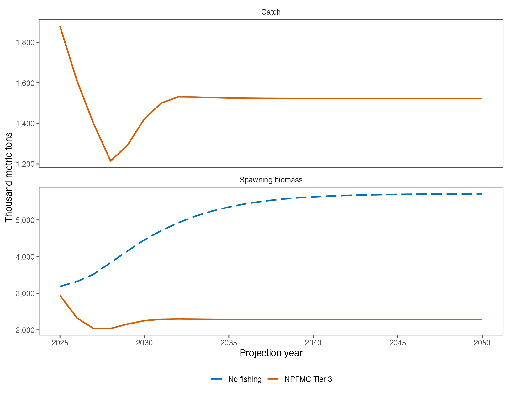

<!--
Editorial writing note for this document:
- Use plain language and define necessary scientific terms at first use.
- Replace jargon and unexplained abbreviations with familiar wording.
- State results, limits, and next steps in affirmative terms.
- Preserve specialized terms when they carry a precise scientific meaning.
-->

::: {.callout-note title="AI-assisted development"}
Artificial intelligence (AI) tools were used to aid document development and
model implementation. AI-assisted material was reviewed and revised by the
authors, who retain responsibility for the scientific content, code, analyses,
interpretations, and conclusions.
:::

# Summary

::: {.callout-note title="Summary placeholder"}
TODO: Update this summary after the relevant assessment-development sections
have been moved into this document. Summarize the changes in assessment inputs,
methods, diagnostics, projections, and management advice represented in the
completed sections.
:::

# Introduction

This document brings together eastern Bering Sea pollock assessment work
affected by the 2025 funding lapse and federal furlough. Routine SAFE
preparation, review, and archiving paused during that period. After work
resumed, data preparation and model development progressed on different
schedules. This report restores a single review record for the data updates,
model numbering, ADMB-to-RTMB bridge, and 2026 RTMB and Rceattle development.

The appendices preserve supporting material that informs this work.
[Appendix 1](#sec-ssc-comments) presents the main SSC comments and planned
responses and retains the earlier 2024 comments. [Appendix
2](#sec-length-frequency-patterns) summarizes seasonal and spatial patterns in
the observed pollock length-frequency samples. [Appendix
3](#sec-esp-development-framework) provides the development structure for an
EBS pollock Ecosystem and Socioeconomic Profile (ESP). Together, the main
sections and appendices connect the resumed work with the assessment review
record.

# Model specifications

## Model numbering plan

The model number should identify the model's place in the review record. The
software name should be shown separately. Under this plan, **Model 23.0** is the
2024 ADMB source and **Model 23.1** is its direct RTMB translation check. The
newer model names are **Model 25.0 (RTMB)** for the work begun in 2025 and
**Model 26.0 (Rceattle)** for the development line begun in 2026.

```{mermaid}
%%| label: fig-model-numbering
%%| fig-cap: "Proposed numbering and development history for EBS pollock assessment models."
%%| fig-alt: "Flowchart beginning with the Model 23.0 ADMB source used in 2024. One branch passes through the Model 23.1 RTMB translation check to Model 25.0 in RTMB, begun in 2025. A second branch leads to Model 26.0 in Rceattle, begun in 2026. SPoRC supports comparisons with both development lines and would receive a model number if advanced as an assessment candidate."

flowchart LR
  accTitle: EBS pollock assessment model numbering and development history
  accDescr: Flowchart from the 2024 Model 23.0 ADMB source to the Model 23.1 RTMB translation check, Model 25.0 RTMB line, and Model 26.0 Rceattle line, with SPoRC supporting comparisons of the two development lines.
  A["Model 23.0<br/>2024 ADMB source"] -->|"direct translation<br/>and checks"| B["Model 23.1<br/>RTMB translation check"]
  B --> C["Model 25.0<br/>RTMB line begun in 2025"]
  A -->|"new implementation<br/>and development"| D["Model 26.0<br/>Rceattle line begun in 2026"]
  S["SPoRC<br/>supporting comparison"] -.->|"common tests"| C
  S -.->|"common tests"| D
  classDef model fill:#e8f0f7,stroke:#52616b,color:#111111
  class A,B,C,D,S model
```

The labels should be used as follows:

- **Model 23.0 (ADMB)** identifies the accepted source model used in 2024.
- **Model 23.1 (RTMB)** identifies the direct translation used to check that the
  new code reproduces Model 23.0. Its role is a numbered translation check,
  while Model 23.0 continues to support management advice.
- **Model 25.0 (RTMB)** is the public name for the RTMB assessment line begun in
  2025 at the SSC's request.
- **Model 26.0 (Rceattle)** is the public name for the Rceattle development line
  begun in 2026. List its scientific changes separately from the software
  change. Its bridge, diagnostics, retrospective behavior, and projections
  support review of its future operational role. Model 23.0 continues to
  support current management advice.
- **SPoRC** remains a supporting comparison. The [single-region EBS pollock
  vignette](https://chengmatt.github.io/SPoRC/articles/f_single_region_ebs_pollock_case_study.html)
  illustrates the bridge from Model 23.0 to SPoRC and identifies the current
  differences between the implementations. Research on pollock movement and
  connections between U.S. and Russian waters is progressing. A numbered model
  name would apply when SPoRC advances as an assessment candidate.

For later variants, keep the main number and add a decimal suffix, such as
26.1 or 26.2. Each suffix should represent one clearly documented change. Use
the same label in the report, tables, presentations, run folders, and archive.

# Data

## Data summary {#sec-data-summary}

The current cross-platform comparison uses the sex-combined, ages 1--15 data
basis inherited from the 2024 Model 23.0 assessment. The population time series
extends from 1964 through 2024. Fishery age compositions extend through 2023
because of the normal processing lag. The same underlying assessment
observations are translated into the ADMB, RTMB, SPoRC, and Rceattle input
structures. Each model retains its own fit calculations, sample-size
conventions, and data organization. The accepted assessment and
2024 model-evaluation documents provide the overall data lineage
[@ianelli2023a; @ianelli2024].

The basic data used across the platforms are:

- **Fishery data:** annual retained catch from 1964 through 2024, fishery age
  compositions from 1964 through 2023, empirical fishery weight at age, and
  the historical fishery catch-per-unit-effort (CPUE) index for 1965--1976.
- **Bottom-trawl survey (BTS):** the biomass index and its covariance,
  age compositions, sample sizes, and survey weight at age for 42 survey years
  during 1982--2024. The standard survey was absent in 2020. Model-based
  estimation of pollock survey indices and age compositions is described by
  @OLeary2020, and spatially structured estimation of pollock weight at age is
  described by @indivero2023.
- **Acoustic-trawl survey (ATS):** pollock abundance indices, age compositions,
  sample sizes, and weight at age for 19 survey years during 1994--2024. The
  survey series includes separate information for age-1 pollock and older
  pollock. Survey methods are documented by @honkalehto2015; current work on
  uncertainty in acoustic-trawl estimates is described by @urmy2025.
- **Supplementary abundance indices:** the acoustic vessel-of-opportunity
  (AVO) series has 18 observations during 2006--2024, and the historical CPUE
  series has 12 observations during 1965--1976. The AVO approach and recent
  reanalysis are described by @honkalehto2011 and @lauffenburger2024.
- **Biological schedules:** the models use ageing-error information, maturity,
  natural mortality, and spawning, fishery, and survey weight-at-age schedules.
  AFSC pollock ageing methods and data quality are summarized by
  @matta2026agegrowth; spatial and temporal variation in EBS pollock weight at
  age is evaluated by @indivero2023.

| Platform | Use of the shared data basis |
|---|---|
| **ADMB (Model 23.0)** | Provides the accepted 2024 assessment reference, observation schedule, and source model settings. |
| **RTMB (Models 23.1 and 25.0)** | Uses the corrected ADMB bridge inputs directly and preserves the complete ages 1--15 BTS composition treatment. See the [RTMB data-input documentation](https://jimianelli.github.io/rtmb_ebswp/ebs_pollock_rtmb_ebswp_assessment.html#data-inputs). |
| **SPoRC** | Maps the corrected bridge observations to one fishery and four survey/index components for an independent single-region model comparison. See the [SPoRC EBS pollock working paper](https://jimianelli.github.io/sporc_ebswp/). |
| **Rceattle (Model 26.0)** | Reads a workbook prepared from the same 1964--2024 assessment source and retains all 15 modeled ages. See the [Rceattle EBS pollock application](https://noaa-afsc.github.io/ebswp_rceattle/). |

: Cross-platform use of the common 2024 EBS pollock assessment data. The table
describes the shared observations. Each platform retains its own internal data
structure and method for measuring model fit. {#tbl-cross-platform-data}

The summary above describes the common 2024-terminal bridge used for model
comparison. New 2025 and 2026 observations will enter the assessment only
after their source products, sample sizes, ageing-error treatment, and quality
control have been finalized.

## Issues {#sec-age-data-issues}



# Model results

## Model 23.1 {#sec-model-23-1}

The [September 2025 ADMB-to-RTMB bridge](https://noaa-afsc.github.io/EBS_pollock/doc/Sept_2025.html#bridging-admb-to-rtmb)
documented the small ADMB changes made before checking the direct RTMB
translation. For the model numbering used here, **ADMB original = Model 23.0**
and **ADMB Modified = Model 23.1**. The second label identifies the adjusted
ADMB version used to build and check Model 23.1 in RTMB. Model 23.1 serves as a
translation check, while Model 23.0 continues to support management advice.

The spawning biomass and age-1 recruitment comparisons are reproduced in
@fig-model-23-1-admb-bridge. The source analysis attributes most of the small
differences between the series to a revised rule for fishery selectivity,
specifically the penalty applied when selectivity declines after age 6.

{#fig-model-23-1-admb-bridge fig-alt="Two-panel comparison of Models 23.0 and 23.1 from 1978 through 2024. The upper panel shows closely tracking spawning stock biomass trajectories with uncertainty ribbons. The lower panel shows closely tracking age-1 recruitment estimates with uncertainty bars. Model 23.1 is generally slightly above Model 23.0 for spawning biomass, while recruitment differences are small and vary by year." width="100%"}

## Model 25.0 {#sec-model-25-0}

The RTMB implementation matches the corrected ADMB bridge, including the full
BTS age range, at the same best-fitting ADMB values, called maximum-likelihood
estimates. Observed and predicted BTS age compositions each cover ages 1--15
and sum to one. Integer sample sizes set their influence in the multinomial
likelihood, the fit calculation for age proportions. The total number of fish
used to scale the age composition retains its ages 2--15 definition. The
fitted BTS survey index measures biomass. Comparison with the historical
configuration shows the effect of correcting the treatment of BTS data in the
model fit.

The same corrected base model supports the one-step-ahead (OSA) checks, the
analysis fitted only to BTS data (Only-BTS sensitivity), nine retrospective
peels that remove recent years in sequence, and stock-production-model (SPM)
projections. The retrospective procedure accounts for reporting lags among
data streams and uses the previous year's selectivity curve for the final
year. Positive Mohn's rho values, which summarize the direction and size of
retrospective change, identify a stability concern for continued evaluation.
Simulation testing and review will guide future operational refinements.
Current management advice uses the accepted ADMB assessment model. The
hierarchical Form-2 results generated with SparseNUTS describe a separate
selectivity option.

### Evaluation of time-varying BTS availability {#sec-bts-availability}



## Model 26.0 {#sec-model-26-0}

### Data and simple model approach

Model 26.0 uses the common 1964--2024 bridge data described in
@sec-data-summary. This run was fitted with Rceattle version 5.23.0 from the
[`dsem-v5-integration` branch](https://github.com/grantdadams/Rceattle/tree/dsem-v5-integration),
pinned at commit
`adf22f84b399e84e3b9a707e0b3bbb1624179a27`. The version number and commit are
reported together because the run represents a branch snapshot.

The simple configuration retains non-parametric selectivity for the fishery,
acoustic vessel-of-opportunity (AVO), acoustic-trawl survey (ATS), and
historical catch-per-unit-effort series. The bottom-trawl survey (BTS) retains
the logistic curve and separate age-1 component used in the bridge. Annual
selectivity changes follow the established random-walk configuration. The 2D
age-by-year AR1 formulation remains a separate research sensitivity, allowing
this analysis to focus on the simpler assessment structure requested for Model
26.0.

```{mermaid}
%%| label: fig-model-26-approach
%%| fig-cap: "Data and calculation flow for the simple Model 26.0 Rceattle analysis."
%%| fig-alt: "Fishery catch, survey and abundance indices, age compositions, and biological schedules enter the Rceattle population model. The model estimates annual abundance, recruitment, fishing mortality, and selectivity. The fitted model is then compared with the Model 23.2 bridge and used for OSA residuals, jitter tests, self-tests, retrospective analysis, native projections, and exploratory DSEM pathways."

flowchart LR
  accTitle: Simple Model 26.0 data and analysis flow
  accDescr: Assessment observations and biological schedules enter the simple Rceattle population model. Its fitted states support the bridge comparison, diagnostics, projection, and exploratory DSEM analyses.
  A["Catch and abundance indices"] --> M["Model 26.0<br/>Rceattle 5.23.0"]
  B["Ages 1-15<br/>composition data"] --> M
  C["Maturity, mortality,<br/>weight, and ageing error"] --> M
  M --> S["Abundance, recruitment,<br/>fishing mortality, selectivity"]
  S --> V["Model 23.2 bridge comparison"]
  S --> D["OSA, jitter, self-test,<br/>and retrospective checks"]
  S --> P["Native Rceattle projection"]
  S --> E["Exploratory DSEM pathways"]
  classDef input fill:#e8f0f7,stroke:#52616b,color:#111111
  class A,B,C,M,S,V,D,P,E input
```

| Item | Model 26.0 setting |
|---|---|
| Assessment years and ages | 1964--2024; ages 1--15 |
| Composition fit | `MultinomialAFSC`; likelihood sample sizes retained from the bridge workbook |
| Non-parametric selectivity | Fishery, AVO, ATS, and historical CPUE |
| BTS selectivity | Logistic curve with the separate age-1 component retained from the bridge |
| Time variation | Established random-walk selectivity changes |
| Natural mortality | Fixed age schedule used in the bridge |
| Fitting sequence | Scale fit with annual selectivity changes held constant, followed by the full simple fit |

: Main settings for the Rceattle 5.23.0 Model 26.0 analysis. {#tbl-model-26-configuration}

The current branch retains the time-varying parametric BTS field as a
compatibility setting and directs future development toward the newer
selectivity-linkage interface. This run keeps the compatibility setting to
match the bridge configuration. A later Model 26.x comparison can evaluate
the interface change separately.

Both fitting stages met the current Rceattle convergence criteria. Model 26.0
had a maximum absolute gradient of $7.65\times10^{-5}$, a positive-definite
Hessian, and a Hessian condition number of 489,090. The weakest direction
remains associated with the shared ATS/AVO annual selectivity changes.

| Fit | Objective | Maximum gradient | Positive-definite Hessian | Status |
|---|---:|---:|:---:|:---:|
| Stage 1 scale fit | 562.952 | 0.0000495 | Yes | OK |
| Model 26.0 | 716.908 | 0.0000765 | Yes | OK |

: Model 26.0 fitting results from Rceattle 5.23.0. {#tbl-model-26-convergence}

The analysis is archived as separate R scripts for the
[assessment fit and OSA checks](scripts/model-26-0/run_model_26_rceattle_5_23.R),
[DSEM pathways](scripts/model-26-0/run_model_26_dsem_5_23_pathways.R),
[projection and retrospective](scripts/model-26-0/run_model_26_projection_retro_5_23.R),
and [self-test](scripts/model-26-0/run_model_26_self_test_5_23.R).

### Model 23.2 bridge comparison

For this comparison, **Model 23.2** identifies the Rceattle-aligned ADMB bridge
configuration. It contains the structural and likelihood changes needed to
place the ADMB and Rceattle calculations on a common basis. Model 23.2 therefore
provides the closest reference for evaluating the fitted Model 26.0
trajectories, while Model 23.1 continues to identify the direct RTMB translation
described earlier.

| Quantity | Correlation | Mean absolute difference | 2024 difference |
|---|---:|---:|---:|
| Spawning biomass | 0.9992 | 1.45% | +2.88% |
| Age-1 recruitment | 0.9997 | 0.69% | -4.95% |
| Total biomass | 0.9989 | 1.17% | +1.63% |

: Basic comparison of Model 26.0 with the Model 23.2 Rceattle-aligned ADMB
bridge. Differences are relative to Model 23.2. {#tbl-model-26-bridge}

The fitted trajectories closely follow the bridge over the full assessment
period (@fig-model-26-bridge). The remaining differences reflect parameter
estimation in Rceattle rather than a fixed-parameter translation test.

{#fig-model-26-bridge fig-alt="Three vertically arranged time-series panels compare Model 26.0 with the Model 23.2 bridge from 1964 through 2024. The two lines closely track for spawning biomass, age-1 recruitment, and total biomass, with small departures in selected years." width="92%"}

### Diagnostics

The diagnostic sequence begins with one-step-ahead residuals for composition
data, followed by dispersed starting values, simulated-data recovery, and
retrospective peels. These tests address complementary questions: observation
fit, sensitivity to starting values, recovery under known simulated data, and
stability as recent years are removed.

#### One-step-ahead residuals

One-step-ahead (OSA) residuals compare each observed age proportion with its
conditional prediction after the preceding age bins have been accounted for.
Rceattle calculated the internal residuals, and
[`afscOSA` version 0.0.1](https://github.com/noaa-afsc/afscOSA/releases/tag/v0.0.1)
produced the common AFSC plots and summaries. The `N` input came from the
Rceattle `Sample_size` field used in the multinomial likelihood. It represents
the likelihood sample size rather than an estimated effective sample size.

| Composition source | Residuals | SDNR | Expected interval | Input sample-size total | Effective sample size |
|---|---:|---:|---:|---:|---:|
| Fishery | 840 | 0.638 | 0.952--1.048 | 17,127 | 154,219 |
| BTS | 588 | 0.802 | 0.943--1.057 | 5,397 | 3,040 |
| ATS | 266 | 0.534 | 0.915--1.085 | 914 | 680 |

: OSA dispersion and aggregate sample-size diagnostics. SDNR is the standard
deviation of normalized residuals. The sample-size totals reflect the integer
counts retained by the `afscOSA` plotting conversion. {#tbl-model-26-osa}

Each SDNR is below its expected interval, showing that the OSA residuals are
narrower than the standard-normal reference. The bubble plots provide the more
useful guide to persistent age, year, and cohort patterns. The current Rceattle
decomposition also marked 188 extremely small conditional predictions as
uninformative, including slight values below zero. Interpretation therefore
emphasizes aggregate fits and cells supported by appreciable predicted counts.

{#fig-model-26-osa fig-alt="Four rows of diagnostic plots for fishery, bottom-trawl survey, and acoustic-trawl survey age compositions. The first row compares aggregate observed and fitted proportions. The second row shows OSA quantile plots with SDNR values below one. The lower rows show OSA and Pearson residual bubbles by age and year." width="100%"}

#### Jitter test

Fifty phased refits began from parameter values perturbed with standard
deviation 0.2 and seed 20260831. All 50 completed with convergence status OK.
Forty-seven returned to the best objective within 0.001. Three reached the same
higher objective, approximately 609.5 units above the best value
(@fig-model-26-jitter). This repeated higher solution identifies a second mode
and supports retaining the two-stage fitting sequence and dispersed-start
checks in routine work.

| Requested fits | Converged fits | Returned to best | Higher-mode fits | Largest objective difference |
|---:|---:|---:|---:|---:|
| 50 | 50 | 47 | 3 | 609.5 |

: Fifty-start jitter test for Model 26.0. {#tbl-model-26-jitter}

{#fig-model-26-jitter fig-alt="Histogram of objective differences for 50 converged jitter fits. Forty-seven values cluster at zero, while three fits occur around 609.5 objective units above the best solution." width="78%"}

#### Self-test

The self-test simulated 50 new observation sets from Model 26.0 and refitted
each from the original pre-fit starting values. Recruitment deviations were
held at their fitted realization, so this test measures recovery under new
observation error. All 50 refits completed with convergence status OK; the
largest maximum gradient was $1.19\times10^{-4}$.

| Quantity | Median difference | Mean absolute difference | Central 90% range |
|---|---:|---:|---:|
| Age-1 recruitment | -1.51% | 9.76% | -23.76% to +22.83% |
| Spawning biomass | -2.09% | 6.23% | -13.55% to +17.75% |
| Total biomass | -1.71% | 4.77% | -9.34% to +13.36% |

: Recovery across all years and the 50 observation-level self-tests.
{#tbl-model-26-self-test}

The current simulator redrew some AVO and BTS index observations to retain
positive values. Those simulated observations follow a positive-truncated
distribution while the fitted bridge likelihood uses the corresponding normal
form. The recovery summary is therefore strongest as a fitting and coding
check. A future observation-model sensitivity can align the fitted and
simulated distributions directly.

{#fig-model-26-self-test fig-alt="Horizontal boxplots show percent differences from the operating-model values for age-1 recruitment, spawning biomass, and total biomass across 50 simulated observation sets and all assessment years. Distributions are centered slightly below zero and are widest for recruitment." width="82%"}

#### Retrospective patterns

Nine phased peels ended in 2023 through 2015. The current Rceattle
retrospective method preserves stream-specific observation lags, fixes peeled
time-varying parameters at each peel's terminal-year values, and extends the
peeled result through the removed years using observed catch and mean
recruitment. All nine peels completed with convergence status OK. Their maximum
gradients ranged from $8.17\times10^{-9}$ to $3.00\times10^{-4}$.

| Quantity | Year-0 Mohn's rho |
|---|---:|
| Total biomass | 2.899 |
| Spawning biomass | 2.151 |
| Age-1 recruitment | 0.121 |
| Fishing mortality | 0.713 |

: Mohn's rho from nine Model 26.0 retrospective peels. Year 0 compares each
peel at its terminal assessment year. {#tbl-model-26-retro}

The positive values show that models ending in earlier years generally
estimate larger biomass, recruitment, and fishing mortality at their terminal
years than the corresponding values from the full model. The large biomass
values identify retrospective stability as a central Model 26.0 development
priority (@fig-model-26-retro). Logarithmic vertical scales preserve the
visibility of the full model and recent peels while also showing the much
larger 2015 and 2016 peel estimates.

{#fig-model-26-retro fig-alt="Four line-chart panels use logarithmic vertical scales to show the full Model 26.0 time series and nine retrospective peels ending from 2023 back to 2015. The 2015 and 2016 peels have much larger terminal recruitment and biomass estimates than the full model. The logarithmic scales keep the full model and recent peels visible while retaining those extreme early-peel estimates." width="100%"}

### Projections

The native Rceattle projection carries the saved Model 26.0 state from 2025
through 2050 under the NPFMC Tier 3 harvest rule. The setup assigns all
projected fishing mortality to the commercial fishery, uses $F_{40\%}$ as the
target and $F_{35\%}$ as the limit, and applies the rule beginning in 2025.
These deterministic results test the current branch's projection pathway.
The accepted Model 23.0 continues to provide management advice.

| Year | Spawning biomass | Catch | Fishing mortality | Biomass relative to the $F_{40\%}$ reference |
|---:|---:|---:|---:|---:|
| 2025 | 2,944 | 1,880 | 0.324 | 1.25 |
| 2026 | 2,332 | 1,612 | 0.324 | 1.00 |
| 2027 | 2,034 | 1,397 | 0.324 | 0.88 |
| 2028 | 2,040 | 1,214 | 0.286 | 0.89 |
| 2030 | 2,254 | 1,423 | 0.305 | 0.98 |
| 2035 | 2,291 | 1,525 | 0.324 | 1.00 |
| 2050 | 2,286 | 1,522 | 0.324 | 1.00 |

: Deterministic native Rceattle projection. Biomass and catch are in thousand
metric tons. {#tbl-model-26-projection}

Spawning biomass reaches its smallest ratio to the target reference in 2027.
The harvest rule then reduces fishing mortality, and the projected stock
returns toward the target reference by the early 2030s. The no-fishing line in
@fig-model-26-projection provides a calculation reference rather than a harvest
alternative proposed for management.

{#fig-model-26-projection fig-alt="Two projection panels show spawning biomass and catch from 2025 through 2050. The NPFMC Tier 3 spawning-biomass line declines through 2027 and then approaches a stable level. A no-fishing reference rises over time. Catch falls through 2028 and then approaches a stable level." width="90%"}

### Exploratory DSEM recruitment pathways

The Dynamic Structural Equation Model (DSEM) analysis links recruitment to a
small set of prespecified environmental pathways while retaining the Model
26.0 assessment structure. It uses the same Rceattle 5.23.0 branch snapshot.
The four models share the same observation years, missing-value pattern,
standardization, and time-series treatment of the two environmental indices.

The response is age-1 recruitment. Late-summer sea-surface temperature (SST)
is aligned with the cohort's age-0 year. Cold-pool extent is aligned with the
following age-1 calendar year. SST represents a broad energetic-condition
pathway, while cold-pool extent represents a possible spatial-separation and
cannibalism pathway. The conceptual graph keeps the biological steps visible
even though the fitted examples use direct proxy paths (@fig-model-26-dsem-dag).

{#fig-model-26-dsem-dag fig-alt="Directed graph in which sea ice affects cold-pool extent, temperature, blooms, and prey. Prey and juvenile abundance affect age-0 energy and overwinter survival. Cold-pool extent and adult-juvenile overlap affect cannibalism. These survival pathways lead to age-1 recruitment. Dashed direct paths connect late-summer SST and cold-pool extent to recruitment for the fitted proxy models." width="100%"}

All four DSEM fits completed with positive-definite Hessians and convergence
status OK. The age-0 SST model had the lowest Akaike information criterion
(AIC). The combined model was 1.63 AIC units higher, the no-edge reference was
2.25 units higher, and the cold-pool model was 4.11 units higher
(@tbl-model-26-dsem; @fig-model-26-dsem-aic).

| DSEM specification | Delta AIC | Reduction in unexplained recruitment variation |
|---|---:|---:|
| Age-0 late-summer SST | 0.00 | 10.5% |
| Cold pool + age-0 late-summer SST | 1.63 | 12.0% |
| No-edge reference | 2.25 | 0.0% |
| Cold pool | 4.11 | 0.3% |

: Exploratory DSEM comparison using the common data block. {#tbl-model-26-dsem}

{#fig-model-26-dsem-aic fig-alt="Horizontal bars compare AIC differences for age-0 late-summer SST, the combined SST and cold-pool model, the no-edge reference, and the cold-pool-only model. The SST-only model has the lowest AIC." width="76%"}

| Model | Recruitment pathway | Estimate | 95% interval |
|---|---|---:|---:|
| Cold pool | Cold pool | 0.041 | -0.169 to 0.251 |
| Age-0 late-summer SST | SST | -0.222 | -0.426 to -0.017 |
| Combined | Cold pool | -0.069 | -0.292 to 0.153 |
| Combined | SST | -0.254 | -0.484 to -0.024 |

: Standardized direct proxy pathways to age-1 recruitment. {#tbl-model-26-dsem-paths}

The SST pathway is negative in both models that include it, with intervals
below zero. The cold-pool pathway is smaller and its interval spans zero in
both models. These results describe an in-sample association that is consistent
with the proposed energetic pathway. Direct measurements of fall age-0 energy,
prey quality, overwinter survival, and juvenile-adult overlap will provide the
stronger next tests of the biological mechanism.

{#fig-model-26-dsem-paths fig-alt="Point estimates and 95-percent intervals compare direct cold-pool and age-0 late-summer SST paths to recruitment. Both SST estimates are negative with intervals below zero. Cold-pool estimates lie near zero with intervals spanning zero." width="88%"}

The diagnostics and DSEM results support continued Model 26.0 development.
The close bridge trajectories and complete convergence provide a strong
implementation basis. The OSA dispersion, repeated higher jitter mode, and
large biomass retrospective pattern define the next evaluation priorities.
The ESP framework in [Appendix 3](#sec-esp-development-framework) organizes the
additional indicator and mechanism work.

# References {.unnumbered}

::: {#refs}
:::

# Appendix 1: Main SSC comments and responses {#sec-ssc-comments}

A funding lapse ended preparation of the November and December 2025 EBS
pollock SAFE package. The October 2025 SSC comments therefore carry forward to
the 2026 assessment cycle for formal response. The responses below describe
the planned work for 2026 and later years.

## Current status

- The next assessment needs to trace the 2025 RTMB starting model back to the
  2024 ADMB source, along with updated survey data, 2025 FT-NIRS ages, the
  comparison of traditional and FT-NIRS ages, model names, and the document
  archive.
- Work continues on Rceattle, SPoRC, natural mortality, selectivity, and
  age-composition weighting in response to the SSC comments.
- Current analyses address Russian catches and the recruitment penalty for the
  2018 year class.
- Work on the revised AVO index depends on completion and review of the new
  uncertainty analysis.

Completion of an SSC response requires the analysis, results, and explanation
for review. Current research contributes evidence toward that completion.

## Comments and responses

| SSC comment | Response |
|---|---|
| Use the 2024 base model as the source for an RTMB implementation, with routine data updates. | Use the accepted Model 23.0 (ADMB) configuration as the scientific source. First check the direct RTMB translation as Model 23.1, then use Model 25.0 (RTMB) for the assessment line begun in 2025. List each new data set and each model change separately. Save the model version, run files, diagnostics, projections, and management quantities used in the report. |
| Use the updated Groundfish Assessment Program estimates of survey biomass and age composition. | Add the `sdmTMB` biomass estimates and `tinyVAST` age compositions as updated survey data. Record the data delivery date, software version, model settings, and input files. Compare the old and new survey series and show whether the change affects the assessment results. |
| Use FT-NIRS age compositions for the 2025 fishery and surveys. | Document how the FT-NIRS ages were produced, screened, grouped, and assigned to fishery and survey data. Record sample sizes and aging-error matrices. Check the final model input against the source data before fitting the assessment. |
| Compare traditional microscope ages with FT-NIRS ages and show the effects on model results and management quantities. | Run the same assessment with traditional ages, FT-NIRS ages with one aging-error matrix, and FT-NIRS ages with fleet-specific aging-error matrices. Compare cohort patterns, fits to fishery and survey ages, residuals, recruitment, spawning biomass, reference points, ABC, and OFL. Save the full comparison in the assessment appendix and at a permanent web address. |
| Revisit the revised AVO index after the new uncertainty analysis has been reviewed. | After review of the final uncertainty method, compare the revised point estimates and uncertainty with the current AVO series. Show their effect on model fit, stock estimates, and management quantities before proposing a change to the base model. |
| Develop a plan with the BSAI Groundfish Plan Team for moving beyond ADMB. | Use the model history and numbering plan above. Compare RTMB, Rceattle, and SPoRC with the same data and a common set of tests. Ask the Plan Team to agree on the tests before selecting the model software for future assessments. Keep the accepted assessment model as the control until a replacement gives stable estimates, sound uncertainty, acceptable retrospective results, and reproducible projections. |
| Examine the effect of including Russian catches. | First confirm the source, area, years, units, species identification, and uncertainty of the Russian catch estimates. Then run clearly defined catch scenarios. Explain the assumptions about stock movement and population boundaries and show the effects on stock size, reference points, ABC, and OFL. |
| Explore time-varying natural mortality, selectivity, age-composition weighting, and cohort and temperature effects on weight at age. | Study each topic separately. State the scientific question before fitting a model. For each change, show model fit, parameter uncertainty, retrospective results, projections, and effects on management advice. Keep poorly estimated or unstable models as research results. |
| Continue work with CEATTLE estimates of natural mortality and consider Rceattle for time-varying mortality. | Test time-varying natural mortality as a sensitivity analysis. Check whether the model can separate mortality changes from recruitment, selectivity, and survey effects. The full set of assessment needs will guide the choice of model software. |
| Explain how the recruitment penalty affects the estimated 2018 year class and why the likelihood profile favored a larger recruitment estimate. | Prepare a likelihood profile for the 2018 recruitment deviation. Show how the recruitment penalty and each data source change across the profile. Explain which parts of the model favor a larger year class and how the estimate affects spawning biomass, reference points, ABC, and OFL. |
| Clearly identify the models proposed for the assessment, including model numbers. | Use Model 23.0 (ADMB) for the accepted 2024 source, Model 23.1 (RTMB) for the direct translation check, Model 25.0 (RTMB) for the line begun in 2025, and Model 26.0 (Rceattle) for the line begun in 2026. Use the same short names in the report, presentations, run folders, tables, and archive. For every model, list its purpose, parent model, data set, model changes, software version, and review status. State clearly which model is recommended for management advice. |
| Archive the October and December SAFE documents and presentations. | Archive the October 2025 material that exists and add a short note explaining that the funding lapse prevented the November and December SAFE package. For future reviews, save the Quarto source, rendered reports, presentations, model files, data list, software versions, and file checksums in one dated release. |

: Responses to the October 2025 SSC comments on EBS pollock. The SSC comments
are summarized from pages 27 to 29 of the final October 2025 SSC report.

## Earlier responses to 2024 SSC comments

::: {.callout-note title="Retained material"}
The responses below were on the previous version of the SSC response page and
retain their original scientific claims. Confirm these claims against the
completed analyses and assessment record before citing them as final 2025
results.
:::

**Dynamic Species Environment Models (DSEM) and recruitment mechanisms**  
*The SSC recommended further exploration of DSEM to reconcile contrasting signals such as record larval biomass in 2024, low age-0 abundance, chronically low condition, and increasing adult biomass.*  
*In 2025, exploratory DSEM analyses continue under the ESR framework and remain outside the current assessment. The Recruitment section presents anomalous recruitment indicators for context.*

> **2026 activity:** The [Rceattle application](https://noaa-afsc.github.io/ebswp_rceattle/) presents the DSEM analysis together with preliminary ESP work.

**Pollock cannibalism index**  
*The SSC requested extrapolation of the index to biomass consumed.*  
*For 2025, the index is updated. Work continues toward final biomass-consumed estimates as a development priority.*

**Tier 1 vs. Tier 3 classification**  
*The SSC supported Tier 3 classification given reliance on priors and limited data at low stock sizes.*  
*The 2025 assessment maintains Tier 3a status and focuses its calculations on that tier, consistent with SSC guidance.*

**Multispecies model outputs**  
*The SSC encouraged use of time-varying mortality or consumption estimates from the multispecies model, noting its strategic role in climate planning.*  
*In 2025, multispecies outputs remain under review for potential use in ESP indicators and future assessment development.*

**Biological observations**  
*The SSC noted low weight-at-age and condition in recent years and emphasized the importance of the 2018 year class.*  
*The 2025 BTS confirms condition remains below average. The 2018 year class continues to dominate spawning biomass but shows expected decline as it ages out of the population.*

**Selectivity assumptions**  
*The SSC supported the use of the five-year moving average selectivity for projections.*  
*This method is retained in 2025, with updated retrospective diagnostics.*

**Model status and diagnostics**  
*The SSC endorsed Model 23.0, Tier 3a classification, and ABC equal to the maximum permissible.*  
*Model 23.0 is retained for 2025 with updated data inputs. Tier 3a status and ABC recommendations remain as supported by the SSC.*

**Additional recommendations**

- *State-space approach (TMB/RTMB):* exploratory work is ongoing.
- *Russian proportion/movement:* work continues to develop updated estimates.
- *FT-NIR age validation:* further evaluation continues in preparation for integration.
- *Recruitment penalty (2018 cohort):* sensitivity analyses are included; discussion of penalty influence is provided.

**Stock-Recruitment relationship**  
*The SSC noted reduced influence under Tier 3, but stressed unbiased estimation of recruitment deviates and transparent use of steepness priors.*  
*The recruitment bias correction is set to zero; steepness priors remain meta-analysis based. The 2025 assessment presents the Tier 3 analysis.*

**Documentation request**  
*The SSC requested that the September 2024 SRR document be included as an appendix or linked.*  
*The document has been added as Appendix X in this SAFE.*

### SSC 2024 comments and 2025 responses

| SSC comment | 2025 response |
|---|---|
| Explore use of DSEM for pollock recruitment anomalies | Recruitment section presents the anomalies; exploratory analyses continue toward future integration. |
| Extrapolate cannibalism index to biomass consumed | Index updated; extrapolated biomass estimates continue in development toward final review. |
| Tier 1 vs. Tier 3 classification | Maintained Tier 3a classification and focused calculations on that tier. |
| Use multispecies model outputs (time-varying M, consumption) | Multispecies outputs remain under review for ESP and future assessment use. |
| Biological observations (low condition, 2018 year class) | 2025 BTS confirms below-average condition; 2018 cohort still dominant but declining. |
| Use of five-year moving average selectivity | Retained for 2025 projections; retrospective diagnostics updated. |
| Endorse Model 23.0, Tier 3a, ABC=max permissible | Continued use of Model 23.0; Tier 3a classification; ABC set equal to maximum permissible. |
| Recommendations: state-space approach, Russian distribution, FT-NIR, recruitment penalty | State-space exploration and FT-NIR evaluation continue; work is developing updated Russian estimates; sensitivity runs describe the penalty influence. |
| Stock-recruitment relationship | The 2025 assessment focuses on recruitment deviations with zero bias correction; the steepness prior remains meta-analysis based. |
| Add Sept 2024 SRR document as appendix | Document included as Appendix X. |

# Appendix 2: Length-frequency patterns {#sec-length-frequency-patterns}



# Appendix 3: Draft EBS pollock ESP development framework {#sec-esp-development-framework}

This appendix provides a working structure for an eastern Bering Sea pollock
Ecosystem and Socioeconomic Profile (ESP). It separates the concise assessment
development results in @sec-model-26-0 from the broader indicator synthesis,
evidence trail, and update cycle needed for a complete ESP. The headings below
can be expanded as current-year ecosystem and socioeconomic products become
available.

| ESP component | EBS pollock content | Current development status |
|---|---|---|
| Executive summary | Management relevance, principal ecosystem signals, socioeconomic conditions, and key data needs | Complete after the annual indicator assessment |
| Introduction and justification | Purpose, review history, focal population responses, and intended management use | Initial justification recorded; team review planned |
| Data | Assessment states, physical indices, plankton and prey indices, age-0 condition, predation and overlap products, and socioeconomic series | Core inventory assembled; biological mediators continue to expand |
| Indicator synthesis | Life-history table, conceptual pathways, and mechanism table | Draft structure and initial recruitment graph available |
| Proposed indicators | Small set selected by mechanism, timing, record length, uncertainty, and annual availability | SST and cold pool illustrate the workflow; age-0 energy and prey remain priorities |
| Indicator assessment | Current condition, trends, uncertainty, and plain-language interpretation | Update with current-year ESP and Ecosystem Status Report products |
| Indicator analysis | Common-data DSEM comparisons, pathway estimates, prediction checks, and scientific sign checks | Four current-branch DSEM fits presented in Section 5.3 |
| Data gaps and priorities | Age-0 energy, prey lipid and abundance, bloom-prey timing, overlap, and observation error | Priorities identified for team confirmation and annual production |
| Conclusion and management use | Role of each indicator in recruitment modeling, risk assessment, or monitoring | Complete after validation and review |

: Proposed EBS pollock ESP structure and present development status.
{#tbl-esp-appendix-structure}

## Executive summary

::: {.callout-note title="ESP summary placeholder"}
Summarize the current ecosystem and socioeconomic conditions after the annual
indicator assessment is complete. Distinguish indicators that improve
prediction from those that provide management context.
:::

## Introduction and justification

The ESP will connect ecosystem and fishing-community conditions with the
assessment quantities used to evaluate pollock status and risk. Age-1
recruitment is the initial focal population response because early survival
links physical conditions, prey, age-0 condition, overwinter survival, and
cannibalism with later assessment observations. The completed ESP should state
the management question for every retained indicator.

## Data

The ESP data inventory will record the source, units, timing, spatial coverage,
uncertainty, update schedule, and cohort alignment of each candidate series.
The inventory includes assessment states; sea ice, temperature, and cold-pool
indices; plankton and prey; age-0 abundance and condition; predator overlap and
consumption; and fishery and community indicators. The common data block used
for each statistical comparison will be archived with the results.

## Indicator synthesis

| Life stage | Processes emphasized | Current evidence | Priority information need |
|---|---|---|---|
| Spawning and eggs | Adult condition, timing, location, egg development, and transport | Adult and physical indices are regularly available | Cohort-specific egg production and transport exposure |
| Larvae | Bloom timing, prey match, transport, growth, and predation | Physical forcing is available across many years | Annual prey-match and larval-survival indices |
| Age 0 | Prey amount and quality, growth, distribution, and fall energy | SST is long; prey and condition series are shorter | Consistent fall abundance, diet lipid, energy density, and total energy |
| Overwinter age 0 to age 1 | Energy reserves, metabolic demand, winter conditions, and predation | Physical proxies and modeled recruitment are available | Direct annual survival observations and uncertainty |
| Juvenile and pre-recruit | Adult overlap, cannibalism, and other predation | Adult abundance is long; overlap products require timing review | Cohort-aligned overlap and predation mortality |
| Adult | Spawner abundance, condition, distribution, and cannibalism | Assessment abundance, maturity, and condition are available | Separation of maternal, density, and shared-data pathways |

: Draft life-history synthesis for the EBS pollock ESP.
{#tbl-esp-life-history}

The conceptual graph in @fig-model-26-dsem-dag is the initial recruitment
framework. Each candidate statistical pathway should trace to a stated
mechanism, cohort timing, expected direction, and documented data source.

## Proposed indicators

Candidate indicators will be screened for a clear biological or socioeconomic
mechanism, correct seasonal and cohort timing, adequate record length,
quantified uncertainty, stable annual production, and a defined use in
assessment or risk evaluation. The initial physical examples are age-0
late-summer SST and cold-pool extent. Proximal biological indicators such as
fall age-0 energy and lipid-rich prey have priority as their annual series
develop.

## Indicator assessment

For every retained indicator, the annual assessment will show the current
value, historical distribution, trend, uncertainty, and interpretation. A
short synthesis will distinguish broad environmental context from evidence
that directly informs recruitment, stock status, fishery performance, or
community exposure.

## Indicator analysis

The initial common-data DSEM comparison is presented in
@sec-model-26-0. Future analyses will add terminal-year and blocked prediction,
alternative cohort timing, observation-error sensitivity, retrospective
stability, and candidate graphs containing proximal biological mediators.
Candidate models will retain a common data block so changes in fit reflect the
pathways rather than a changing set of years.

## Data gaps and priorities

The principal biological priorities are fall age-0 energy, lipid content and
abundance of key prey, bloom and prey-match timing, juvenile-adult overlap,
predation mortality, and consistent observation-error estimates. The ESP team
will also identify fishery and community indicators with stable annual updates
and clear links to management questions.

## Conclusion and management use

The completed ESP will classify each indicator as suitable for recruitment
modeling, assessment risk evaluation, socioeconomic context, or continued
monitoring. Predictive indicators will require performance checks across
withheld years. Contextual indicators will retain value by describing current
conditions and plausible mechanisms even when they remain outside the
assessment likelihood.
