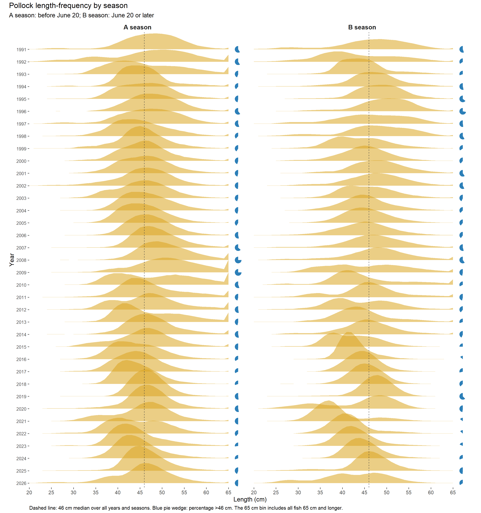
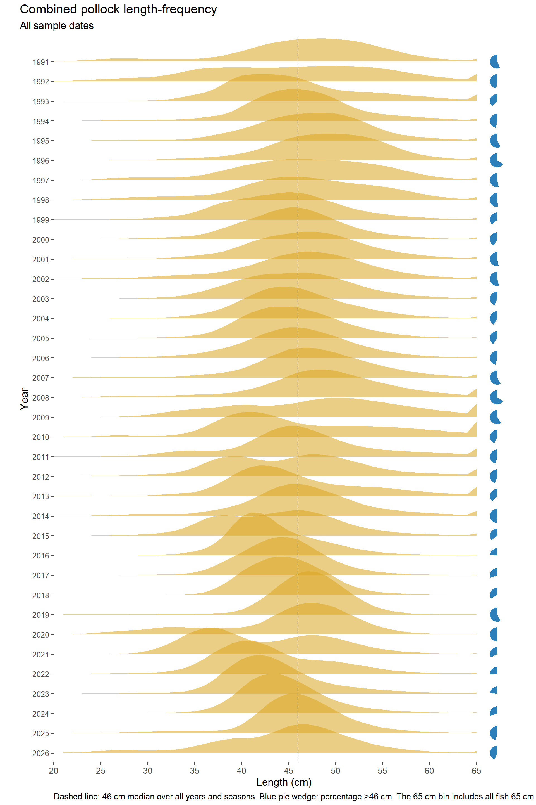

This appendix summarizes exploratory seasonal and spatial patterns in observed
pollock length-frequency samples. Its scope is exploratory description;
assessment-model tests belong in separate analyses. The source analysis
includes pollock observations from 1991
onward, excludes observations below 20 cm, and accumulates fish 65 cm and
longer in a 65-cm-plus group. Length frequencies are normalized within each
displayed year and grouping. A season includes samples collected before June
20; B season data are from June 20 onward. Earlier years appear at the top of
each figure.

Source material: [RTMB working-paper length-frequency appendix](https://jimianelli.github.io/rtmb_ebswp/ebs_pollock_rtmb_ebswp_assessment.html#sec-length-frequency-patterns).

### Change from 2025 to 2026

The observed length distribution shifted toward smaller fish from 2025 to
2026. Across seasons, mean sampled length declined from 46.17 to 44.81 cm,
while the median remained 46 cm. The percentage longer than 46 cm decreased
from 46.40% to 43.96%, and the percentage at or below 35 cm increased from
4.03% to 9.86%.

The shift occurred primarily in the B-season samples. B-season mean length
declined from 45.93 cm in 2025 to 42.55 cm in 2026, and the median declined
from 46 to 43 cm. The proportion longer than 46 cm decreased from 48.90% to
34.76%, while the proportion at or below 35 cm increased from 6.79% to 17.54%.
Both B-season area groups shifted toward smaller fish. In the western group
(`NMFS_AREA > 519`), mean length declined from 44.26 to 39.39 cm and the
percentage at or below 35 cm increased from 9.86% to 29.24%. In the eastern
group (`NMFS_AREA < 520`), mean length declined from 48.55 to 45.62 cm and the
percentage longer than 46 cm decreased from 70.13% to 49.88%.

The A-season change was smaller and differed in shape. Mean length declined
from 46.39 to 45.82 cm and the median remained 46 cm, while the percentages
longer than 46 cm and at or below 35 cm both increased. This indicates greater
representation in the tails of the sampled A-season distribution in 2026.
Sample coverage also changed: the A-season count increased from 91,912 to
101,038 observations, whereas the B-season count decreased from 80,749 to
45,057. These are unstandardized sample distributions, so the differences
describe the available observations and may reflect changes in sampling as
well as changes in the fish encountered by the fishery.

### A- and B-season distributions

The seasonal distributions show the larger 2026 shift toward smaller fish in
the B season and the broader-tailed A-season pattern
(@fig-appendix-lf-seasons).

{#fig-appendix-lf-seasons fig-alt="Two-panel ridge plot of annual pollock length-frequency proportions from 1991 onward. A-season distributions before June 20 appear in the left panel and B-season distributions from June 20 onward appear in the right. Each row represents one year; a dashed vertical line marks 46 cm and a blue pie wedge gives the percentage longer than 46 cm."}

### Combined-season distributions

The combined-season series places the 2026 increase in fish at or below 35 cm
within the longer record of annual sample distributions
(@fig-appendix-lf-combined).

{#fig-appendix-lf-combined fig-alt="Ridge plot of annual pollock length-frequency proportions across A and B seasons from 1991 onward. Each row represents one year; a dashed vertical line marks 46 cm and a blue pie wedge gives the percentage longer than 46 cm."}

### B-season distributions by NMFS area

The B-season area comparison shows a stronger shift toward smaller fish in the
western group, while the eastern group retains a larger share above 46 cm
(@fig-appendix-lf-b-season-area).

{#fig-appendix-lf-b-season-area fig-alt="Two-panel ridge plot of annual B-season pollock length-frequency proportions from June 20 onward for 1991 through 2026, divided into areas west and east of 170 degrees W. Each row represents one year; a dashed vertical line marks 46 cm and a blue pie wedge gives the percentage longer than 46 cm."}
